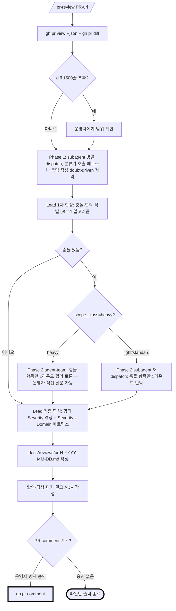
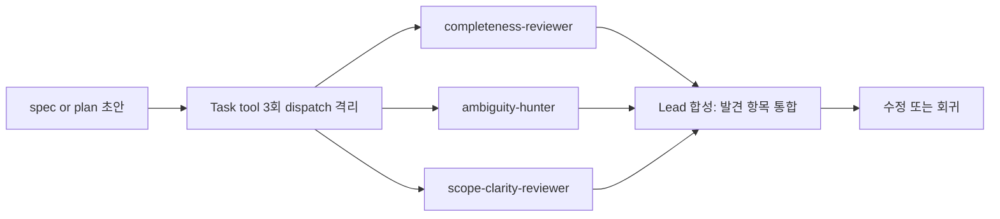
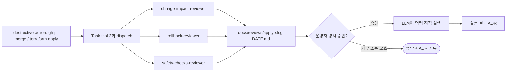

# mypower 프레임워크 설계 문서

> 최종 갱신: 2026-05-13 | v3.16 | Claude Code 운영자용 멀티 에이전트 스킬 프레임워크 (Claude Code plugin)
>
> 변경 이력은 `docs/adrs/` + git log 단일 진실 출처. ADR `2026-05-11-mypower-changelog-policy.md` 참조. spec 본문은 현재 상태만 기술.

## 1. 배경 및 목표

### 1.1 운영자 컨텍스트

mypower의 가상 운영자(target user) 프로필 — 본 spec의 모든 설계 결정은 이 프로필을 기준으로 합리화된다. fork·customization 시에도 이 가정을 알면 어디까지 손대도 되는지 판단 가능:

| 속성 | 가정 |
|---|---|
| 역할 | infra/SRE/플랫폼 운영자 또는 인접 도메인 |
| 코드 패턴 | 비즈니스 로직 코드는 직접 안 짠다 — LLM에 위임 |
| 검토 방식 | LLM 산출물을 본인 도메인 지식으로 직접 verify한다 (따라서 **검토 가능한 형태** = 가독성 = 1순위) |
| 환경 | Claude Code 단일 IDE. 한국어 1순위. agent-team experimental flag(`CLAUDE_CODE_EXPERIMENTAL_AGENT_TEAMS=1`) 활성 |

다른 도메인 운영자(예: 풀스택 백엔드 엔지니어, ML 엔지니어)도 fork 후 §6.1.3 사전 체크리스트 + `decision-catalog-template.md` 도메인 기본값을 갈아끼우면 사용 가능. SRE 도메인 가정은 references 본문 default 영역에 집중 — 코어 lifecycle 로직은 도메인 독립.

`harness_framework/` 자체 프레임워크 v0이 있었으나 [obra/superpowers](https://github.com/obra/superpowers)와 [addyosmani/agent-skills](https://github.com/addyosmani/agent-skills)를 본 후 **갈아엎고 새로 설계**.

mypower 자체는 **Claude Code plugin** 형식. 운영자 본인 dotfiles 워크플로우뿐 아니라 fork·marketplace 배포 경로도 plugin 표준에 자연스럽게 얹힘. 다른 IDE 지원 안 함 (Claude Code 단일 타깃).

### 1.2 mypower 목표

| # | 목표 | 측정 가능한 지표 |
|---|---|---|
| 1 | 운영자가 머릿속에 카탈로그를 그릴 수 있는 적정 크기 | **운영자가 외울 슬래시 커맨드 6개** (lifecycle 단계). **tdd는 7번째 SKILL.md지만 executing-plan sub-process로 자동 호출되므로 외울 필요 없음**. 슬래시 6개 + 자동 호출 1개 = 총 7개 SKILL.md |
| 2 | 한국어 가독성 = 운영자 검토 가능성 | SKILL.md 한 페이지로 의도·절차·검증 기준 파악 |
| 3 | 두 레퍼런스 강점 누락 없이 차용 | 4-agent 멀티 검증 통과 |
| 4 | LLM 회피 차단 = 강제력 장치 | HARD-GATE / Iron Law / Rationalization / REQUIRED SUB-SKILL 4개 장치 모든 스킬에 박힘 |
| 5 | plan 스킬 모호함 0 | placeholder grep 0건, 모호 부사 grep 0건, AC 모두 step 한정 실행 명령, `_review.md` 산출물 강제 |
| 6 | Claude Code 표준 준수 | `agents/`, `skills/`, `references/` 디렉토리. agent-team은 운영자 환경 활성화(`CLAUDE_CODE_EXPERIMENTAL_AGENT_TEAMS=1`, 확인 완료) 가정 |
| 7 | 의사결정 추적 가능 | 운영자 결정·LLM 자율 결정·agent-team 합의 모두 ADR로 기록 |
| 8 | 자율 실행 + 안전 게이트 | PR merge / terraform apply 같은 destructive 작업은 검증 팀 통과 + 운영자 명시 승인 후 LLM이 직접 실행 |
| 9 | Deprecated 회피 (tech currency) | 코드 작성·PR 리뷰 시 사용 라이브러리/API가 **deprecated 표시 있는지** + 명백히 잘못된 사용 패턴 아닌지 확인. **무조건 최신 메이저 버전 사용은 강요 안 함** — stable이고 deprecation 표시 없으면 OK. AWS Knowledge MCP + Context7 MCP + web_search로 공식 문서 조회 |

### 1.3 명시적 비목표

- 다른 IDE 지원 (Cursor, Gemini, Codex)
- BDD 강제 워크플로우 (TDD는 코드 영역에 한해 적용 — §6.4 참조)
- Git worktree 자동 관리
- prod SRE 영향 분석 (PagerDuty/SLO 등) — 운영자가 만드는 대상이 개인 프로젝트 위주, 본격 prod SRE 분석은 별도 도구 영역

### 1.4 mypower 자체 분류 A 사전 응답

§6.1.3 분류 A 사전 질문 체크리스트(brainstorming 강제)는 모든 spec에 적용. 본 spec도 brainstorming 산출물이므로 6개 카테고리 응답 박음 — meta self-application.

| 카테고리 | mypower spec 응답 | 결정 위치 |
|---|---|---|
| 보안 | applying-approval-gate.sh + plugin manifest 모두 secret 처리·인증 처리 없음 (운영자 로컬 환경 한정 영역). secret 발생 시 v1.1 백로그로 격상 | §4.1 hooks 디렉토리, §6.7 applying |
| 데이터 스키마 | `index.json` schema 정의됨 (§6.2.2) + `_review.md` schema (§6.2.2-1) + `{slug}-review.md` (§5.5.6). 영구 저장 데이터 없음 (운영자 프로젝트 `docs/` 안 산출물만) | §6.2.2, §6.2.2-1, §5.5.6 |
| 비용 | agent-team 7배 토큰 정성 명시 (§8.1). 정량 한도는 운영자 직접 모니터 약속 — v1에 별도 제한 없음 | §8.1, §8.2.4 |
| scope | §1.3 비목표 4개 + §14 v1.1 백로그 분리 명시. 분류 A 위반은 §6.3.5 분류 A로 격상 | §1.3, §14 |
| **TDD framework** | MyPower repo 자체 빌드 = **단순 grep + smoke test** (`plugin/tests/smoke.sh` 1개). 검증 대상: plugin install/uninstall 동작 + hook script destructive 패턴 차단 동작 (`/plugin marketplace add ./` → `/plugin install mypower@mypower-dev` 후 `~/.claude/plugins/` 인식 + `/plugin uninstall mypower@mypower-dev` 후 미인식 grep). bats 같은 추가 의존성 없음 | §6.4.2 표 "MyPower 자체 빌드" 행 |
| **로깅 정책** | install.sh 폐기되어 stdout echo 항목 사라짐. applying-approval-gate.sh = stderr만 출력 (Claude Code hook protocol 보호 — stdout은 hook 응답 전용)은 그대로. plugin install/reload 진행 출력은 Claude Code가 표준화 출력. JSON 구조화·요청ID는 v1에 미적용 (shell script 단순성 우선) | §4.1 hooks, §4.2 plugin install |

6개 카테고리 응답이 spec에 박혀 있어 plan 작성 LLM이 자율 결정 없이 인용 가능. v1 빌드 plan 분해 시 step별로 위 응답을 결정 카탈로그(§6.2.2 G2)에 인용.

**메타 결정 (6 카테고리 frame 외)**: mypower self-bootstrap = §11.1 — **v1 빌드 plan은 superpowers writing-plans 사용**, mypower 평가 메커니즘은 v1.1부터 self-application. chicken-and-egg 모순 해소 (mypower writing-plan은 step7에서 빌드되므로 v1 빌드 1단계에 사용 불가). 다른 카테고리 결정은 plan LLM 자율 인용이지만, 이 메타 결정은 plan 작성 시점에 superpowers writing-plans 진입 전제.

---

## 2. 두 레퍼런스 분석 결과 — 차용 매핑

### 2.1 obra/superpowers에서 차용 (8개 패턴)

| # | 패턴 | 출처 + 라인 | mypower 적용 위치 |
|---|---|---|---|
| 1 | `<HARD-GATE>` 블록 | `skills/brainstorming/SKILL.md:12-14` | 7개 스킬 본문 상단 (6 lifecycle + tdd sub-process) |
| 2 | Iron Law 코드블록 + letter-vs-spirit 절 | `verification-before-completion/SKILL.md:14-20` | 7개 스킬 본문 |
| 3 | mermaid 종료 노드 굵은 테두리 | `brainstorming/SKILL.md:48` (doublecircle 재해석) | `## 언제 쓰나` 다이어그램 |
| 4 | `**REQUIRED SUB-SKILL:** ...` 마커 | `writing-plans/SKILL.md:52, 147, 151` | 7개 스킬 마지막 섹션 (tdd→verifying 체이닝 포함) |
| 5 | 2단계 리뷰 (spec → code, 순서 강제) | `subagent-driven-development/SKILL.md:9, 13, 39-40, 249` | PR 리뷰 페르소나 — spec-compliance 1순위 |
| 6 | Common Failures 표 (Claim → Required Evidence → Not Sufficient) | `verification-before-completion/SKILL.md:42-50` | §6.5 verifying + `references/verification-checklist.md` |
| 7 | Implementer Status 5종 (done / done_with_concerns / needs_context / blocked / error) — superpowers 직접 차용. mypower는 lifecycle 2종(`pending`/`in_progress`) 추가해 총 **7종** | `subagent-driven-development/SKILL.md:106-120` | §6.3 executing-plan, §6.3.4 |
| 8 | 연속 실행 규칙 (step 간 인간 개입 요청 금지) | `subagent-driven-development/SKILL.md:14` | §6.3 executing-plan |
| 9 | **TDD Red-Green-Refactor + Iron Law** ("NO PRODUCTION CODE WITHOUT A FAILING TEST FIRST") | `test-driven-development/SKILL.md:14-15, 32-46` | §6.4 tdd 스킬 (코드 영역 한정) |

### 2.2 addyosmani/agent-skills에서 차용 (7개 패턴)

| # | 패턴 | 출처 | mypower 적용 위치 |
|---|---|---|---|
| 1 | 라이프사이클 phase ↔ 슬래시 커맨드 1:1 매핑 | README 7-phase 표 | mypower 6단계 |
| 2 | description "Use when..." 2~3회 반복 | 21개 SKILL.md frontmatter | 7개 스킬 description |
| 3 | Common Rationalizations (변명 → 반박) | 21개 SKILL.md 본문 | 7개 스킬 본문 |
| 4 | `agents/<name>.md` 별도 디렉토리 + 시스템 프롬프트 | `agents/code-reviewer.md` 등 | mypower `agents/` 12개 |
| 5 | `references/*.md` on-demand 분리 | `references/testing-patterns.md` 등 | mypower `references/` |
| 6 | 5-tier Severity (Critical / Important / Nit / Optional / FYI) | `code-review-and-quality/SKILL.md` | §8.3 PR 리뷰 라벨 |
| 7 | doubt-driven 격리 (artifact + contract만, author reasoning withhold) | `doubt-driven-development/SKILL.md` | §8 PR 리뷰 + 평가 팀 spawn |
| 8 | **TDD 절차 + Rationalizations 표** | `test-driven-development/SKILL.md` | §6.4 tdd 스킬 본문 보강 |

### 2.3 안 가져오는 것

| 항목 | 출처 | 이유 |
|---|---|---|
| `using-git-worktrees` | superpowers | 별도 도구 영역 |
| `writing-skills` 메타 스킬 | superpowers | MVP 6개에선 불필요 |
| Ship phase 전체 | addyosmani | applying이 종료점 |
| `accessibility-checklist.md` | addyosmani | 도메인 거리 멈 |
| 듀얼 트랙 (`.gemini/`, `.codex/`) | 둘 다 | Claude Code 단일 타깃 |
| persona `test-engineer` | addyosmani | code-quality-reviewer가 테스트 lens 흡수 |

### 2.4 의도적 lens 결정

addyosmani 5축 (correctness / readability / architecture / security / performance) 분배:
- correctness, readability → `code-quality-reviewer`
- architecture → `architect-reviewer`
- security → `security-reviewer`
- **observability** → `observability-reviewer` (신규, mypower 고유)
- performance → `code-quality-reviewer`에 명백한 함정 (N+1, unbounded loop, 메모리 누수)만 흡수. 본격 분석 별도 도구
- **tech currency** (deprecated · 잘못된 API 사용) → **: `tech-currency-reviewer` 신규 페르소나**. 4-agent 검토에서 "한 페르소나에 5개 lens 응축은 검토 품질 저하"로 지적되어 분리. 단 호출은 조건부 — diff 분류기(§8.2.2)에서 deps/API 변경이 있을 때만 spawn (typo·문서 PR엔 미호출). MCP/web_search trigger 조건은 `tech-currency-guide.md`에 명시

---

## 3. 운영 모델 — 6단계 라이프사이클

### 3.1 단계 흐름


`applying`은 PR merge / terraform apply 같은 destructive 작업이 있을 때만 호출되는 옵션 단계. 변경이 코드 수준에서 끝나면 `pr-review` 후 운영자 결정으로 종료.

### 3.2 단계별 역할 / 슬래시 커맨드 / 산출물 / 다음 단계

| # | 단계 | 슬래시 | 산출물 | 평가·검증 모드 | 다음 단계 |
|---|---|---|---|---|---|
| 1 | 아이디어 → 합의된 spec | `/brainstorming` | `docs/specs/YYYY-MM-DD-{slug}.md` + 채택 결정 ADR | spec 평가 팀 (subagent 병렬, 3명) | `writing-plan` |
| 2 | spec → 단계별 plan | `/writing-plan` | `docs/plans/{slug}/index.json` + `step{N}.md` + `_review.md` + step 분할 ADR | plan 평가 팀 (subagent 병렬, 같은 3명 재사용) | `executing-plan` |
| 3 | plan → 실행 (subagent 위임) | `/executing-plan` | 코드/리소스 변경 + step별 결과 + 자율 결정 ADR | (각 코드 step마다) `tdd` 자동 호출 → `verifying` | `tdd` (코드 영역) → `verifying` 매 step |
| 4 | 증거 기반 검증 | `/verifying` | 명령 출력 + Common Failures 표 통과 결과 | (없음 — 자체 게이트) | (선택) `pr-review` |
| 5 | PR 머지 전 다관점 검토 | `/pr-review <PR>` | `docs/reviews/pr-{N}-YYYY-MM-DD.md` + 합의/격상 ADR | PR 리뷰 팀 (하이브리드: Phase 1 subagent 병렬, Phase 2 heavy 시 agent-team — D6) | (선택) `applying` |
| 6 | destructive 작업 자율 실행 | `/applying <action>` | `docs/reviews/apply-{slug}-YYYY-MM-DD.md` + 실행 결과 ADR | 실행 검증 팀 (subagent 병렬, 3명) + 운영자 승인 게이트 | 운영자 결정 |

호출은 `/<skill-name>` 형태 (user-scope skill로 등록되면 plugin prefix 없음).

---

## 4. 디렉토리 구조 — Claude Code plugin

> 이전 차수 "GitHub repo + symlink install" 폐기 → **Claude Code plugin** 형식. 디렉토리·환경변수·hooks 등록 모두 plugin 표준 따름. 운영자 직관(symlink + install.sh는 plugin 시스템 흉내내기) + 두 전문가 팀 공수 산정 ~2시간 합리적 + dotfiles 패턴 양보 1단계(`claude plugin update` alias로 동등화)에 기반. 상세 의사결정 근거는 `docs/adrs/2026-05-11-mypower-plugin-adopt.md`.

### 4.1 MyPower repo 구조 (의사결정 누적 docs/ + plugin source plugin/ 분리)

```
MyPower/                              GitHub repo root (`/plugin marketplace add` 대상)
├── README.md                         프로젝트 전체 안내 — toy/learning 목적 + plugin install 흐름 + docs/ 학습 자료 안내
├── .gitignore                        macOS·iCloud·Claude cache·secrets·node·python·build·.claude/agent-memory/ 등
├── .claude-plugin/
│   └── marketplace.json              marketplace 등록 manifest. `plugins[0].source: "./plugin"`으로 plugin 디렉토리만 install 대상 지정. 외부 사용자가 `/plugin marketplace add <owner>/MyPower`로 등록 시 본 파일 자동 발견 (superpowers v5.1.0 동반 패턴 인용)
├── docs/                             의사결정 누적 영역 — git commit + clone에 포함되지만 `/plugin install`엔 무관 (cache에 안 복사됨). 외부 사용자에 학습 자료로 노출
│   ├── specs/                        spec 본문
│   ├── adrs/                         결정 + 변경 이력
│   └── superpowers/plans/            v1·v1.1·... 빌드 plan
└── plugin/                           Claude Code plugin install 대상 — marketplace.json의 `source: "./plugin"` 인용. 본 디렉토리만 `~/.claude/plugins/cache/`로 복사
    ├── README.md                     plugin 사용자용 — 슬래시 6개 + 12 페르소나 사용법
    ├── .claude-plugin/
    │   └── plugin.json               plugin manifest (name: "mypower" · version · author · description · repository)
    ├── skills/
    │   ├── brainstorming/SKILL.md
    │   ├── writing-plan/SKILL.md
    │   ├── executing-plan/SKILL.md
    │   ├── tdd/SKILL.md              코드 영역 step에서 자동 호출 (sub-process)
    │   ├── verifying/SKILL.md
    │   ├── pr-review/SKILL.md
    │   └── applying/SKILL.md
    ├── agents/                       12명. frontmatter에 `memory` 필드 명시 — sub-agent persistent memory(공식 docs) 활성. ambiguity-hunter·tech-currency-reviewer 2명은 `memory: user` (cross-project 누적), 나머지 10명은 `memory: project` (프로젝트별 격리). ADR `2026-05-11-mypower-subagent-memory.md` 참조
    │   ├── spec-compliance-reviewer.md
    │   ├── code-quality-reviewer.md
    │   ├── tech-currency-reviewer.md  deprecated/잘못된 사용 패턴 lens 분리
    │   ├── architect-reviewer.md
    │   ├── security-reviewer.md
    │   ├── observability-reviewer.md
    │   ├── completeness-reviewer.md
    │   ├── ambiguity-hunter.md
    │   ├── scope-clarity-reviewer.md
    │   ├── change-impact-reviewer.md
    │   ├── rollback-reviewer.md
    │   └── safety-checks-reviewer.md
    ├── hooks/                        1개. plugin 형식 표준 등록
    │   ├── hooks.json                plugin manifest 표준 hooks 등록 (`${CLAUDE_PLUGIN_ROOT}` 사용)
    │   └── applying-approval-gate.sh destructive 명령(gh pr merge / terraform apply 등) 실행 전 운영자 승인 텍스트 부재 시 차단
    ├── references/
    │   ├── plan-checklist.md         writing-plan self-review 4-pass 상세
    │   ├── verification-checklist.md Common Failures 표 + Gate Function
    │   ├── pr-review-checklist.md    Severity 5단 + 매트릭스 + 합의/충돌 식별 알고리즘 (§8.2.1)
    │   ├── applying-checklist.md     실행 검증 게이트 + 승인 절차 + 한국어 승인 동의어 (§6.7.4)
    │   ├── observability-guide.md    코드 작성 시 observability 가이드라인 + self-check 항목
    │   ├── tech-currency-guide.md    deprecated 회피 trigger·도구 (§9.2.2)
    │   ├── critical-decisions-guide.md 분류 A/B/C + 게이트 형식 (§9.2.3)
    │   ├── decision-catalog-template.md step{N}.md 결정 카탈로그(§6.2.2)에서 "default 따름" 인용
    │   ├── tdd-guide.md              영역 판단 + Red-Green-Refactor (§6.4)
    │   ├── adr-template.md           ADR 양식
    │   └── persona-checklists/       페르소나 두 층 구조 — 2층(체크리스트) 12개
    │       ├── spec-compliance.md
    │       ├── code-quality.md
    │       ├── tech-currency.md
    │       ├── architect.md
    │       ├── security.md
    │       ├── observability.md
    │       ├── completeness.md
    │       ├── ambiguity.md
    │       ├── scope-clarity.md
    │       ├── change-impact.md
    │       ├── rollback.md
    │       └── safety-checks.md
    └── tests/
        ├── smoke.sh                  Step 0~5 정적 + hook 동작 검증
        └── integration-checklist.md  Step 13 운영자 토이 프로젝트 수동 검증
```

> 구조 결정 근거: docs/와 plugin/ 분리 = ADR `docs/adrs/2026-05-12-mypower-docs-plugin-split.md`. 모호함 처리 규칙(ARP) 채택 + `plugin/references/ambiguity-protocol.md` 추가 = ADR `docs/adrs/2026-05-13-ambiguity-protocol-adopt.md`. ARP는 v1 MVP에서 슬래시 스킬 프롬프트 단독 강제, hook·검증 에이전트는 v1.1+ 도입 예정.

**root `.claude-plugin/marketplace.json` minimal schema** (운영자 식별자는 fork 시 갈아끼움):

```json
{
  "name": "mypower-dev",
  "description": "mypower skills library marketplace",
  "owner": { "name": "<owner-name>", "email": "<owner-email>" },
  "plugins": [
    {
      "name": "mypower",
      "description": "Multi-agent skill framework for Claude Code (6 lifecycle skills + tdd sub-process + 12 reviewer personas)",
      "version": "1.0.0",
      "source": "./plugin",
      "author": { "name": "<owner-name>", "email": "<owner-email>" }
    }
  ]
}
```

`source: "./plugin"`로 plugin/ 디렉토리만 install 대상 지정 — `/plugin install mypower@mypower-dev` 시 plugin/ 디렉토리 전체가 `~/.claude/plugins/cache/<marketplace>/<plugin>/`로 복사. docs/는 install에 안 따라가지만 git clone에는 포함(학습 자료 +). v1 빌드 step 0 AC에서 본문 5필드(name·description·owner·plugins[0].name·plugins[0].source) grep 검증.

**plugin/.claude-plugin/plugin.json minimal schema** (외부 사용자가 install 후 cache에서 보게 되는 manifest):

```json
{
  "name": "mypower",
  "version": "1.0.0",
  "description": "Multi-agent skill framework for Claude Code",
  "author": { "name": "<owner-name>", "email": "<owner-email>" },
  "repository": "https://github.com/<owner>/MyPower",
  "license": "MIT"
}
```

### 4.2 install — Claude Code plugin 절차

Claude Code plugin은 `/plugin install` 명령이 **marketplace를 경유한 install만 지원** (공식 문서 [discover-plugins](https://code.claude.com/docs/en/discover-plugins) + [plugins-reference](https://code.claude.com/docs/en/plugins-reference)). 따라서 mypower repo에 `.claude-plugin/marketplace.json`을 포함해 본인 dotfiles·외부 fork·marketplace 배포 3 경로 모두 동일 명령 흐름으로 처리. superpowers v5.1.0도 동일 패턴(`marketplace.json` + `plugin.json` 동반).

**운영자 본인 default = 시나리오 A**. 본인이 mypower plugin owner이자 사용자 (v1·v1.1·v1.2 코드를 본인이 계속 손대고 commit·push). 로컬 git working copy가 있어야 코드 편집 → 검증 → push 흐름이 성립. B·C는 다른 입장(외부 사용자·개발 중 빠른 테스트) 보조 흐름.

**시나리오 A — 운영자 본인 default** (plugin owner — 로컬 repo working copy를 marketplace로 등록):

```bash
# 1회: clone 후 로컬 경로를 marketplace로 등록 → plugin install
git clone https://github.com/<owner>/MyPower ~/Projects/MyPower
/plugin marketplace add ~/Projects/MyPower         # root .claude-plugin/marketplace.json 자동 발견
/plugin install mypower@mypower-dev                # <plugin-name>@<marketplace-name> 형식. marketplace.json source: "./plugin"에 따라 plugin/ 디렉토리만 cache로 복사 — docs/는 cache 안 들어감

# 이후 갱신
cd ~/Projects/MyPower && git pull
claude plugin update mypower@mypower-dev           # alias 한 줄 (예: alias mpup='cd ~/Projects/MyPower && git pull && claude plugin update mypower@mypower-dev')
/reload-plugins                                    # (선택) 현재 세션 즉시 반영
```

**시나리오 B — 외부 사용자** (fork·marketplace 받는 사람 — 로컬 working copy는 git clone 시 받지만 plugin install은 plugin/만 cache):

```bash
# 1회: GitHub repo의 root marketplace.json 직접 등록 → plugin install
/plugin marketplace add <owner>/MyPower            # GitHub 상의 root .claude-plugin/marketplace.json 자동 발견
/plugin install mypower@mypower-dev

# 이후 갱신
/plugin marketplace update mypower-dev
claude plugin update mypower@mypower-dev
```

> 외부 사용자가 `git clone https://github.com/<owner>/MyPower`로 직접 받으면 docs/도 같이 받음 — 학습 자료(spec·plan·ADR) 열람 가능. `/plugin install`만 호출하면 docs/는 cache로 안 따라감.

**시나리오 C — 개발 중 빠른 테스트 보조** (install 없이 세션 단위 로드 — 본격 사용 흐름 아님):

```bash
# 설정 미기록, 해당 세션만 활성화 — plugin/ 디렉토리 직접 가리킴
claude --plugin-dir ~/Projects/MyPower/plugin
/reload-plugins                                    # 코드·hooks 수정 후 세션 내 반영
```

`${CLAUDE_PLUGIN_ROOT}` 환경변수는 Claude Code가 plugin install 시 자동 설정 — 스킬·hooks 본문에서 `${CLAUDE_PLUGIN_ROOT}/references/...` 같은 절대 경로 참조 가능. 운영자가 `~/.zshrc`에 환경변수를 박을 필요 없음 (이전 차수 `$MYPOWER_HOME` 방식 폐기).

skills·agents 자동 인식: `.claude-plugin/plugin.json`이 있는 디렉토리 하위 `skills/`·`agents/`는 Claude Code가 자동 로드 — 별도 symlink 생성 단계 불필요. 슬래시 호출은 `/<skill-name>` (user-scope skill과 마찬가지로 plugin prefix 없음).

> [!NOTE]
> 운영자 본인 default dotfiles 흐름 (시나리오 A): `cd ~/Projects/MyPower && git pull && claude plugin update mypower@mypower-dev` 한 줄 alias로 인지 부담 최소화. `/plugin marketplace add ~/Projects/MyPower` 1회 + 이후 plugin update 반복. `/plugin reload`·`/plugin install <name>@<local-path>`는 **존재하지 않는 명령** — 초안에 잘못 박혀 있었던 것을 운영자 지적으로 정정.
>
> **공식 명령 출처**: 본 절 명령(`/plugin marketplace add`, `/plugin install <name>@<marketplace>`, `claude plugin update`, `/reload-plugins`, `--plugin-dir`)은 모두 [discover-plugins](https://code.claude.com/docs/en/discover-plugins) + [plugins-reference](https://code.claude.com/docs/en/plugins-reference) 공식 문서 기반 (2026-05-11 시점). v1 빌드 step 0 `tests/smoke.sh`에 `claude plugin --help` + `claude plugin update --help` 출력 grep 추가해 명령 존재 사전 검증 — 동작 변화 시 fallback ADR(`docs/adrs/YYYY-MM-DD-plugin-cmd-fallback.md`)로 정정.

### 4.3 운영자 프로젝트 산출물 위치

운영자가 어떤 프로젝트에서 mypower 사용할 때, 산출물은 그 프로젝트의 `docs/` 안:

```
<project>/
└── docs/
    ├── specs/
    │   ├── YYYY-MM-DD-{slug}.md             spec 본문
    │   └── YYYY-MM-DD-{slug}-review.md      spec 평가 점수 루프 시도 이력 (§5.5.6 옵션 b)
    ├── plans/{slug}/
    │   ├── index.json
    │   ├── step{N}.md
    │   └── _review.md                       `## Evaluation Loop History` 섹션 추가 (§6.2.2-1, §5.5.6)
    ├── adrs/YYYY-MM-DD-{slug}.md     ADR 누적
    └── reviews/
        ├── pr-{N}-YYYY-MM-DD.md
        └── apply-{slug}-YYYY-MM-DD.md
```

mypower 스킬은 운영자 프로젝트의 `docs/` 위치를 가정하고 산출물을 생성. `docs/`가 없으면 자동 생성.

### 4.4 agent-team 환경변수

운영자 `~/.claude/settings.json`에 다음 활성화 (확인 완료):

```json
"env": { "CLAUDE_CODE_EXPERIMENTAL_AGENT_TEAMS": "1" }
```

`pr-review` 스킬은 **하이브리드 모드**: Phase 1은 항상 subagent 병렬, Phase 2는 scope_class=heavy 시만 agent-team(`CLAUDE_CODE_EXPERIMENTAL_AGENT_TEAMS=1` 활성 가정). 환경변수 비활성 시 Phase 2 heavy도 subagent 재dispatch로 fallback (§8.1).

### 4.5 hooks 등록 (hard enforcement)

hooks 등록은 plugin manifest 표준(`hooks/hooks.json`) 사용. Claude Code가 plugin install 시점에 manifest를 읽어 자동 등록 — 운영자가 `~/.claude/settings.json`을 직접 편집할 필요 없음. prompt-level 행동 유도(§5.3 4 장치)는 LLM이 우회 가능하지만, **hooks는 Claude Code가 LLM 무관하게 차단**하는 유일한 hard enforcement 메커니즘.

**hooks 단순화 (1개로 축소)**: 이전에 hooks 6개를 설계했으나, 4-agent + 3-agent 검토 결과 sentinel 의존성·LLM 협조 의존성·우회 가능성으로 hard enforcement 신뢰도가 낮다고 평가됨. mypower의 가장 위험한 단일 케이스인 **destructive 명령 실행만 hook으로 막고**, 나머지는 prompt-level Iron Law(§5.3) + 운영자 검토(§13)로 처리.

| Hook | Event + matcher | 차단 동작 | 차단 메시지 |
|---|---|---|---|
| `mypower-applying-approval-gate` | `PreToolUse` (matcher: `Bash`) | hook 스크립트가 `tool_input.command`를 grep해 destructive 패턴(`gh pr merge`, `terraform apply`, `kubectl delete`, `aws s3 rm` 등 — `applying-checklist.md`에 전체 패턴 리스트) 매칭 시 `docs/reviews/apply-{slug}-*.md`에 운영자 승인 텍스트(§6.7.4) 부재 → 차단 | "applying 검증 보고서에 운영자 승인 미확인 — 승인 텍스트 인용 후 재시도" |

> [!IMPORTANT]
> **단일 hook 결정 근거**:
> - destructive 명령(데이터 손실·인프라 망가짐·rollback 불가)은 LLM 자율 실행을 hard 차단해야 함. sentinel 의존 없이 hook 스크립트가 명령 패턴 + 보고서 파일 직접 검사하므로 강제력 신뢰도 높음
> - 다른 hook 후보들은 **LLM이 만든 sentinel에 의존**해서 발동. LLM 협조 없으면 hook 자체가 우회됨 → 강제력의 모순. 폐기하고 prompt-level + PR 리뷰 단계로 대체
> - v1 사용 후 실제 우회 사례 발생 시 §14 v1.1 백로그에서 hook 추가 도입 검토

**`hooks/hooks.json` 형식** (superpowers plugin v5.1.0 패턴 참조):

```json
{
  "hooks": {
    "PreToolUse": [
      {
        "matcher": "Bash",
        "hooks": [
          {
            "type": "command",
            "command": "\"${CLAUDE_PLUGIN_ROOT}/hooks/applying-approval-gate.sh\"",
            "async": false
          }
        ]
      }
    ]
  }
}
```

> [!IMPORTANT]
> - plugin install/uninstall 시 Claude Code가 manifest 표준 따라 자동 등록·해제. 운영자가 `~/.claude/settings.json` 직접 편집 안 함 → 다른 hooks·다른 plugin과 격리 보장
> - hook 스크립트는 plugin repo 안에 그대로 들어감 (`mypower/hooks/applying-approval-gate.sh`). `${CLAUDE_PLUGIN_ROOT}`는 Claude Code가 plugin install 시점에 자동 설정 — 절대 경로 박을 필요 없음
> - hook script 종료 코드 1 = 차단, 0 = 통과. stderr만 출력 (분기점 1b — stdout은 hook 응답 전용)
> - **`${CLAUDE_PLUGIN_ROOT}` unset 가드**: hook script 진입 첫 줄에서 `[ -z "${CLAUDE_PLUGIN_ROOT:-}" ]` 검사. unset 시 stderr에 "plugin context 외부 호출 — 정상 plugin install 후 재시도" 출력 + exit 1. 운영자가 시나리오 C(`--plugin-dir`)·수동 dry-run 시 빠르게 원인 파악 가능. v1 빌드 step 5 hook script 작성 시 이 가드 첫 줄에 박음 (`tests/smoke.sh`가 unset stub로 가드 동작 검증)

---

## 5. 스킬 본문 공통 골격

### 5.1 frontmatter

```yaml
---
name: <kebab-case-english>
description: <한국어 트리거 한 문장>. <두 번째 시나리오>. Use when <영문 트리거>.
  Use when <두 번째 영문 트리거>.
allowed-tools: Read Glob Grep Bash Edit Write
---
```

> [!IMPORTANT]
> **agents 파일과 skills 파일의 tool 제한 frontmatter 필드명이 다름** (공식 docs 확인):
> - `agents/<name>.md` (페르소나, §7.2): `tools: Read, Glob, Grep, Bash`
> - `skills/<name>/SKILL.md` (스킬, §5.1): `allowed-tools: Read Glob Grep Bash Edit Write`
>
> 잘못 박으면 tool 제한이 묵음 실패(silent skip)해 페르소나가 모든 tool 접근 가능 또는 스킬이 의도한 tool 못 씀. 빌드 시 frontmatter linter로 mypower 파일 전수 검사 권장.
>
> ****: skills의 `allowed-tools`는 공식 docs 권장 **스페이스 구분**(콤마 아님). 또한 이 필드는 `/skill-name` Skill tool 호출 시에만 적용됨 — Read tool로 SKILL.md를 직접 로드하는 경로(D4 spawn prompt)는 이 필드 무효이므로 tool 권한 승인 매번 발생 가능. tool 자동 승인이 필요하면 spawn prompt에 권한 명시 또는 Skill tool 호출 경로 병행.

### 5.2 본문 섹션 순서

```markdown
# <스킬 이름> — <한 줄 부제>

<HARD-GATE>
<금지 행동 (한국어)>
</HARD-GATE>

## 절대 법칙 (Iron Law)

```
<한 문장 절대 법칙 (한국어, ~25자)>
```

이 법칙의 글자(letter)를 어기면 정신(spirit)도 어긴다. 우회는 위반이다.

## 언제 쓰나


종료 노드는 단 하나. 다음 스킬은 `mypower-<next-skill>` 외에 없다.

## 절차

1. ...

## 자주 하는 변명 — 그리고 반박 (Rationalizations)

| 변명 | 실제 |
|---|---|

## 경계 신호 (Red Flags)

- ...

## 검증 (Verification)

기계 검증 항목:
- [ ] ...

self-judge 항목:
- [ ] ...

## ADR 트리거

이 스킬에서 다음 결정이 있을 때 ADR 자동 작성:
- ...

## 다음 스킬 (필수)

**REQUIRED SUB-SKILL: `mypower-<next-skill>`**
```

> [!NOTE]
> **§5.2 골격 풀어쓰기**
>
> **이 섹션이 무엇인가**: 7개 스킬(brainstorming, writing-plan, executing-plan, tdd, verifying, pr-review, applying)의 SKILL.md를 어떤 순서·구조로 쓸지 정한 **골격 템플릿** (template). 위 코드블록의 markdown 자체가 SKILL.md 파일이 되는 것이 아니라, 각 스킬이 이 골격을 따라 본인 내용으로 채운다.
>
> **`...` 또는 빈 표가 왜 보이나**: 골격은 섹션 머리(헤더)만 정의하고, 실제 절차·Rationalization 표·Red Flags·검증 항목·ADR 트리거는 **§6.1~§6.7 스킬별 정의**에서 채운다. spec 본문은 골격 + 채움 정의가 분리된 구조 — v1 빌드 시점(executing-plan 단계)에 §6 정의를 골격에 박아 실제 `skills/<name>/SKILL.md` 7개 파일을 만든다.
>
> **예시 매핑**:
>
> | 골격 자리 (§5.2) | writing-plan SKILL.md에 들어갈 내용 | 정의 위치 |
> |---|---|---|
> | `## 절차` 1번 ~ N번 | 11단계 (spec 읽기 → TDD 환경 점검 → ambiguity 게이트 → ... → executing-plan 호출) | §6.2.3 |
> | `## 자주 하는 변명` 표 | "이 정도면 충분히 상세하다" 등 6개 변명 | §6.2.5 |
> | `## 경계 신호` | "구현자 판단에 맡김" 등 5개 신호 | §6.2.6 |
> | `## 검증` 기계/self-judge | placeholder grep / ambiguity-hunter 통과 / 결정 카탈로그 빈 칸 0건 등 12항목 | §6.2.4 |
> | `## ADR 트리거` | step 분할 결정 / brainstorming 회귀 결정 | §6.2.7 |
>
> 즉 **현재 spec의 골격은 비어 있는 게 정상** — 채움은 코드 작성 시점에 §6에서 가져온다.
>
> **`mypower-<next-skill>`이 무엇인가**: `<next-skill>`은 placeholder(자리표시자) — 꺾쇠 안의 부분이 스킬마다 다른 다음 스킬 이름으로 치환된다. 예:
>
> | 현재 스킬 | `<next-skill>`에 박힐 값 (실제 SKILL.md에서) |
> |---|---|
> | brainstorming | `writing-plan` (전체 표기 `mypower-writing-plan`) |
> | writing-plan | `executing-plan` |
> | executing-plan | `verifying` |
> | tdd | `verifying` (sub-process 종료 후 호출자 executing-plan이 verifying 단계로) |
> | verifying | `pr-review` (선택, 모든 step 종료 후) |
> | pr-review | `applying` (선택, PR 머지 후) |
> | applying | (없음 — lifecycle 종료 노드) |
>
> mermaid 종료 노드(`Terminal([mypower-<next-skill> 호출])`)도 동일하게 실제 SKILL.md에서는 구체 이름으로 박힘.

### 5.3 강제력 장치 4가지 (prompt-level) + hooks (hard)

| # | 장치 | 효과 | 구현 |
|---|---|---|---|
| 1 | `<HARD-GATE>` | 다른 스킬·구현 호출 차단 (prompt-level) | SKILL.md 본문 상단 |
| 2 | Iron Law 코드블록 + letter-vs-spirit | 한 문장 절대 법칙 + 우회 차단 | SKILL.md `## 절대 법칙` |
| 3 | mermaid 종료 노드 굵은 테두리 | 다음 스킬이 유일한 합법 출구 | SKILL.md `## 언제 쓰나` |
| 4 | `**REQUIRED SUB-SKILL:**` 마커 | 워크플로우 체이닝 — **두 호출 경로 병행**: **(A) 우선 경로** — `/mypower-{next-skill}` Skill tool 호출 (공식 docs 권장. `allowed-tools` 적용 + skill lifecycle 관리). **(B) 보조 경로** — LLM이 Read tool로 다음 SKILL.md 직접 로드 후 본문 적용 (subagent spawn 컨텍스트에서 Skill tool 호출 불가 시. `allowed-tools` 미적용 — 권한 승인 매번). "스킬이 스킬을 호출"은 부정확 — SKILL은 markdown 파일이고 LLM이 차례로 로드·적용 | SKILL.md `## 다음 스킬 (필수)` |

추가: **hooks (§4.5)** — Claude Code가 LLM 무관하게 차단하는 유일한 hard enforcement. 기준 **`applying-approval-gate` 1개**만 유지 (destructive 명령 차단). 다른 hook 후보들은 sentinel 의존으로 강제력 약화 → prompt-level + 운영자 검토로 대체.

본문 한국어 + 구조 마커 영어 = 하이브리드.

> [!IMPORTANT]
> 1~4 장치는 prompt-level 행동 유도. 실제 강제력 = 운영자 검토 + LLM self-compliance + applying-approval-gate hook (destructive 작업만 hard 차단). 다른 영역에서 hook 강제 없음 — prompt-level만으로 부족하다면 운영자가 v1.1 백로그 §14 #23로 hook 추가 도입 검토.

### 5.4 markdown 시각성 강화

이모지 미사용. GitHub callout / details / 표 / 코드블록 / 굵게로 시각성 확보.

| 도구 | 사용처 |
|---|---|
| `> [!NOTE]` `> [!TIP]` `> [!IMPORTANT]` `> [!WARNING]` `> [!CAUTION]` callout | 박스 강조 (5단계 우선순위 표시) |
| `<details><summary>` | 길어지는 설명·예시 접어두기 |
| 표 | 비교·분류 |
| 코드블록 | 명령·파일 형식 |
| `**굵게**` | 핵심 키워드 |

### 5.5 평가 점수 루프 — 공통 메커니즘

brainstorming의 spec 평가 팀(§6.1 절차 7번)과 writing-plan의 plan 평가 팀(§6.2.3 절차 7번)이 공유하는 **평가 → LLM 자동 수정 → 재평가** 루프. 자잘한 평가 이슈가 운영자 호출 없이 LLM 자동 수정으로 해소되도록 설계 — **운영자 개입 최소화 목표와 정합**. 운영자 검토 게이트는 그대로 유지 (자동 수정 결과도 마지막에 운영자 명시 승인).

#### 5.5.1 점수 정의 — severity 카운트 (운영자 결정: 옵션 C)

평가 팀 finding 결과를 5-tier severity (Critical / Important / Nit / Optional / FYI)로 분류:

| 통과 기준 | 조건 |
|---|---|
| **PASS** | Critical 0건 + Important 2건 이하 + Nit/Optional/FYI 무관 |
| **FAIL** | Critical 1건 이상 또는 Important 3건 이상 |

severity 분류 가이드는 `references/persona-checklists/<name>.md` 본문 참조. 페르소나마다 5-tier 분류 기준 일치 (§7.2 1층 골격에 박힘).

#### 5.5.2 루프 시퀀스 — 최대 3회

```
[1회차] 평가 팀 호출 (subagent 병렬)
  ↓ finding 합성 → 점수 계산
  ↓
PASS? ─ 예 → 운영자 검토 게이트 (자동 수정 0회 인용)
  └─ 아니오 → LLM 자동 수정 (§5.5.4 범위 제한)
              ↓
[2회차] 평가 팀 재호출 (동일 페르소나 + spawn prompt 격리 강화 — §5.5.5 옵션 c)
              ↓
PASS? ─ 예 → 운영자 검토 게이트 (자동 수정 1회 + 시도 이력 인용)
  └─ 아니오 → LLM 자동 수정 (3회차 진입 사유 ADR)
              ↓
[3회차] 평가 팀 재호출 (1·2회차와 다른 페르소나로 교체 — anchoring 차단)
              ↓
PASS? ─ 예 → 운영자 검토 게이트 (자동 수정 2회 + 시도 이력 + 페르소나 교체 명시)
  └─ 아니오 → 3회 상한 도달 — 운영자 호출 + 3개 옵션 (§5.5.3)
```

#### 5.5.3 3회 상한 도달 시 운영자 호출 형식

```
[평가 점수 루프 미해소] {brainstorming 또는 writing-plan}

## 시도 이력
- 1회차: Critical N건 / Important M건 → FAIL → 자동 수정 요약 X
- 2회차: Critical N건 / Important M건 → FAIL → 자동 수정 요약 Y
- 3회차 (페르소나 {교체 페르소나명}로 교체): Critical N건 / Important M건 → FAIL

## 미해소 finding (요약)
- F1 (Critical) {file:line} {요약}
- F2 (Important) {file:line} {요약}
...

## 옵션
1. **운영자 직접 수정** — 운영자가 spec/plan 직접 편집 후 평가 1회 추가 호출 (루프 미진입)
2. **기준 완화 후 진입** — Important 임계값 상향 (예: 2건 → 5건). ADR 자동 작성 `docs/adrs/{slug}-eval-criteria-loosen.md`
3. **미해소 인지 후 강제 진입** — 미해소 finding을 인지하고 다음 단계로 진입. ADR 자동 작성 `docs/adrs/{slug}-eval-bypass.md` + 다음 단계 산출물에 미해소 finding 표시
```

운영자 답: "옵션 N으로 진행" / "다른 옵션".

#### 5.5.4 자동 수정 범위 제한

LLM 자동 수정은 finding이 명시한 영역만 손댄다. 자율 확장 금지 — 의도 왜곡 차단.

| 허용 | 금지 |
|---|---|
| finding의 `file:line` 명시 영역 수정 | 다른 file 자율 변경 |
| finding의 lens별 수정 (예: ambiguity finding은 모호 표현 정정) | spec/plan 구조 자율 재작성 |
| 결정 카탈로그(§6.2.2 G2)·spec 본문 누락 항목 채움 | 운영자 명시 결정 항목 자율 변경 |
| placeholder 잔존 정정 | brainstorming 회귀가 필요한 의미적 모호성을 자동 수정으로 우회 |

위반 시 자동 수정 무효 처리 + 운영자 호출 (3회 상한 전이라도).

#### 5.5.5 페르소나 anchoring 방지 — 옵션 c (운영자 결정)

같은 페르소나가 본인이 지적한 결함의 자동 수정 결과를 다시 평가하면 "내가 지적한 거 고쳤네 PASS" anchoring 위험. 회차별 페르소나 운용:

| 회차 | 페르소나 | spawn prompt 격리 |
|---|---|---|
| 1회차 | 기본 풀 (brainstorming/writing-plan은 completeness-reviewer / ambiguity-hunter / scope-clarity-reviewer 3명) | 표준 doubt-driven 격리 (§7.2 — `docs/adrs/` + `docs/ARCHITECTURE.md` Read·Glob 금지) |
| 2회차 | 1회차와 **동일 페르소나 3명** | 추가 격리: "이전 시도 결과 + 본인 이전 finding 보지 마라. 새로 평가하라"를 spawn prompt에 명시 |
| 3회차 | 1·2회차와 **다른 페르소나로 교체** — 후보: `architect-reviewer` (구조적 lens 추가), `code-quality-reviewer` (writing-plan 한정 — plan 코드 시그니처 lens 적용 가능) | 표준 격리 + "이전 회차 시도 이력 보지 마라" 명시 |

페르소나 풀 부족 시(평가 팀 외 페르소나 모두 사용 불가) 3회차 직접 운영자 호출로 강제 종료.

#### 5.5.6 시도 이력 박는 위치 — 옵션 b (운영자 결정: 별도 파일 통일)

| 단계 | 시도 이력 파일 |
|---|---|
| brainstorming | `docs/specs/{slug}-review.md` 신설 — writing-plan 패턴과 통일. spec 본문은 깔끔 유지 |
| writing-plan | `docs/plans/{slug}/_review.md` 기존 (§6.2.2-1 schema에 `## Evaluation Loop History` 섹션 ) |

§4.3 운영자 프로젝트 산출물 위치 트리에 `docs/specs/{slug}-review.md` 신규 반영.

운영자 검토 게이트 강화: 시도 이력 파일이 PASS 회차 + 자동 수정 요약을 인용해야 운영자가 "어떤 finding이 자동 수정됐는지" 검토 가능. 의도 왜곡 사후 발견 가능.

---

## 6. 7개 스킬 상세 정의

### 6.1 brainstorming

| 항목 | 내용 |
|---|---|
| 역할 | 자연어 요청 → 합의된 spec 문서 |
| 입력 | 운영자 자연어 요청 |
| 출력 | `docs/specs/YYYY-MM-DD-{slug}.md` (git commit) + `docs/adrs/YYYY-MM-DD-{slug}-approach.md` (채택 접근법 ADR) |
| 절대 법칙 | 설계 승인 없이 구현 단계로 넘어가지 않는다 |
| HARD-GATE 금지 | 코드 작성, 다른 스킬 호출, 파일 생성, 명령 실행 |
| 평가 팀 | spec 평가 (subagent 병렬, 3명: completeness / ambiguity / scope-clarity) |
| ADR 트리거 | 채택한 접근법 + 트레이드오프 (운영자 합의 후 자동 작성) |
| 다음 스킬 | `mypower-writing-plan` |

#### 절차 요약

1. 프로젝트 컨텍스트 확인 (`docs/`, recent commits)
2. **작업 규모 분류 게이트 (light / standard / heavy)** — 명확화 질문 시작 전 1단계. 분류에 따라 평가 팀·페르소나·ADR 동작 동적 셀렉션 (§6.1.1 분류 표)
3. 명확화 질문 (한 번에 하나씩) — 분류 결과 따라 질문 깊이 조정
4. 2~3 접근법 제시 + 추천 + 트레이드오프
5. 설계 발표 (섹션별 승인)
6. spec 초안을 `docs/specs/`에 저장
7. **spec 평가 팀 호출** — 분류에 따라 동적. **`standard`/`heavy` 호출 시 §5.5 평가 점수 루프 진입. 최대 3회 자동 수정 시도. 3회 상한 도달 시 §5.5.3 형식으로 운영자 호출**:
   - `light`: 평가 팀 호출 생략 + 점수 루프 미진입 (단일 함수·typo·dependency bump 같은 작업)
   - `standard`: 3명 호출 (`completeness-reviewer`, `ambiguity-hunter`, `scope-clarity-reviewer`) → 점수 루프 진입
   - `heavy`: 3명 호출 + 운영자에 "추가 페르소나 필요한가" 1회 확인 → 점수 루프 진입
8. 평가 결과 합성 → spec 수정. **점수 루프 PASS 시점에 시도 이력을 `docs/specs/{slug}-review.md`에 박음**
9. 운영자 검토 게이트 (commit + 명시 승인). **시도 이력 파일(`{slug}-review.md`)을 운영자에 함께 보고 — 자동 수정 N회 + 어떤 finding이 어떻게 수정됐는지 검토 가능**
10. **ADR 자동 작성** — 채택 접근법 + 포기한 옵션 + 이유. `light` 분류는 ADR 면제 옵션 (운영자에 확인)
11. `writing-plan` 호출 + 분류 결과 전달 (`docs/plans/{slug}/index.json`에 `scope_class` 필드)

#### 6.1.1 작업 규모 분류 게이트

brainstorming 시작 시점에 LLM이 자연어 요청을 다음 분류로 판단. 모호 시 **standard로 분류** (안전 원칙).

| 분류 | 기준 | 평가 팀 | PR 리뷰 페르소나 | ADR 동작 |
|---|---|---|---|---|
| **light** | 단일 함수·typo·dependency bump·rename 등 한 PR 한 step에 끝나는 작업. spec 본문 ~50줄 이하 예상 | 생략 (`ambiguity-hunter`만 spec 0건 grep 검증) | diff 분류기가 자동 선택 (typo면 1명, deps면 2명) | 채택 접근법 ADR 면제 가능 (운영자 확인) |
| **standard** | 한 컴포넌트/모듈에 새 기능 추가, 기존 기능 보강, 다중 step 필요. spec 본문 100~400줄 예상 | 3명 호출 (기본) | 5명 모두 호출 (기본) | 모든 분류 A/B/C 결정 ADR |
| **heavy** | 다중 컴포넌트·아키텍처 경계 변경·인프라 신규·migration. spec 본문 400줄 이상 또는 step 7개 이상 예상 | 3명 + 운영자 추가 페르소나 확인 | 기본 5명 + `architect-reviewer` 별도 라운드 (조건: 다중 컴포넌트 변경 또는 ADR-새로 추가된 경계 변경 PR. 단순 한 모듈 안 추가는 별도 라운드 면제) | A/B/C ADR + heavy 전용 ADR (마이그레이션 plan, rollout 계획) |

분류 결과는 `docs/plans/{slug}/index.json`의 `scope_class` 필드에 기록되어 이후 단계(writing-plan / executing-plan / pr-review / applying)가 동일 분류를 참조.

> [!NOTE]
> 4-agent 검토에서 "small CLI에도 페르소나 전원 spawn + ADR 5~10개"가 운영자 우회를 유발한다고 지적됨. 분류 게이트는 비용·시간 비례성을 확보하기 위한 첫 번째 동적 메커니즘.

> [!IMPORTANT]
> **light 분류 자가 점검 강화 (G4)**: light 진입 결정 직후, 분류 A 키워드 grep 자가 점검을 1회 실행. 1건 이상 hit 시 standard로 자동 격상.
>
> **자가 점검 키워드 카테고리 6개**:
> 1. **보안** — `auth`, `secret`, `token`, `password`, `credential`, `IAM`, `RBAC`, `permission`, `CVE`, `npm audit` 결과
> 2. **데이터 스키마** — `migration`, `ALTER TABLE`, `CREATE TABLE`, `DROP COLUMN`, `schema`, dynamodb table, JSON key 추가/삭제
> 3. **비용** — `instance`, Lambda `concurrency`, `provisioned`, Datadog custom metric, RUM, synthetics
> 4. **scope** — 운영자 요청 본문에 명시 안 된 새 endpoint·새 파일 추가 의도
> 5. **TDD framework** — `package.json`/`go.mod`/`requirements.txt` 미존재 또는 test runner 미설치
> 6. **로깅 정책 변경** — 기존 코드에 없는 새 log level·구조화 포맷·민감정보 마스킹 정책
>
> 검사 방법: 운영자 자연어 요청 + `gh pr diff` 미리보기(가능 시) + 영향 받을 파일 디렉토리 `grep`. hit 시 운영자에 "분류 A 후보 N건 발견 — light → standard 격상 권고. 사유: {카테고리} {증거}" 1줄 보고 후 자동 격상.
>
> 이유: dependency bump 가장한 보안 패치(예: `lodash` CVE 패치), schema migration 동반 dependency(예: ORM major 업그레이드), greenfield TDD framework 결정 누락 등이 light 평가 팀 생략 경로로 빠지면 §6.3.5 분류 A 게이트가 executing-plan 코드 시점에 발동 → 운영자 호출. 사전 격상으로 차단.

#### 6.1.2 다음 스킬

**REQUIRED SUB-SKILL: `mypower-writing-plan`**

#### 6.1.3 분류 A 사전 질문 체크리스트

brainstorming 명확화 질문 단계(절차 3번)에서 운영자가 직접 말 안 했지만 결정해야 할 분류 A 카테고리를 사전 제시. 한 번에 표로 보여주고 운영자에 카테고리별 응답(결정값 / "default 따름" / "out of scope" / "추후 결정") 받음. 1라운드에 누락 차단.

| 카테고리 | 사전 질문 항목 | spec 박는 위치 | executing-plan 차단 효과 |
|---|---|---|---|
| **보안** | (1) 인증 방식 (none / Bearer / OAuth / IAM 등) (2) secret 처리 (env / Secrets Manager / Parameter Store) (3) 입력 검증 정책 (whitelist / blacklist / pass-through) (4) 권한 범위 (IAM policy / RBAC role) | spec "보안" 또는 "Security Decisions" 섹션 | §6.3.5 분류 A 보안 게이트 사전 통과 |
| **데이터 스키마** | (1) 영구 저장 데이터 유무 (2) DB/DynamoDB table·컬럼·키 정의 (3) 기존 schema 변경 가능성 (migration 필요?) (4) 데이터 보존 기간·삭제 정책 | spec "데이터 모델" 섹션 | 분류 A 스키마 게이트 사전 통과 |
| **비용 영향** | (1) 새 AWS 서비스 도입 여부 (2) 비싼 인스턴스·provisioned 모드 (3) Datadog custom metric 카디널리티 추정 (4) Lambda concurrency·timeout 정책 | spec "비용 영향" 섹션 (비용 발생 시 필수) | 분류 A 비용 게이트 사전 통과 |
| **scope** | (1) Out-of-scope 항목 명시 (이번 spec에 안 들어가는 것) (2) 미래 확장 여지 (v1.1 백로그 후보) | spec "Out of Scope" 섹션 (필수) | 분류 A scope 위반 게이트 사전 통과 |
| **TDD framework** | (1) 기존 프로젝트면 자동 탐지 결과 인용 (`package.json`/`go.mod` 등) (2) greenfield면 사용할 framework 명시 (jest / vitest / pytest / go test 등) (3) light 코드 step의 RGR skip 여부 사전 결정 | spec "테스트 framework" 섹션 또는 step0 | §6.4.3 Step 0 setup gate 사전 통과 |
| **로깅 정책** | (1) log level 기본값 (DEBUG / INFO / WARN / ERROR) (2) 구조화 포맷 (JSON / plaintext) (3) 필수 필드 (요청ID, 호출 컨텍스트, latency 등) (4) 민감정보 마스킹 정책 | spec "관측성" 섹션 또는 references 인용 | 분류 B 로깅 자율 결정 사전 명시 (executing-plan ADR 폭증 방지) |

**제시 방법**: 절차 3번 시작 직후, "다음 6개 카테고리 결정이 spec에 박혀야 합니다. 카테고리별로 결정값 / default 따름 / out of scope / 추후 결정 중 응답해주세요" 한 번에 표 제시. 운영자 응답을 spec 해당 섹션에 그대로 박음.

**default 따름 처리**: `${CLAUDE_PLUGIN_ROOT}/references/decision-catalog-template.md`의 운영자 도메인 기본값 인용 (SRE/플랫폼 도메인 가정 — fork 시 갈아끼우는 영역). 카테고리별로 default 값이 정의돼 있으면 spec에 "default 따름 — `decision-catalog-template.md` §X 참조" 한 줄. step{N}.md 결정 카탈로그(§6.2.2 7번째 섹션)에서 동일하게 인용 가능.

**완전성 검증**: completeness-reviewer가 §7.3 책임 확장(G5)에 따라 "분류 A 카테고리 6개 모두 spec에 응답 박혔나" 검사. 누락 1건 이상 시 brainstorming으로 회귀.

> [!NOTE]
> "운영자가 안 물어본 것을 LLM이 먼저 물어본다"가 brainstorming 핵심. 자연어 요청만 의존하면 운영자가 미처 생각 못 한 분류 A 결정이 spec에 안 박혀 executing-plan 코드 시점에 발동 → 진행 멈춤 → 운영자 호출. 6개 카테고리는 SRE/플랫폼 도메인 (mypower 가정 운영자, §1.1)에서 가장 자주 누락되는 항목 모음 — 다른 도메인 운영자는 fork 시 갈아끼우는 영역. v1 사용 중 추가 패턴 발견 시 v1.1에서 카테고리 보강.

### 6.2 writing-plan (모호함 없이 상세)

mypower의 핵심 스킬. 운영자가 plan을 그대로 LLM에 넘겨도 의도 이탈 없이 실행되도록 모든 항목 명시적.

#### 6.2.1 입력·출력·절대 법칙

| 항목 | 내용 |
|---|---|
| 입력 | `docs/specs/YYYY-MM-DD-{slug}.md` |
| 출력 | `docs/plans/{slug}/index.json` + `step{N}.md` 시리즈 + `_review.md` + step 분할 ADR |
| 절대 법칙 | 사용자 검토·승인 없는 plan으로 실행 단계로 넘어가지 않는다 |
| HARD-GATE 금지 | spec 본문 수정, 코드 작성, plan 미완성 상태에서 executing-plan 호출, `_review.md` 생략 |
| 평가 팀 | plan 평가 (subagent 병렬, 같은 3명 재사용) |

#### 6.2.2 plan 파일 포맷

`docs/plans/{slug}/index.json`:

```json
{
  "spec": "docs/specs/YYYY-MM-DD-{slug}.md",
  "slug": "{slug}",
  "scope_class": "standard",
  "steps": [
    { "step": 0, "name": "project-setup", "status": "pending" },
    { "step": 1, "name": "core-types", "status": "pending", "observability_check": null }
  ]
}
```

- `scope_class` enum: `light` / `standard` / `heavy` (§6.1.1 분류 게이트 결과). 단일 진실 출처는 `index.json`. `_review.md`·`reviews/`는 이 필드를 참조 인용
- `steps[].status` enum: `pending` / `in_progress` / `done` / `done_with_concerns` / `needs_context` / `blocked` / `error` (§6.3.4 참조 — 7종)
- `steps[].observability_check` (코드 영역 step만, §6.3.3-1): null(미실행) 또는 `{1: pass|fail, 2: pass|fail, 3: pass|fail, 4: pass|fail}`
- `tdd_skip` 필드 폐기 (E10 통째 폐기). TDD skip 결정은 `_review.md` 또는 step 본문 자연어로 기록 (§6.4.2)

`step{N}.md` — 한 step 정의. **7개 섹션 강제**:

```markdown
# Step {N}: {kebab-case-name}

## 읽어야 할 파일

- `docs/specs/YYYY-MM-DD-{slug}.md` (전체 spec)
- `docs/ARCHITECTURE.md` (있다면 — 없으면 spec 안 아키텍처 의도 추출)
- `${CLAUDE_PLUGIN_ROOT}/references/observability-guide.md` (코드 작성 시 필독)
- {이전 step에서 생성/수정된 산출 파일 경로}

## 작업

1. 파일 경로: 만들/수정할 파일 절대 경로
2. 시그니처 수준: 함수/클래스/타입 인터페이스 + 한 줄 docstring까지 OK.
   함수 본문(body) 작성 금지. 의사코드 금지
3. 핵심 규칙: 멱등성·보안·데이터 무결성 등 설계 의도 항목

## Acceptance Criteria

```bash
{이 step에서 추가/수정한 파일에 한정한 실행 가능한 명령}
```

전체 명령 (`npm test`만)이 아니라 step 한정 명령 (`npm test -- --testPathPattern=X`).

## 검증 절차

1. AC 명령 실행 + 출력 인용 (verifying 스킬 Common Failures 표 적용)
2. step별 체크리스트
3. `index.json` step status 업데이트 — Implementer Status 5종

## 금지사항

- "X 하지 마라. 이유: Y" 형식
- 기존 테스트 깨뜨리지 마라
- "작업" 섹션에 명시되지 않은 파일 수정 금지 (공통 import 파일 제외)

## 결정 카탈로그

분류 B 자율 결정 후보 6항목을 사전 명시. executing-plan이 코드 시점에 결정하지 않도록 spec/brainstorming 결정값을 step에 박는다.

| 항목 | 결정값 또는 N/A 또는 "default 따름" |
|---|---|
| 에러 정책 | (예: raise / return null / fallback / structured error response 4xx) |
| 로깅 레벨 + 메시지 포맷 | (예: INFO + JSON 구조화 + 요청ID 포함) |
| retry · timeout | (예: 지수 backoff 3회 / timeout 5s) |
| 입력 검증 정책 | (예: whitelist + 거부 시 4xx) |
| 데이터 스키마 | (예: 영구 저장 없음 / 또는 DynamoDB key 정의 인용) |
| 의존성 import 방향 | (예: domain → infra 단방향, infra → domain 금지) |

각 항목 응답:
- **결정값** — 운영자가 spec/brainstorming에서 결정한 값을 인용
- **"default 따름"** — `${CLAUDE_PLUGIN_ROOT}/references/decision-catalog-template.md` §X 참조 (도메인 기본값 사용)
- **"N/A"** — 이 step에 해당 카테고리 결정이 발생하지 않음 (예: 외부 호출 없는 step의 retry·timeout)

작성 강제: 6항목 모두 명시 또는 "N/A" 또는 "default 따름" 표기. 빈 칸 발견 시 §6.2.4 검증 체크리스트(G7)에서 fail → writing-plan 회귀.
```

#### 6.2.2-1 `_review.md` schema

`_review.md`는 다음 단계 LLM(executing-plan)이 grep·파싱 가능한 고정 schema로 작성. 자유 형식 markdown은 다음 단계가 신뢰성 있게 읽지 못 함.

```markdown
# Plan Review — {slug}

## Metadata

- plan_path: docs/plans/{slug}/index.json
- spec_path: docs/specs/YYYY-MM-DD-{slug}.md
- scope_class: light | standard | heavy
- generated_at: YYYY-MM-DD HH:MM
- generated_by: writing-plan

## Pass Results

| Pass | Status | Detail |
|---|---|---|
| placeholder | PASS | grep -E "(TBD\|TODO\|FIXME\|...)" → 0건 인용 |
| consistency | PASS | step간 모순 0건. 같은 파일 두 step 수정 0건 |
| ambiguity | PASS | ambiguity-hunter 의미 검사 통과. (의도적 일반화 N건 명시) |
| scope | PASS | spec out-of-scope 위반 0건 |
| decision_catalog | PASS | 모든 step{N}.md 7번째 섹션(§6.2.2 G2)에 6항목 모두 명시 또는 "N/A" 또는 "default 따름" 표기. 빈 칸 0건 |
| tdd_framework | PASS | spec 또는 step0.md에 test runner framework 명시 (자동 탐지 결과 인용 또는 운영자 결정값). greenfield + code 영역 step 1개 이상에서 framework 미명시 시 fail → writing-plan §6.2.3 절차 1.5번 회귀 |
| classA_preflight | PASS | brainstorming §6.1.3 분류 A 사전 질문 체크리스트 6개 카테고리 모두 spec에 응답 박힘 (결정값 / default 따름 / out of scope / 추후 결정). 누락 1건 이상 시 fail → brainstorming 회귀 |

## Evaluation Loop History

| 회차 | 점수 (Critical / Important / Nit) | PASS? | 페르소나 | 자동 수정 요약 (FAIL 시) |
|---|---|---|---|---|
| 1 | 1 / 3 / 5 | FAIL | completeness / ambiguity / scope-clarity | step3.md AC 한정성 보강, step5.md 결정 카탈로그 빈 칸 채움 |
| 2 | 0 / 2 / 4 | PASS | (1회차 동일 + spawn 격리 강화) | — |

3회 상한 도달 시 §5.5.3 형식으로 운영자 호출 + ADR(`docs/adrs/{slug}-eval-bypass.md` 또는 `eval-criteria-loosen.md`) 작성. PASS 회차의 자동 수정 요약은 운영자 검토 게이트에서 직접 검토 가능 — 의도 왜곡 사후 발견 가능.

## Findings (있을 때만)

### F1 (severity: Critical | Important | Nit)

- **type**: ambiguity | scope | consistency | placeholder
- **file**: `step3.md:12-15`
- **issue**: ...
- **resolution**: ...

## Approvals

- writing-plan self-review: PASS (자동 작성)
- 평가 팀 호출 결과: see `docs/reviews/eval-{slug}-YYYY-MM-DD.md`
- 운영자 승인: (위 모두 PASS 후 운영자 텍스트 인용)
```

executing-plan은 이 파일이 없거나 **7개 Pass** 중 하나라도 PASS 아니면 진입 차단 (§6.3.2 Step 0 + 운영자 검토. hooks 강제 없음 — sentinel 의존성 우려로 단일 hook 정책).

> [!NOTE]
> ** 3행 풀어쓰기 (운영자 검토 응답)**
>
> **`_review.md`가 뭐인지**: writing-plan 끝나면 자동 생성되는 "내가 만든 plan 자체점검 결과" 보고서. 위치 `docs/plans/{slug}/_review.md`.
>
> **Pass / PASS 의미**: 표 각 행마다 한 가지 항목을 점검하고 PASS(통과) / FAIL(실패)을 박는다. FAIL 1건이라도 있으면 plan 또는 spec 다시 만들기로 회귀.
>
> **회귀 (regression) 의미**: "이전 단계로 되돌아가서 다시 시작"한다는 뜻. "writing-plan 회귀" = plan 다시 만들기. "brainstorming 회귀" = spec 다시 다듬기.
>
> **3행 한국어 의미**:
>
> | 행 ID | 한국어 의미 | 통과 조건 | 실패 시 | executing-plan에서 차단되는 운영자 호출 예시 |
> |---|---|---|---|---|
> | `decision_catalog` | "결정 카탈로그 다 채웠나" | 모든 step{N}.md 7번째 섹션의 6항목(에러 정책 / 로깅 레벨 / retry·timeout / 입력 검증 / 데이터 스키마 / 의존성 import 방향) 모두 결정값 / "N/A" / "default 따름"으로 채워짐 | writing-plan 다시 (plan 보강) | "에러 처리 어떻게?" "로그 레벨 INFO?" "retry 몇 번?" |
> | `tdd_framework` | "테스트 도구 뭐 쓸지 정해 놨나" | spec 또는 step0.md에 framework 명시 (자동 탐지 결과 인용 또는 운영자 결정값) | writing-plan 다시 (절차 1.5번부터) | "jest? pytest?" |
> | `classA_preflight` | "분류 A 6개 카테고리 spec에 다 적혔나" | brainstorming §6.1.3 6개 사전 질문(보안 / 스키마 / 비용 / scope / TDD framework / 로깅 정책)에 spec이 응답을 모두 담음 | brainstorming 다시 (spec 보강) | "이 함수 인증 방식?" "이 데이터 영구 저장?" "비싼 인스턴스 OK?" |
>
> 영문 ID(`decision_catalog` 등)는 코드처럼 grep 가능하게 표 머리말 형태로 박음. 본문에서 한국어로 인용 가능.
>
> **운영자 개입 최소화와의 연결**: 위 표 마지막 열의 "운영자 호출 예시"가 적용 후 사전 차단되는 자리. plan을 잘 만들었으면 executing-plan 중에 이런 질문이 운영자에게 떠오지 않음.

#### 6.2.3 절차

1. spec 읽기
1.5. **TDD 환경 점검 게이트** — code 영역 step 1개 이상이고 test runner 미설치(greenfield) 시 framework 결정을 운영자에 1회 질문 후 spec 또는 step0.md에 박는다. brainstorming §6.1.3 사전 체크리스트 5번(TDD framework)에서 이미 결정됐다면 인용만, 미결정이면 이 게이트가 운영자 호출의 마지막 fallback. §6.4.3 Step 0 setup gate 사전 통과 — executing-plan 진입 직후 정지 1회 제거
   - 점검 절차: (1) `ls package.json go.mod requirements.txt Cargo.toml pom.xml` (2) test runner 설치 여부 grep (`jest`, `vitest`, `pytest`, `go test`, `cargo test` 등) (3) spec에 framework 명시 여부 grep
   - 미설치 + spec 미명시 시: 운영자에 "TDD framework 결정 필요. 후보: jest / vitest / pytest / go test / 다른 것 — 결정해주세요" 1회 질문
   - 답 받은 framework를 spec 또는 step0.md에 박은 뒤 절차 2번 진행. `_review.md`의 `tdd_framework` Pass(§6.2.2-1 G6)가 이 게이트 통과 흔적

> [!NOTE]
> **1.5번 절차 풀어쓰기**
>
> 한 줄 정의: **writing-plan이 plan 만들기 전에 "이 프로젝트에 테스트 도구가 깔려 있나, 안 깔려 있으면 운영자에게 어떤 거 쓸지 한 번 물어보고 답을 spec에 적어두기"** — 이걸 강제하는 새 절차.
>
> **시나리오 비교** — (게이트 없음) vs (게이트 적용 후):
>
> | # | 동작 | 동작 |
> |---|---|---|
> | 1 | 운영자 "TS로 hello-world 함수 짜줘" | 동일 |
> | 2 | brainstorming → spec → plan → executing-plan 진입 | brainstorming §6.1.3 사전 체크리스트 5번이 "TDD framework 뭐 쓸지" 미리 물어봄 → spec에 박힘 |
> | 3 | step1 코드 작성 시작 → TDD 스킬이 `package.json` 확인 → **없음** → "어떤 framework 쓸까요? jest? vitest?" **운영자 호출 발생** | writing-plan 절차 1.5번이 spec에 framework 박혀 있나 한 번 더 확인 (마지막 안전망) |
> | 4 | 운영자 "jest" → setup → 코드 작성 | plan → executing-plan 진입 → **멈춤 없이 진행** |
>
> **용어 풀이**:
> - **code 영역 step**: 일반 프로그래밍 코드(TS/JS/Python/Go/Rust 등) 쓰는 step. §6.4.2 표 참조. IaC(Terraform), 스크립트, 문서, 설정 파일 step은 제외
> - **test runner**: 테스트 실행 도구. JS는 jest/vitest, Python은 pytest, Go는 go test, Rust는 cargo test 등. `package.json`에 의존성으로 박혀 있고 `npm test`로 돌릴 수 있는 그것
> - **greenfield**: `package.json`/`go.mod`/`requirements.txt` 같은 의존성 파일도 없는 처음 만드는 새 프로젝트
> - **§6.4.3 Step 0 setup gate**: TDD 스킬이 Red-Green-Refactor 사이클 시작 전 "테스트 도구 있나" 점검하는 절차. 도구 없으면 운영자에 "뭘 쓸까?" 묻는 자리 — 게이트가 이 호출을 사전에 처리
> - **executing-plan 정지 1회 제거**: 원래 plan 실행 중 한 번 멈추고 운영자에 물어봤어야 할 질문을 미리 plan 만들 때 끝내서 안 멈추게 한다는 뜻

2. **spec ambiguity 게이트** — `ambiguity-hunter` subagent 의미 검사. 다음 발견 시 plan 작성 중단, brainstorming으로 회귀:
   - **placeholder 잔존** — `grep -E "(TBD|TODO|FIXME|\\.\\.\\.)" docs/specs/{slug}.md` → 1건 이상 (이건 grep으로 OK, 기계적으로 명확)
   - **의미적 모호성** — `ambiguity-hunter`가 맥락 인식으로 검사 (단순 grep으로 "등", "필요시" 같은 한국어 표현이 정상 문장에 나타날 때 false positive 폭발 방지). 출력은 "X 부사가 의도적 일반화인가, 누락인가" 판단 포함
   - "Out of scope" 섹션 부재
   - 둘 이상 해석 가능한 기능 요구사항

> [!NOTE]
> 4-agent 검토에서 단순 grep("대략·적절히·필요시·충분한·등")은 한국어 정상 표현까지 잡아 plan 통과 불가 → 운영자 우회 → 강제력 붕괴 가능성 지적됨. 따라서 placeholder 잔존(TBD/TODO/FIXME 등 기계적으로 명확한 것)만 grep으로 두고, 의미적 모호성은 `ambiguity-hunter`가 맥락 보고 판단.
3. **재실행 가드** — `docs/plans/{slug}/`가 이미 존재 → 운영자에게 "덮어쓸까 / 다른 slug" 확인. 자율 덮어쓰기 금지
4. **Step 분할 원칙**:
   - 기본은 1 모듈/step. 두 모듈이 같은 PR에서만 의미 있으면 1 step에 묶되 작업 섹션 모듈별 sub-heading
   - 자기완결성 — 산출 *파일 경로* 인용은 OK, 이전 step *본문* 재참조 금지
   - 시그니처 수준 — 함수 인터페이스 + 한 줄 docstring까지
   - 실행 가능한 step 한정 AC
   - 구체적 금지사항 ("X 하지 마라. 이유: Y")
   - **Step 크기 임계값** — `step{N}.md` 작업 섹션 200줄 초과 또는 AC 명령 3개 초과 → 분할 검토
5. `index.json` 작성
6. 각 step `step{N}.md` 작성 (6개 섹션)
7. **plan 평가 팀 호출** (subagent 병렬, 3명) → **§5.5 평가 점수 루프 진입. 최대 3회 자동 수정 시도. 3회 상한 도달 시 §5.5.3 형식으로 운영자 호출**:
   - `completeness-reviewer`: spec의 모든 요구사항이 step에 매핑됐나 (+ G5 책임 확장 — `needs_context` 시뮬레이션)
   - `ambiguity-hunter`: plan 본문에 모호 부사·다중 해석 표현 grep
   - `scope-clarity-reviewer`: spec scope 위반·scope creep 식별
8. **self-review 4-pass + G6 3-pass 결과를 `_review.md`로 산출** (총 7-pass):
   - Placeholder scan: "TBD", "TODO", "FIXME", "{name}", "..." 0건 확인
   - Internal consistency: step간 모순 없음, 같은 *파일*을 두 step이 수정 안 함 (공통 import 제외)
   - Ambiguity check: 모호 부사 grep 결과 인용 (0건)
   - Scope check: spec "Out of scope" 대조, 위반 0건
   - decision_catalog: step{N}.md 7번째 섹션 6항목 빈 칸 0건
   - tdd_framework: spec 또는 step0.md에 framework 명시
   - classA_preflight: brainstorming §6.1.3 6개 카테고리 응답 박힘
   - **점수 루프 시도 이력을 `_review.md`의 `## Evaluation Loop History` 섹션에 박음**
9. plan + `_review.md` 발표 + 운영자 검토 게이트. **시도 이력 (Evaluation Loop History 섹션)을 운영자에 함께 보고**
10. **ADR 자동 작성** — step 분할 결정 (왜 이렇게 쪼갰나) + 대안 옵션
11. `executing-plan` 호출

#### 6.2.4 검증 체크리스트

기계 검증 항목:
- [ ] `docs/plans/{slug}/index.json` 존재
- [ ] 모든 step에 `step{N}.md` 존재
- [ ] 각 `step{N}.md`에 **7개 섹션 헤더** 존재 (`# Step` / `## 읽어야 할 파일` / `## 작업` / `## Acceptance Criteria` / `## 검증 절차` / `## 금지사항` / `## 결정 카탈로그`)
- [ ] `docs/plans/{slug}/_review.md` 존재 + **7-pass 결과 모두 포함**
- [ ] **placeholder grep** (기계 검증): `grep -E "(TBD|TODO|FIXME|\\.\\.\\.|\\{name\\}|\\{slug\\}|XXX)" docs/plans/{slug}/*.md` → 0건. 한국어 모호 부사("대략·적절히·필요시·충분한·등")는 grep 대신 `ambiguity-hunter` 의미 검사로 위임 (false positive 폭발 방지)
- [ ] **`ambiguity-hunter` 의미 검사 결과 통과** — `_review.md`의 ambiguity 섹션에 "의도적 일반화" 또는 "누락" 분류 명시
- [ ] AC 한정성: 모든 AC 코드블록에 step 한정 인자 (`--testPathPattern`, 파일명 등)
- [ ] 같은 파일을 두 step이 수정 안 함 (공통 import 제외)
- [ ] 평가 팀 결과 모두 수신 + 합성됨
- [ ] **결정 카탈로그 빈 칸 0건**: 모든 step{N}.md `## 결정 카탈로그` 섹션의 6항목 모두 결정값 / "N/A" / "default 따름" 중 하나로 표기. 빈 칸 발견 시 fail
- [ ] **TDD framework 명시**: code 영역 step 1개 이상이면 spec 또는 step0.md에 framework 명시 (자동 탐지 결과 인용 또는 운영자 결정값). 미명시 시 fail → §6.2.3 절차 1.5번 회귀
- [ ] **분류 A 사전 체크리스트 응답**: brainstorming §6.1.3 6개 카테고리(보안/스키마/비용/scope/TDD framework/로깅 정책) 모두 spec에 응답 박힘. 누락 1건 이상 시 fail → brainstorming 회귀

self-judge 항목:
- [ ] 모호한 표현 없음 — `_review.md` ambiguity check 결과 명시
- [ ] Scope 위반 없음
- [ ] 운영자 명시 승인

#### 6.2.5 Rationalizations

| 변명 | 반박 |
|---|---|
| "이 정도면 충분히 상세하다" | 다른 세션 LLM이 같은 결정 내리는가? 모르면 부족 |
| "구현하면서 채우면 됨" | 모호하면 LLM 자의적 결정 → 운영자 의도 이탈 |
| "예시 코드 보여주면 안 됨" | 시그니처 + 한 줄 docstring OK, 풀 구현체 plan 위반 |
| "AC 추상적으로 적어도 LLM이 알아서" | 검증 자동화 불가 + 운영자 verify 못 함 |
| "step 너무 잘게 나누면 비효율" | 200줄/AC 3개 임계값 적용 |
| "spec 약간 모호해도 plan에서 보충" | brainstorming 책임. 회귀 게이트 발동 |

#### 6.2.6 Red Flags

- "구현자 판단에 맡김"
- "비슷한 거 있으니 알아서"
- "TODO" / "TBD" / "FIXME" / "..." 단어 plan 잔존
- "대략적으로" / "적절히" / "충분한" / "필요시" / "~등"

#### 6.2.7 ADR 트리거

1. step 분할 방식 (대안과 트레이드오프)
2. spec 모호 항목 → brainstorming 회귀 결정 (회귀했다면 그 사실)

#### 6.2.8 다음 스킬

**REQUIRED SUB-SKILL: `mypower-executing-plan`**

---

### 6.3 executing-plan

#### 6.3.1 핵심

| 항목 | 내용 |
|---|---|
| 역할 | plan을 step 순서대로 LLM/subagent에 위임 실행. 각 step 완료마다 `verifying` 강제 |
| 입력 | `docs/plans/{slug}/index.json` + step{N}.md 시리즈 + `_review.md` |
| 출력 | 코드/리소스 변경 + step 상태 업데이트 + 자율 결정 ADR |
| 절대 법칙 | 한 step의 검증 통과 없이 다음 step으로 넘어가지 않는다 |
| HARD-GATE 금지 | plan에 없는 파일 수정, step 순서 변경, AC 명령 실행 생략, "계속할까요?" 호출 |
| ADR 트리거 | subagent가 spec/plan에 답이 없는 갈림길에서 자율 결정한 모든 항목 |

#### 6.3.2 절차

**Step 0 (진입 게이트, schema 재검증)** —  (sentinel 제거, prompt-level HARD-GATE 강화):

> [!CAUTION]
> **HARD-GATE 강화**: writing-plan 산출물(`docs/plans/{slug}/index.json` + `step{N}.md` 시리즈 + `_review.md`)이 **존재하지 않거나 4-pass PASS 결과가 모두 명시되지 않은 상태**에서는 executing-plan을 한 줄도 진행하지 않는다. 누락 발견 시 즉시 `/mypower-writing-plan`으로 회귀. 글자 어김 = 정신 어김. hooks로 강제하지 않으므로 LLM self-compliance + 운영자 검토가 유일한 강제력.

executing-plan 진입 시점에 다음을 검증 (writing-plan 1회 검증 후 수동 편집·git stash·rebase로 깨졌을 수 있음):

| 항목 | 검증 | 실패 시 |
|---|---|---|
| `index.json` JSON parse 성공 + 필수 필드 (`spec`, `slug`, `scope_class`, `steps[]`) 존재 | 기계 검증 | 운영자에 "writing-plan 다시 호출 필요" 보고 후 중단 |
| `index.json`의 `steps[].name` 모두 `step{N}.md` 파일과 1:1 매핑 | 파일 존재 검증 | 누락된 `step{N}.md` 또는 고아 파일 보고 후 중단 |
| 각 `step{N}.md`에 6개 섹션 헤더 (`# Step` / `## 읽어야 할 파일` / `## 작업` / `## Acceptance Criteria` / `## 검증 절차` / `## 금지사항`) 존재 | grep 검증 | schema 깨진 step 보고 후 중단 |
| `_review.md` 존재 + 4-pass 결과 (`placeholder` / `consistency` / `ambiguity` / `scope`) 모두 PASS | grep 검증 | "writing-plan self-review 미통과" 보고 후 중단 |

검증 항목 하나라도 실패하면 즉시 중단. 모든 검증 통과 후에만 step 1로 진행.

| 항목 | 검증 | 실패 시 |
|---|---|---|
| `index.json` JSON parse 성공 + 필수 필드 (`spec`, `slug`, `steps[]`, `scope_class`) 존재 | 기계 검증 | 운영자에 "writing-plan 다시 호출 필요" 보고 후 중단 |
| `index.json`의 `steps[].name` 모두 `step{N}.md` 파일과 1:1 매핑 | 파일 존재 검증 | 누락된 `step{N}.md` 또는 고아 파일 보고 후 중단 |
| 각 `step{N}.md`에 6개 섹션 헤더 (`# Step` / `## 읽어야 할 파일` / `## 작업` / `## Acceptance Criteria` / `## 검증 절차` / `## 금지사항`) 존재 | grep 검증 | schema 깨진 step 보고 후 중단 |
| `_review.md` 존재 + 4-pass 결과 (`placeholder` / `consistency` / `ambiguity` / `scope`) 모두 PASS | grep 검증 | "writing-plan self-review 미통과" 보고 후 중단 |

게이트 통과 못하면 executing-plan은 한 줄도 진행 못함. hooks(`mypower-executing-plan-gate`, §4.5)도 같은 규칙으로 백업 차단.

1. `index.json` 첫 `pending` step 식별
2. **step 영역 판단** — `${CLAUDE_PLUGIN_ROOT}/references/tdd-guide.md`에 따라 코드 영역 / IaC / 스크립트 / 문서 분류
3. step{N}.md를 subagent 위임 — spawn prompt에 다음 **단일 진입점 한 줄로 명시**:
   - **코드 영역이면**: "`/mypower-tdd` Skill tool로 호출하거나(우선 경로 — `allowed-tools` 적용), subagent context에서 Skill tool 호출 불가 시 Read tool로 `${CLAUDE_PLUGIN_ROOT}/skills/tdd/SKILL.md`를 로드한 뒤 본문 절차를 따른다" — spawn prompt에 TDD 절차를 직접 박지 않음. SKILL.md 본문이 단일 진실 출처. IaC/스크립트/문서면 verification-only
   - `${CLAUDE_PLUGIN_ROOT}/references/observability-guide.md`를 Read tool로 로드해 적용 (로깅·메트릭·trace tag 가이드)
   - `${CLAUDE_PLUGIN_ROOT}/references/tech-currency-guide.md`를 Read tool로 로드해 적용 (라이브러리/API 사용 전 deprecated 여부 + 잘못된 사용 패턴 확인)
   - doubt-driven 격리: 운영자 의도/대화 이력 전달 안 함, plan 파일·spec 파일 경로만. **`docs/adrs/` 및 `docs/ARCHITECTURE.md` 등 의사결정 축적 파일 Read 금지**
   - 자율 결정 발생 시 즉시 ADR 작성 강제 (`docs/adrs/`) — 자율 결정 시점에만 Read 허용 (ADR 양식 로드 목적)
4. subagent 결과 받기
5. AC 명령 직접 실행 (lead가 — subagent 보고 hearsay 금지)
6. `verifying` 스킬 호출 → Common Failures 표 적용
7. Implementer Status 결정 (§6.3.4) → `index.json` 업데이트
8. 다음 step 자동 진행 — "계속할까요?" 묻지 않음 (`subagent-driven-development:14` 차용)
9. 모든 step `done`/`done_with_concerns` 도달 시 종료

#### 6.3.3 연속 실행 규칙

step 간 인간 개입 요청 금지. progress 요약·"계속할까요?" 호출은 토큰 + 시간 낭비. **`blocked` / `needs_context` / `error` 외엔 묻지 않고 진행**.

#### 6.3.3-1 observability self-check

`observability-reviewer`는 PR 리뷰 단계에서만 동작 → 코드 작성 시점에 누락이 발생해도 PR까지 발견 안 됨. 따라서 코드 영역 step 종료 직전 lead가 **self-check 4항목**을 직접 점검:

| # | 항목 | 검증 방법 |
|---|---|---|
| 1 | 함수 진입·이상 분기·외부 호출 직전/직후 로깅 존재 | 변경 파일에 로그 호출 grep |
| 2 | 외부 호출 latency 메트릭 또는 명시적 면제 사유 | 변경된 외부 호출 함수 인근 메트릭 호출 grep |
| 3 | 에러 핸들링에 stack trace + context | `try`/`catch` 블록 grep, silent catch 0건 |
| 4 | 민감정보 로깅 0건 | 비밀번호·토큰·API key 변수명 + 로그 호출 grep |

self-check 결과는 `index.json`의 해당 step에 `observability_check: {1: pass, 2: pass, 3: pass, 4: pass}` 형태로 기록. PASS 못 하면 step status `done_with_concerns` + concerns 배열에 항목 추가 → PR 리뷰 단계 architect/observability reviewer가 우선 확인.

> [!NOTE]
> self-check는 작성 시점 누락 즉시 잡는 안전망. PR 리뷰 시점은 이미 다음 step이 그 위에 쌓인 상태라 수정 비용 ↑.

#### 6.3.4 step status 7종 (lifecycle 2종 + Implementer Status 5종)

| Status | 의미 | 다음 행동 |
|---|---|---|
| `pending` (lifecycle) | writing-plan 작성 직후 초기값 | executing-plan 진입 시 `in_progress`로 전환 |
| `in_progress` (lifecycle) | executing-plan이 step 시작 | step 실행 후 아래 5종 중 하나로 전환 |
| `done` | AC 통과 + 의심 없음 | 다음 step |
| `done_with_concerns` | AC 통과, 의심 있음 (테스트 1개 skip 등) | 다음 step + `concerns` 기록 → PR 리뷰 재검토 |
| `needs_context` | spec/plan에 답 없는 질문 발생 | 운영자에게 질문 → 답 후 재실행 |
| `blocked` | 외부 인증·수동 설정 필요 | 운영자에게 사유 보고 후 중단 |
| `error` | 3회 재시도 후 실패 | 운영자에게 에러 보고 후 중단 |

> [!NOTE]
> : §6.3.7 검증 + §2.1 차용 매핑이 "5종"으로 표기되어 있던 것을 "7종"으로 통일. superpowers `subagent-driven-development:106-120` 차용은 5종(`done`~`error`)이며, mypower는 lifecycle 2종(`pending`/`in_progress`) 추가. hooks의 `step-status-gate`가 "5종 중 하나"로 검사하면 `pending`/`in_progress` step이 모두 false positive 차단.

#### 6.3.5 의사결정 분류 게이트 — 크리티컬은 운영자 승인, 그 외는 자율 + ADR

subagent가 결정 갈림길에 부딪히면 다음 분류로 처리. 상세 카테고리는 `${CLAUDE_PLUGIN_ROOT}/references/critical-decisions-guide.md`.

**분류 A — 크리티컬 (운영자 명시 승인 필수, 진행 일시 중단)**

| 카테고리 | 예시 |
|---|---|
| 보안 정책 | 인증/권한 변경, secret 처리, 입력 검증 정책 |
| 데이터 스키마 | DB migration, 테이블/컬럼 변경, 데이터 손실 가능성 |
| 비용 영향 큼 | 새 AWS 서비스, 비싼 인스턴스, Datadog 커스텀 메트릭 카디널리티 폭증 |
| **plan scope 위반** | plan에 없는 기능·endpoint·파일 추가. 자율 진행 시 운영자 합의 사후 무효화 위험. **반드시 운영자 승인 후 plan/spec 갱신** |

운영자에게 다음 형식으로 보고 후 승인 대기:

```
[크리티컬 결정 요청] {카테고리}

## 상황
{왜 결정 필요}

## 옵션
1. {옵션 1} — 트레이드오프
2. {옵션 2} — 트레이드오프

## 추천
{LLM 추천 + 이유}

## 영향
{시스템에 미치는 영향}
```

운영자 답: "옵션 N으로 진행" / "다른 옵션 X" / "plan 갱신 후 재시작".

**분류 B — 자율 + ADR 작성 후 진행 (운영자 사후 검토)**

| 카테고리 | 자동 처리 |
|---|---|
| 라이브러리 버전·외부 호출 retry/timeout·에러 정책·기본값·로깅 레벨·새 dependency·test coverage·perf 함정 | ADR 작성 후 진행 |
| **아키텍처 경계 변경** | ADR + (있다면) `docs/ARCHITECTURE.md` 자동 갱신. PR 리뷰 단계에서 architect-reviewer가 사후 검토 |

> [!NOTE]
> **plan scope 위반은 분류 A로 격상**. 이유: 자율 진행 시 운영자가 brainstorming에서 합의한 scope가 사후 무효화되어 통제력 상실. plan scope 변경은 의도 변경이므로 운영자 승인 필요.

**분류 C — 자율 (ADR 불필요)**

변수명·함수명 (프로젝트 컨벤션 따름) / 로깅 위치 (observability-guide 따름) / 사소한 코드 구조·주석.

#### 6.3.6 plan scope 위반 처리 절차

LLM이 spec/plan에 없는 항목 추가가 필요한 갈림길에 부딪힐 시:

1. **즉시 진행 일시 중단** (분류 A 동작)
2. 운영자에 분류 A 게이트 형식으로 보고 — 무엇을·왜 추가하려 하는지 + 트레이드오프
3. 운영자 답:
   - "승인 + plan 갱신" → 4번 진행
   - "거부, 우회 방법 제시" → 다른 옵션 모색
   - "plan 갱신 후 재시작" → writing-plan으로 회귀
4. 승인 후 ADR 작성 (`docs/adrs/YYYY-MM-DD-{slug}-scope-{n}.md`) — 무엇을·왜 추가
5. plan 파일 갱신 — 새 step 추가 또는 기존 step 작업 섹션 보강
6. spec 갱신 — out-of-scope에서 in-scope로 항목 이동
7. **scope_class 재검토**: 변경된 규모가 원래 분류(`index.json.scope_class`)를 벗어났는지 판단
   - light → standard: spec 본문이 100줄 초과로 확장됐거나 step 2개 이상 추가된 경우
   - standard → heavy: 다중 컴포넌트 변경 또는 아키텍처 경계 추가된 경우
   - 분류 격상 시 운영자에 별도 보고("scope_class 격상 권고: light → standard, 사유 X") + 승인 후 `index.json.scope_class` 갱신. **scope_class는 `index.json` 단일 진실 출처** — `_review.md`·`reviews/`는 인용만
8. 진행 재개

> [!IMPORTANT]
> D7: scope_class 격상이 발생하면 이후 단계(verifying / pr-review / applying)가 새 분류 기준으로 동작. 예: light→standard 격상 후 pr-review는 페르소나 1명에서 5명으로 호출 페르소나 수 변경.

> [!CAUTION]
> 자율 결정을 ADR로 기록하지 않고 진행하면 HARD-GATE 위반. 검증 체크리스트에서 grep으로 점검 (`docs/adrs/` 갱신 시점이 step 진행과 일치하는지).

#### 6.3.7 검증

기계 검증:
- [ ] 각 step AC 명령 실제 실행 (출력 인용)
- [ ] `index.json` 모든 step이 7종 status 중 하나 (`pending`/`in_progress`/`done`/`done_with_concerns`/`needs_context`/`blocked`/`error`)
- [ ] `done_with_concerns` step은 `concerns` 배열 비어있지 않음
- [ ] 자율 결정 (분류 B) 발생한 step은 대응 ADR 파일 존재
- [ ] plan scope 위반은 분류 A 게이트 통과(운영자 승인 인용) 후에만 plan/spec 갱신 발생
- [ ] 분류 A 도달 시 운영자 승인 텍스트 인용

self-judge:
- [ ] HARD-GATE 위반 0건
- [ ] hearsay 표현 0건 ("subagent가 통과라 했음" 같은)
- [ ] 분류 A 카테고리를 분류 B로 잘못 분류한 경우 0건 (애매하면 A로)

#### 6.3.8 Rationalizations

| 변명 | 반박 |
|---|---|
| "subagent 결과 잘 냈으니 AC 또 안 돌려도 됨" | hearsay 금지. lead 직접 실행 |
| "step 순서 바꾸면 빠름" | plan은 의존성 그래프. 임의 변경 금지 |
| "이 step 검증 명령 없이 봐도 통과 같음" | "보여서" 통과는 통과 아님 |
| "운영자 지켜보고 있을 테니 중간 보고" | 연속 실행 규칙 위반 |
| "자율 결정 사소해서 ADR까지 만들 필요 없음" | 분류 B는 모두 ADR 강제. 분류 C(변수명 등)만 ADR 면제 |
| "이건 분류 B니까 운영자 안 물어봐도 됨" | 애매하면 A로 분류 (안전 원칙). critical-decisions-guide 표 따름 |
| "plan scope 약간 벗어나도 자율 진행" | scope 위반은 분류 A. 운영자 승인 없이는 한 줄도 진행 못 함 |

#### 6.3.9 Red Flags

"subagent가 했다고 합니다" / "에러 없는 것 같습니다" / "거의 다 됐어요" / "이건 크리티컬 아닌 것 같음"

#### 6.3.10 다음 스킬

**REQUIRED SUB-SKILL: `mypower-verifying`**

각 step마다 `mypower-verifying`. 코드 영역 step은 verifying 진입 전에 **`mypower-tdd` (sub-process)** 자동 호출 (§6.3.2 절차 3번 — `/mypower-tdd` Skill tool 우선 / Read tool 보조). 모든 step 종료 후 (선택) `mypower-pr-review`.

---

### 6.4 tdd (executing-plan sub-process, 코드 영역 한정)

#### 6.4.1 핵심

| 항목 | 내용 |
|---|---|
| 역할 | 코드 영역 step에 한해 Red-Green-Refactor 사이클 강제 |
| 입력 | step{N}.md (코드 영역 — 일반 프로그래밍) |
| 출력 | 테스트 코드 + 통과한 production 코드 + Red/Green 명령 출력 인용 |
| 모드 | `executing-plan` sub-process 자동 호출 (또는 운영자 명시 `/mypower-tdd`) |
| 절대 법칙 | **실패하는 테스트 없이 production 코드 작성 금지** ("NO PRODUCTION CODE WITHOUT A FAILING TEST FIRST"). 글자 어김 = 정신 어김. **단 하나의 예외**: `scope_class=light` 코드 step에서 운영자 명시 승인을 받은 경우만 RGR skip 가능 (§6.4.2 참조). 그 외 모든 경우 절대 우회 금지. hook 강제 없음 — prompt-level Iron Law + PR 리뷰 `code-quality-reviewer` 테스트 lens가 유일한 검증 |
| HARD-GATE 금지 | 테스트 없이 코드 작성 (단 §6.4.2 light scope + 운영자 명시 승인 예외), Green 단계 명령 실행 생략, "테스트 나중에", scope_class=light 외 작업에서 자율 skip 결정 |

#### 6.4.2 적용 영역 판단 (호출 trigger)

`${CLAUDE_PLUGIN_ROOT}/references/tdd-guide.md`에 따라 step 영역 분류:

| step 영역 | scope_class=light | scope_class=standard/heavy | 대신 |
|---|---|---|---|
| 일반 프로그래밍 코드 (TS/JS/Python/Go/Rust 등) | **운영자 1회 확인 후 RGR skip 가능** | **적용** (RGR 강제) | — |
| IaC (Terraform / K8s manifest / Helm) | 미적용 | 미적용 | `terraform plan/validate` + verifying |
| 스크립트 (bash / Datadog 쿼리 / SQL 마이그레이션 등) | 미적용 | 미적용 | 명령 실행 + 출력 검증 |
| 문서 (.md / spec / plan) | 미적용 | 미적용 | grep placeholder/금칙어 검사 |
| 설정 파일 (.json / .yaml — 코드 아닌 것) | 미적용 | 미적용 | schema validate |
| **MyPower 자체 빌드** | 해당 없음 (scope_class 무관) | 해당 없음 | markdown 산출물(SKILL.md / agents / references) = grep placeholder + 본문 절차 grep. plugin manifest 2개(root `.claude-plugin/marketplace.json` + `plugin/.claude-plugin/plugin.json`) + `plugin/hooks/hooks.json` + shell script(`plugin/hooks/applying-approval-gate.sh`) = `plugin/tests/smoke.sh` 1개로 `/plugin marketplace add ./` → `/plugin install mypower@mypower-dev` → `/plugin uninstall mypower@mypower-dev` 흐름 실행 + `~/.claude/plugins/` 인식·미인식 grep + hook script 실행 + destructive 패턴 입력 stub 시 exit 1 + stderr 메시지 검증 (§1.4 응답 인용) |

판단 모호 시: **TDD 적용으로 분류**. 안전 원칙 — 테스트 작성 비용 < 테스트 누락 비용.

> [!NOTE]
> scope_class=light(typo·rename·dependency bump 등 한 PR 한 step) 코드 step에서 TDD RGR 강요는 운영자 우회 유발. 따라서 light 코드 step은 영역 판단 후 운영자에 "TDD 적용할까 / skip할까" **1회 확인**. 운영자 명시 결정만 인정 — 자동 skip 아님. hook 강제 없음 + `index.json.steps[].tdd_skip` 필드 미사용 — skip 결정은 `_review.md` 또는 step 본문에 자연어로 기록. PR 리뷰 `code-quality-reviewer` 테스트 lens가 skip 결정의 사후 검증.

#### 6.4.3 절차 (Red-Green-Refactor)

**Step 0 (setup gate)**: TDD framework 존재 여부 확인 (greenfield 대응).

| 상태 | 행동 |
|---|---|
| `package.json` / `requirements.txt` / `go.mod` 등에 test runner 명시되어 있고 실행 가능 | 다음 단계 진행 |
| test runner 미설치 (greenfield) | **`tdd-setup` 게이트 발동** — Red 단계 진입 전 운영자에 "어떤 framework 쓸까" 1회 질문 (jest/vitest/pytest/go test 등). 답 받으면 `executing-plan`이 setup step 자동 추가 → install + 최소 config + smoke test 실행 → setup 통과 후 Red-Green-Refactor 진입 |
| test runner는 있으나 step 영역 언어 미지원 (예: jest만 있는데 Python 코드) | 운영자에 "추가 framework 설치할까 / 영역 분류 변경할까" 1회 질문 |

setup 단계 비용을 plan에 포함시키지 않으면 Red 단계가 "framework 없음 = 실패"로 잘못 통과되어 GREEN 진입 가능. 따라서 setup 게이트는 HARD-GATE.

**Step 1~3 (Red-Green-Refactor 사이클)**:

1. **RED**: 실패하는 테스트 작성 + 명령 실행 → **실패 출력을 본문에 인용**. 출력에 "framework not found" / "module not installed" 등이 보이면 setup 게이트로 회귀
2. **GREEN**: 통과시키는 최소 production 코드 작성 + 명령 재실행 → **통과 출력을 본문에 인용**
3. **REFACTOR**: 코드 정리 + 명령 재실행 → 통과 유지 출력 인용
4. 다음 테스트 케이스로 1번 회귀

각 RED/GREEN/REFACTOR 단계의 출력 인용은 `_review.md` 또는 verifying 단계 보고서에 보존. PR 리뷰 `code-quality-reviewer`가 테스트 lens로 사후 검증. hook 강제 없음 — `## 절대 법칙`(§6.4.1) + `## Rationalizations`(§6.4.5) + `## Red Flags`(§6.4.6) prompt-level 강제력에 의존.

#### 6.4.4 검증

기계 검증:
- [ ] 각 케이스에 RED 단계 실패 출력 인용 존재
- [ ] 각 케이스에 GREEN 단계 통과 출력 인용 존재
- [ ] REFACTOR 단계 후 통과 유지 출력 인용

self-judge:
- [ ] 테스트가 production 코드 작성 *전에* 작성됨 (커밋 순서 또는 작업 메모로 확인)
- [ ] "테스트 나중에" / "이번만 통과 확인 안 해도 됨" 같은 우회 시도 0건

#### 6.4.5 Rationalizations

| 변명 | 반박 |
|---|---|
| "이번 코드는 너무 단순해서 TDD 필요 없음" | 단순할수록 RED-GREEN 사이클이 빠름. 비용 < 누락 위험 |
| "테스트 먼저 짜면 시간 2배 듦" | TDD 안 한 후 디버깅·재작성 비용 포함하면 짧음 |
| "IDE에서 통과 표시 봤으니 GREEN 명령 안 돌려도 됨" | hearsay 금지. 출력 인용 강제 |
| "이건 코드 영역인지 모호함" | 모호하면 적용. 안전 원칙 |
| "Red 단계 실패 메시지 너무 명확하니 인용 생략" | 출력 인용은 강제력 장치. 생략 = HARD-GATE 위반 |

#### 6.4.6 Red Flags

- "테스트는 step 끝나고 한 번에"
- "이번 케이스는 작아서 GREEN만"
- "기존 테스트 통과하니까 새 케이스 안 써도 됨"

#### 6.4.7 ADR 트리거

tdd는 executing-plan sub-process로, **독립 ADR 발생 없음**. tdd 사이클 안에서 발생하는 자율 결정(테스트 framework 선택, 모킹 전략 등)은 호출자 executing-plan의 §6.3.5 분류 B ADR로 흡수. 즉 `docs/adrs/`에 별도 tdd ADR 파일을 만들지 않고, executing-plan ADR 본문의 "tdd 결정" 항목으로 통합 기록.

예외: TDD framework setup 결정(§6.4.3 Step 0 setup gate, jest/vitest/pytest 선택 등)은 분류 A 운영자 승인 필요 → 운영자 결정 ADR로 별도 작성.

#### 6.4.8 다음 스킬

**REQUIRED SUB-SKILL: `mypower-verifying`**

`mypower-tdd` 종료 후 `mypower-verifying`(각 step의 통합 검증). 코드 step 흐름:
`executing-plan → tdd (Red-Green-Refactor 반복) → verifying`.

---

### 6.5 verifying

#### 6.5.1 핵심: Common Failures 표

mypower의 핵심 자산. "통과"라는 단어가 의미하는 바를 LLM이 추측 못 하도록 못 박음.

| 주장 | 요구 증거 | 충분하지 않은 것 |
|---|---|---|
| "테스트 통과" | 해당 변경에 대한 테스트 실제 실행 + 통과 출력 인용 | 테스트 코드 작성만 / 코드 리뷰만 / "통과할 것 같다" |
| "Lint 통과" | `npm run lint` 등 실행 + 0 error 출력 인용 | IDE 표시만 본 것 |
| "빌드 성공" | `npm run build` / `terraform plan` 등 실행 + exit code 0 인용 | "에러 메시지 없는 것 같음" |
| "버그 수정됨" | 재현 시나리오 다시 실행 + 정상 동작 출력 | 코드만 변경 |
| "subagent가 완료라 함" | lead 직접 AC 명령 재실행 + 출력 일치 확인 | subagent 보고 그대로 인용 |
| "이미 잘 되고 있음" | 현재 시점 명령 실행 + 출력 캡처 | "이전에 됐었음" |
| "관측성 OK" | 로그·메트릭 항목이 코드에 실제 존재함을 grep + 호출 경로 확인 | "로깅 했어요" |

#### 6.5.2 입력·출력·절대 법칙

| 항목 | 내용 |
|---|---|
| 역할 | "완료" 선언 전 증거 확보 |
| 입력 | step의 AC 명령 또는 운영자 verify 항목 |
| 출력 | 검증 결과 — 명령·출력·통과/실패 표 |
| 절대 법칙 | 검증 명령 실행 없이 완료 선언 금지. 글자 어김 = 정신 어김 |
| HARD-GATE 금지 | 명령 실행 생략, 출력 추측·요약, "통과로 보임" 같은 약한 표현, hearsay |

#### 6.5.3 절차 (Gate Function 5단계)

1. **IDENTIFY** — 검증할 주장 리스트 명시
2. **RUN** — 각 주장에 대응하는 명령 실제 실행
3. **READ** — 출력을 끝까지 읽음 (skim 금지)
4. **VERIFY** — Common Failures 표에 비춰 "요구 증거" 충족 확인
5. **ONLY THEN** 완료 선언

> [!CAUTION]
> 어느 단계 하나라도 건너뛰면 = lying, not verifying.

#### 6.5.4 검증

기계: 각 검증 항목에 명령 + 출력 둘 다 인용 / 모든 AC 통과
self-judge: 추측·요약 표현 0건 / Common Failures 표 "충분하지 않은 것" 칸 행동 0건

#### 6.5.5 다음 스킬

**REQUIRED SUB-SKILL: `mypower-pr-review`** (선택 — destructive 작업 또는 PR 머지 단계에서. E13 마커 통일)

verifying 단계 종료 후 PR 리뷰가 필요하면 `mypower-pr-review`. 코드 변경 없이 끝나면 운영자 결정.

---

### 6.6 pr-review (하이브리드 모드, 기본 5명 + 조건부 1명)

#### 6.6.1 핵심

| 항목 | 내용 |
|---|---|
| 역할 | PR diff에 대해 5관점 병렬 검토 + 충돌 1라운드 반박 + 5단 보고 |
| 입력 | PR URL 또는 hash |
| 출력 | `docs/reviews/pr-{N}-YYYY-MM-DD.md` (5-tier severity) + 머지 권고 ADR. PR comment 게시는 명시 승인 |
| 모드 | **하이브리드**: Phase 1은 항상 subagent 병렬 (격리 보장 + 토큰 절약). Phase 2는 scope_class=heavy 시만 agent-team(`CLAUDE_CODE_EXPERIMENTAL_AGENT_TEAMS=1`), light/standard는 subagent 재dispatch |
| 절대 법칙 | 분류기(§8.2.2)가 호출한 모든 페르소나(기본 5명, 조건부 6명) 병렬 검토 결과 없이 PR 머지 권고 금지 |
| HARD-GATE 금지 | 운영자 승인 없이 comment 게시, 1명 페르소나만으로 결론, 결과 임의 가공, 운영자 의도/대화 이력 페르소나에 전달 (doubt-driven 위반) |
| ADR 트리거 | 합의 항목 / Severity 격상 / 머지 권고 / 게시 결정 |

#### 6.6.2 흐름은 §8 참조

#### 6.6.3 페르소나 (기본 5명 + 조건부 1명)

**기본 5명** — standard 분류 PR에서 항상 spawn:

| 페르소나 | lens |
|---|---|
| `spec-compliance-reviewer` | plan/spec 부합 (누락·위반·scope 외 추가) |
| `code-quality-reviewer` | correctness · 가독성 · 테스트 + 명백한 perf 함정 (N+1, unbounded loop, 메모리 누수) |
| `architect-reviewer` | 시스템 경계 · 의존성 방향 · 추상화 · ADR 위반 |
| `security-reviewer` | OWASP · 인증 · 입력 검증 · secret leak |
| `observability-reviewer` | 로그·메트릭·trace tag·에러 핸들러 적정성 — "이 코드 이상 동작 시 운영자가 1분 안에 원인 짚을 단서 있나?" |

**조건부 1명** — diff 분류기(§8.2.2)가 trigger:

| 페르소나 | lens | trigger |
|---|---|---|
| `tech-currency-reviewer` | deprecated API · 잘못된 라이브러리 사용 패턴 (`tech-currency-guide.md` trigger 조건 활용) | deps 파일 변경 / 새 import / 새 API 호출 / 운영자 명시 요청 |

페르소나는 의도적으로 lens가 *겹친다*. 같은 라인에 2명 이상 flag → §8.2 메커니즘 3 발동, Severity 격상. 합의는 결함이 아닌 신호.

> [!NOTE]
> 한 페르소나에 5개 lens 응축은 검토 품질 저하. `tech-currency-reviewer`로 분리하되 조건부 호출(diff 분류기에서 deps/API 변경 시만 spawn)로 비용 통제.

#### 6.6.4 검증

기계: 분류기(§8.2.2)가 호출한 모든 페르소나 spawn 결과 모두 수신 / 5-tier severity 모든 항목에 부여 / `docs/reviews/pr-{N}-*.md` 존재 + `personas_invoked` 필드에 호출된 페르소나 + 미호출 페르소나의 trigger 미해당 사유 둘 다 기록
self-judge: lens 침범 식별 / 합의·충돌 항목 분류 정확

#### 6.6.5 Rationalizations

| 변명 | 반박 |
|---|---|
| "diff 작으니까 1명 페르소나로 충분" | 작은 diff일수록 lens 부족으로 놓치는 게 치명적 |
| "어차피 머지 안 할 테니 comment 미리" | 게시 = 외부 영향. 명시 승인 없이 금지 |
| "페르소나끼리 같은 라인 flag = 한 명만" | 합의는 의도된 시그널. 격상 메커니즘 |

#### 6.6.6 다음 스킬

**REQUIRED SUB-SKILL: `mypower-applying`** (선택 — destructive 작업 있을 때만. E13 마커 통일)

destructive 작업 (PR merge, terraform apply) 있으면 `mypower-applying`. 없으면 운영자 결정으로 종료.

---

### 6.7 applying (자율 실행 + 검증 게이트)

#### 6.7.1 핵심

| 항목 | 내용 |
|---|---|
| 역할 | PR merge / terraform apply 같은 destructive 작업 — 검증 팀 통과 + 운영자 명시 승인 후 LLM이 직접 실행 |
| 입력 | 실행할 action (예: `gh pr merge {N}`, `terraform apply -auto-approve`) + 관련 컨텍스트 (PR diff, terraform plan 출력) |
| 출력 | `docs/reviews/apply-{slug}-YYYY-MM-DD.md` (검증 결과) + 실행 결과 ADR + 명령 출력 |
| 모드 | **subagent 병렬** (3명 검증 페르소나, 토큰 절약 + anchoring 방지) |
| 절대 법칙 | 검증 팀 통과 + 운영자 명시 승인 없이 destructive 명령 실행 금지 |
| HARD-GATE 금지 | 검증 결과 임의 통과, "괜찮아 보임" 만으로 실행, 승인 게이트 우회, 명령 실행 결과 추측·요약 |
| ADR 트리거 | 실행 결과 (성공/실패) + 적용된 변경 내역 + 검증 팀 합의 |

#### 6.7.2 절차

1. action 정보 수집 (PR diff / terraform plan 출력 / 변경 영향 메타)
2. **검증 팀 호출** (subagent 병렬, 3명) — split 결정 규칙은 §8.2.3 참조:
   - `change-impact-reviewer`: 무엇이 바뀌는가 (코드 영역, 리소스, 스키마, 외부 의존)
   - `rollback-reviewer`: 되돌릴 수 있나, 명령·시간
   - `safety-checks-reviewer`: destructive 명령 안전장치 (`terraform plan` 확인, `--dry-run`, 자동 승인 옵션 위험)
3. 검증 결과 합성 → `docs/reviews/apply-{slug}-*.md` 작성. 2-1 split 시 §8.2.3 규칙 적용 (BLOCK lens 우선)
4. **운영자 승인 게이트** — 보고서 보여주고 명시 승인 받기 (한국어 동의어 표 §6.7.4 참조). 미승인 / 모호 응답 시 중단
5. 승인 후 LLM이 직접 명령 실행 (Bash tool)
6. 명령 출력 캡처 + verifying 스킬의 Common Failures 표 적용
7. **ADR 자동 작성** — 실행 내역 + 결정 근거 + 검증 팀 합의
8. 종료

#### 6.7.3 검증

기계: 검증 팀 3명 결과 모두 수신 / `docs/reviews/apply-{slug}-*.md` 존재 / 운영자 승인 텍스트 인용 / 명령 출력 인용 / ADR 존재

self-judge: 승인 게이트 우회 시도 0건 / 검증 팀 합의 결과 임의 변경 0건

#### 6.7.4 한국어 승인 동의어 (Approval Pattern)

운영자가 자연스럽게 쓰는 승인 표현을 모두 인식해야 함. 미인식 시 LLM이 "모호 응답" 처리해 중단되는 false negative 발생.

**승인으로 처리할 표현** (대소문자·공백 무관):
- 직설: `yes`, `apply`, `confirm`, `approve`, `승인`, `허가`, `OK`, `Ok`, `ok`
- 진행 지시: `진행`, `진행해`, `실행`, `실행해`, `해줘`, `해주세요`, `해`, `가자`, `ㄱㄱ`, `ㄱㄱㄱ`
- 짧은 동의: `ㅇ`, `ㅇㅇ`, `네`, `예`, `응`
- 명시 승인: `승인합니다`, `apply 해`, `merge 해`, `apply 진행`, `머지해`

**승인 아님으로 처리할 표현**:
- 모호: `글쎄`, `흠`, `보류`, `잠깐`, `wait`, `hold on`, `생각해볼게`
- 거부: `no`, `cancel`, `아니`, `보류`, `중단`, `멈춰`, `취소`
- 조건부: `~하면 ok`, `~한 다음에` (조건 충족 후 재게이트)

판정 모호 시: **승인 아님으로 처리** (안전 원칙). 운영자에 "명시 승인 필요" 1회 재질문.

자세한 패턴 + edge case는 `${CLAUDE_PLUGIN_ROOT}/references/applying-checklist.md`의 "한국어 승인 동의어" 섹션.

#### 6.7.5 Rationalizations

| 변명 | 반박 |
|---|---|
| "운영자가 이전에 비슷한 작업 승인했으니 이번도" | 매번 승인 필요. 컨텍스트 다름 |
| "`terraform apply` 자동승인 옵션 쓰면 빠름" | safety-checks-reviewer가 정확히 이런 상황 잡는 lens |
| "검증 팀이 다 OK 하면 자동 실행" | 검증 통과 + 운영자 승인 = AND. 둘 다 필요 |
| "명령 출력 길어서 요약" | 출력 끝까지 읽고 인용. Common Failures 표 적용 |

#### 6.7.6 Red Flags

- "운영자가 빨리 머지하라 했음" (구두 지시 hearsay)
- "이번엔 검증 건너뛰자"
- "rollback 명령은 나중에 만들면 됨"

#### 6.7.7 다음 스킬

**REQUIRED SUB-SKILL: (없음 — applying이 lifecycle 종료점, E13 마커 통일)**

운영자 결정 (필수 후속 없음). lifecycle 완료.

---

## 7. 페르소나 12명 정의

### 7.1 그룹 구성

```
PR 리뷰 팀 (기본 5명 + 조건부 1명, 하이브리드 — Phase 1 subagent 병렬, Phase 2 heavy 시만 agent-team. D6 통일)
├── spec-compliance-reviewer
├── code-quality-reviewer       (correctness/readability/perf 함정/test)
├── architect-reviewer
├── security-reviewer
├── observability-reviewer
└── tech-currency-reviewer      (조건부 — deps/API 변경 시. )

spec/plan 평가 팀 (3명, subagent 병렬, 두 단계 재사용)
├── completeness-reviewer
├── ambiguity-hunter
└── scope-clarity-reviewer

applying 검증 팀 (3명, subagent 병렬)
├── change-impact-reviewer
├── rollback-reviewer
└── safety-checks-reviewer
```

### 7.2 두 층 구조

각 페르소나 = 두 층 파일 쌍.

> [!IMPORTANT]
> **Iron Law**: 페르소나는 `references/persona-checklists/<name>.md` 본문을 Read tool로 로드하기 *전*에 finding을 작성하지 않는다. 공식 docs(`code.claude.com/docs/en/agent-teams`)에 따르면 agent 정의 frontmatter의 `skills`·`mcpServers` 사전 로드 필드는 **teammate 모드에서 무시**되므로, 체크리스트는 frontmatter 사전 로드가 아닌 **본문(body)의 Iron Law + Read tool 직접 호출**로 처리해야 lens 깊이가 보존됨.

**1층 (`agents/<name>.md`, ~15줄)** — 시스템 프롬프트 골격:

```markdown
---
name: <persona-name>
description: <한국어 트리거 + 영문 Use when>.
tools: Read, Glob, Grep, Bash
model: sonnet
memory: project   # ambiguity-hunter, tech-currency-reviewer 는 user
---

당신은 mypower 검토 팀의 {역할명}이다. 페르소나는 reviewer 전용 — 운영자 프로젝트의 코드·문서를 직접 수정하지 않고 finding만 출력.

## 절대 법칙 (Iron Law) — 응답 시작 전 필수
- `${CLAUDE_PLUGIN_ROOT}/references/persona-checklists/{name}.md`를 **Read tool로 로드**한 뒤 본문 시작
- 로드 못 했으면 finding 출력 금지. "체크리스트 로드 실패" 보고 후 중단
- 글자(Read 호출) 어김 = 정신(체크리스트 적용) 어김
- **운영자 프로젝트 코드·문서 Write·Edit 금지**: memory 활성화로 Write·Edit tool이 자동 부여되지만, 페르소나는 본인 memory 디렉토리(`.claude/agent-memory/<persona-name>/` 또는 `~/.claude/agent-memory/<persona-name>/`) 안에서만 사용. 운영자 프로젝트 코드·spec·plan에 Write·Edit 시도 시 reviewer 역할 위반 — 해당 finding 전체 무효 처리(executing-plan은 페르소나 출력이 아니라 별도 implementer subagent 담당)

## 메모리 운영 (sub-agent persistent memory)
- 검토 시작 전 본인 memory의 `MEMORY.md` 확인. 이전에 본 유사 패턴·재발 이슈 인용 가능 시 finding에 reference
- 검토 종료 시 새로 발견한 패턴·재발 이슈를 `MEMORY.md`에 누적. 200줄 또는 25KB 한도 도달 시 curate
- anchoring 방지 — 메모리 패턴을 새 코드에 강제 적용 금지. 메모리는 참고용, 현재 코드 본문이 1순위 증거

# 검토 lens
- {주된 lens 한 줄}
- 상세 체크리스트는 위 Iron Law에 따라 로드된 본문 적용

# 출력 규칙
- 모든 지적은 `path/to/file.ext:42-48` 형식으로 라인 인용
- 5-tier 라벨: Critical / Important / Nit / Optional / FYI
- 각 건 5단 보고: [상황] [문제] [현재 영향] [결정 권고] [1줄 요약]
- "위험해 보임"·"개선 여지" 금지. 어떤 입력·시나리오에서 무엇이 깨지는지 구체
- "좋은 지적입니다!" 류 performative agreement 금지

# 격리 규칙 (doubt-driven)
- spawn 프롬프트가 준 정보(diff/plan + spec 경로)만 본다
- 운영자 의도·대화 이력·다른 페르소나 결과 못 본다 (Phase 1)
- 다른 페르소나에 위임 금지
- **`docs/adrs/` 디렉토리 + `docs/ARCHITECTURE.md` Read·Glob 금지**: 의사결정 축적 파일을 보면 "이건 이미 ADR에서 OK됐다"는 anchoring 발생, doubt-driven 격리 무효화. Glob listing도 금지 (파일명만으로도 정보 노출). 글자 어김 = 정신 어김. 위반 시 finding 출력 무효 처리. hook 강제 없음 — lead가 페르소나 결과 수신 시 본인이 Read/Glob 호출 안 했는지 자체 보고하도록 spawn prompt에 명시

# 모르는 경우
- 추측·hallucination 금지. "확인 필요" 명시
```

**2층 (`references/persona-checklists/<name>.md`, ~150~250줄)** — 깊이 보존:
- 해당 페르소나의 sub-checklist (axis별 항목)
- 출력 markdown 템플릿
- 도메인 함정 사례
- 5-tier severity 분류 가이드

### 7.3 페르소나별 핵심 질문

| 페르소나 | 핵심 질문 |
|---|---|
| spec-compliance-reviewer | "이 PR이 spec/plan과 정확히 일치하는가? 추가/누락/scope 위반?" |
| code-quality-reviewer | "버그 가능성·이름·테스트 빠짐·뻔한 perf 함정 어디?" |
| tech-currency-reviewer | "사용한 API/라이브러리가 deprecated거나 잘못된 사용 패턴은 아닌가? (공식 문서 MCP/web_search로 확인)" |
| architect-reviewer | "이 변경이 아키텍처 경계 깨거나 의존성 방향 뒤집는가?" |
| security-reviewer | "보안 취약점·인증 우회·secret 노출 가능성?" |
| observability-reviewer | "이 코드 이상 동작 시 운영자가 1분 안에 원인 짚을 단서 있나?" |
| completeness-reviewer | "spec/plan에 빠진 요구사항·미정의 항목 있나?" **+** "이 step을 다른 세션 LLM이 받았을 때 답 없이 진행 못 하는 질문(executing-plan 시점 `needs_context` 발생 후보)이 무엇인가? 시뮬레이션 1회 후 후보 0건 보장" |
| ambiguity-hunter | "둘 이상 해석 가능한 표현·모호 부사 어디?" **+** "§6.1.3 분류 A 6개 카테고리(보안/스키마/비용/scope/TDD framework/로깅 정책)가 spec에 결정값으로 박혔나? '적절히/필요시/추후' 같은 부사가 분류 A 결정 자리에 들어가 있나?" |
| scope-clarity-reviewer | "Out of scope 명시됐나? scope creep 있나?" |
| change-impact-reviewer | "이 변경이 영향 주는 컴포넌트·파일·외부 시스템 목록?" |
| rollback-reviewer | "실수했을 때 복구 명령은? 자동인가 수동인가? 시간은?" |
| safety-checks-reviewer | "`terraform plan` 확인했나? `--dry-run`·자동 승인 옵션 위험 없나?" |

---

## 8. agent-team vs subagent 병렬 — 단계별 모드

### 8.1 단계별 모드 결정

| 단계 | 모드 | 이유 |
|---|---|---|
| brainstorming spec 평가 | subagent 병렬 (3명) | 각 lens 독립 점검. 토론 가치 없음. anchoring 방지 우선. 토큰 절약 |
| writing-plan plan 평가 | subagent 병렬 (3명, 같은 페르소나 재사용) | 동일 |
| **pr-review Phase 1** (독립 검토) | **항상 subagent 병렬** (기본 5명, 조건부 6명) | 공식 docs(`code.claude.com/docs/en/agent-teams`) 기준 agent-team teammate간 SendMessage 가능 → Phase 1 격리를 기술적으로 보장 못 함. subagent 병렬은 격리 보장 + 토큰 절약 |
| **pr-review Phase 2** (충돌 항목 반박) | **scope_class=heavy 시만 agent-team**, light/standard는 subagent 재dispatch 1라운드 | 1인 환경에서 매 PR agent-team(공식 docs 명시 7배 토큰)은 비용 대비 가치 미검증. heavy PR(다중 컴포넌트·migration)은 합의 토론 가치 큼 |
| applying 실행 검증 | subagent 병렬 (3명) | 다관점 체크리스트 성격. 토론보다 안전장치·롤백 독립 점검. 토큰 절약 |

> [!IMPORTANT]
> 하이브리드 모드 채택 근거: 이전엔 pr-review 전 단계가 agent-team이었음. (1) teammate간 SendMessage가 Phase 1 격리 깸 (2) 1인 환경 7배 토큰 비용 vs 가치 미검증. agent-team은 heavy PR의 Phase 2(충돌 합의 토론)에만 활성화 — 이때만 운영자가 특정 페르소나에 직접 메시지로 질문 가능. light/standard PR은 끝까지 subagent 병렬.

### 8.2 PR 리뷰 흐름 (하이브리드 모드 — Phase 1 subagent 병렬 / Phase 2 heavy→agent-team)



### 8.2.1 Phase 1/2 충돌·합의 식별 알고리즘 (`pr-review-checklist.md`에 본문 작성)

5명의 Phase 1 결과를 lead가 합성할 때, "충돌"과 "합의"의 정의가 vibes 수준이면 재현성이 0. 다음 알고리즘으로 명문화:

**입력**: 페르소나 N명의 출력 — 각 출력은 finding 리스트. finding 한 건 = `{file, line_range, severity, lens, message}`.

**Step 1 (정규화)**: 각 finding을 `(file, normalized_line_range)` 키로 정규화.
- `normalized_line_range`: 라인 범위가 ±2라인 내 겹치면 같은 키로 묶음.
- 같은 file이라도 라인 범위가 5라인 이상 떨어지면 별개 finding.

**Step 2 (합의 식별)**: 같은 키에 페르소나 2명 이상 → **합의 finding**. 단:
- 같은 lens 페르소나끼리 합의는 1건으로 카운트 (예: code-quality + code-quality는 1건)
- 다른 lens 페르소나끼리 합의는 강한 신호 → severity **한 단계 자동 격상** (Nit→Important, Important→Critical)

**Step 3 (충돌 식별)**: 같은 키에 페르소나 2명 이상이지만 결론이 반대 (한쪽 "OK", 다른쪽 "결함") → **충돌 finding**.
- 충돌 항목만 Phase 2로 redispatch (토큰 절약 — 합의·단독 finding은 그대로 통과)
- Phase 2 spawn 프롬프트: 본인 finding + 반대 의견 + diff 발췌만 전달 (다른 페르소나 신원·전체 결과 비공개 = doubt-driven 격리 유지)

**Step 4 (Phase 2 결정)**: Phase 2 라운드 1회만. 결과 가능:
- 한쪽이 입장 철회 → 합의 처리 (격상 적용)
- 양쪽 입장 유지 → lead가 합성 보고서에 "충돌 미해소" 명시. 운영자가 최종 판단

**Step 5 (출력)**: 합의·충돌·단독 finding을 `docs/reviews/pr-{N}-*.md`에 분류 기록 + Severity 격상 ADR.

### 8.2.2 diff 분류기 → 동적 페르소나 선택

PR diff 특성 따라 페르소나 호출 수를 동적 결정. 단순 typo·dependency bump에 5명 호출은 비용 낭비 + 운영자 우회 유발.

**입력**: `gh pr diff` 출력 + `gh pr view --json` 메타.

**분류기 규칙** (위에서 아래 순으로 첫 번째 매칭 적용):

| 패턴 | 호출 페르소나 | 사유 |
|---|---|---|
| diff 100%가 `package.json`/`requirements.txt`/`go.mod` 등 dependency 파일만 | `tech-currency-reviewer` + `security-reviewer` 2명 | deps 변경은 deprecation·보안만 봄 |
| diff 100%가 주석/docstring/`.md` 파일만 | `spec-compliance-reviewer` 1명 | 의도와 일치 여부만 |
| diff 100%가 typo (변경 영역 5라인 이하 + 변수명·문자열만) | `code-quality-reviewer` 1명 | readability lens만 |
| diff에 IaC 파일 (`.tf`, `*.yaml` K8s) 포함 | 기본 5명 + `architect-reviewer` 우선순위 + (Terraform provider 버전 변경 있으면 `tech-currency-reviewer`) | 인프라는 다관점 필수 |
| diff에 새 endpoint·API·schema 변경 | 기본 5명 + `tech-currency-reviewer` | 표준 PR |
| diff에 새 import 또는 라이브러리 호출 추가 | 기본 5명 + `tech-currency-reviewer` | 새 API 활용은 deprecated 위험 |
| diff 1500줄 초과 | 운영자에 "범위 분할 제안" 1회 + 기본 5명 + `tech-currency-reviewer` (1500줄 넘으면 deps/API 변경 포함 가능성 큼) | 큰 PR은 안전마진 |
| 그 외 | 기본 5명 (standard 동작) | tech-currency는 trigger 없을 시 호출 안 함 |

분류 결과는 `docs/reviews/pr-{N}-*.md` 첫 줄에 기록 (`scope_class: light | standard | heavy`, `personas_invoked: [...]`).

> [!NOTE]
> 분류기 자체도 spec 분류(§6.1.1)의 `scope_class`를 참고. PR 단계가 spec 분류와 동기화되면 운영자가 한 PR에서 한 분류 일관성 검증 가능.

### 8.2.3 머지·apply 결정 규칙 (PR Critical 차단 + 검증 팀 split)

**PR 리뷰 — Critical 비율 기반 머지 차단**:

호출된 페르소나 수를 N으로 두고 (분류기에 따라 N=1, 2, 5, 6):

| Critical 페르소나 비율 | 동작 |
|---|---|
| 0~20% (예: N=5에서 0~1명, N=6에서 0~1명) | `docs/reviews/pr-{N}-*.md`에 정상 보고. 머지 권고는 운영자 결정 |
| 21~60% (예: N=5에서 2~3명, N=6에서 2~3명) | "머지 보류 권고" — 운영자 결정 게이트, 본인 판단으로 머지 가능 |
| 61% 이상 (예: N=5에서 4명 이상, N=6에서 4명 이상) | **자동 "머지 차단" 권고** — `docs/reviews/`에 차단 사유 + 합의 항목 모두 인용. PR comment 게시는 그래도 운영자 승인 게이트 유지. 운영자가 강제 머지하려면 ADR 추가 작성 ("차단 권고에도 머지한 이유") |
| **diff 분류기 호출 N=1**(typo·docs PR) | "머지 차단" 임계값 적용 안 함 — 1명 Critical은 운영자 결정 게이트 |

> [!IMPORTANT]
> "머지 차단"은 권고이지 강제 머지 잠금이 아님. GitHub branch protection은 별도. mypower의 차단 = 보고서·운영자 알림 + 강제 머지 시 별도 ADR 강제.

**applying 검증 팀 — 2-1 split 결정 규칙**:

3명 검증 페르소나(`change-impact`, `rollback`, `safety-checks`)의 결과가 갈릴 때:

| 합의 결과 | 동작 |
|---|---|
| 3명 모두 PASS | 운영자 승인 게이트로 진행 |
| 3명 모두 BLOCK | 자동 중단 + `apply-{slug}-*.md`에 차단 사유 인용 |
| 2 PASS + 1 BLOCK | **BLOCK 페르소나 lens 우선**: lens가 `safety-checks` 또는 `rollback`이면 중단 (rollback 불가 위험 = 가장 회피해야 할 결과). lens가 `change-impact`만 BLOCK이면 영향 범위 보고서 + 운영자 명시 결정 게이트 |
| 1 PASS + 2 BLOCK | 자동 중단 |

> [!CAUTION]
> "다수결 PASS"가 default가 아님. **destructive 작업의 default는 BLOCK**. 안전 우선 — 잘못 BLOCK한 비용은 운영자 한 번 더 누름이지만, 잘못 PASS한 비용은 rollback 불가 상태.

### 8.2.4 Phase 1 → Phase 2 agent-team 전환 실행 경로

scope_class=heavy PR의 Phase 2가 agent-team 모드로 전환될 때, **공식 docs(`code.claude.com/docs/en/agent-teams`) 제약**:
- **experimental 상태**: agent-team은 research preview 단계(v2.1.32 도입 후 지속적 버그 fix 중). 운영자 학습·실험 목적이므로 v1에 포함하되, 결함 발생 시 §4.4 fallback(subagent 재dispatch) 동작
- **lead 대화 이력 미인계**: teammate는 lead의 Phase 1 합성 결과를 자동으로 받지 못함. spawn 시 자연어 지시 안에 필요한 finding을 명시적으로 포함해야 함
- **one team at a time**: 한 세션에 1개 team만. Phase 2 진입 시점에 Phase 1 subagent 결과 수신 완료 + lead 합성 완료 후 team 생성. Phase 1의 Task tool subagent는 "team"으로 카운트 안 됨 (별개 메커니즘)
- **shared task list**: teammate 간 직접 메시지 가능, task status 공유 (단 lag 가능성 — lead가 주기적 확인 권장)
- **known issue**: GitHub issue #23712 — 자연어로 "Create a team" 지시 시 lead가 teammate 대신 Task tool subagent를 잘못 spawn하는 혼동 버그 보고됨. fix 미확인. 회피 절차 §8.2.4-A 필수 적용

#### 8.2.4-A spawn 절차 (issue #23712 회피)

자연어 지시만으로는 lead가 Task tool subagent와 agent-team teammate를 혼동할 수 있음. **agent type 명시 + 사전 정의된 agents 파일 참조** 방식으로 회피:

1. **사전 준비** — `agents/<lens>-reviewer.md` 12개 파일은 이미 mypower plugin repo에 존재(§4.1). plugin install 시 Claude Code가 `agents/` 디렉토리를 자동 인식. agent-team teammate가 정의 파일을 자동 로드
2. **lead spawn 지시 형식**:

   ```
   Create an agent team with N teammates to resolve PR review conflicts.
   For each teammate, use the agent type specified — do NOT spawn Task tool subagents.

   - Spawn a teammate using the `spec-compliance-reviewer` agent type
     conflicts = [finding F3, F7]
     spawn prompt에 본인 finding + 반대 의견(첨부) + diff 발췌만 보고 1라운드 반박 작성.
     raw JSON을 docs/reviews/_workspace/pr-{N}-phase2-spec-compliance.json에 Write

   - Spawn a teammate using the `security-reviewer` agent type
     conflicts = [finding F2, F5]
     (각 teammate에 다른 lens의 충돌 항목만 전달 — doubt-driven 격리 유지)
   ```

3. lead가 위 형식을 따르면 issue #23712 회피 가능 — agent type 명시 + "do NOT spawn Task tool subagents" 명시가 핵심

#### 8.2.4-B Phase 2 진행 + 종료 오케스트레이션

3. **team 작업 진행** — task status 주기적 확인 (lag 시 lead가 수동 nudge — 공식 docs known limitation)
4. **모든 teammate raw JSON 완료** → lead가 §8.2.1 알고리즘 Step 4로 합성 (입장 철회 / 양쪽 유지 분류)
5. **종료 오케스트레이션 (필수)** — "one team at a time" 제약 때문에 정리 안 하면 다음 PR 리뷰 시 team 생성 실패:
   - 각 teammate에 shutdown 지시 ("Ask the `spec-compliance-reviewer` teammate to shut down")
   - teammate 승인 또는 거절 응답 대기
   - 모든 teammate shutdown 완료 후 lead가 team cleanup ("Clean up the agent team")
   - cleanup 실패 시(teammate 잔존) 수동으로 tmux 세션 정리 (in-process 모드는 보통 자동 정리)

#### 8.2.4-C teammate 수 상한

충돌 finding을 lens별로 그루핑 → 그룹 수 N 산출:
- N = 충돌이 발생한 distinct lens 수 (1~5 사이)
- teammate 1명당 1 lens 담당
- **teammate 수 상한 3~5명** (공식 docs 권장 "Start with 3-5 teammates for most workflows"). tech-currency-reviewer는 조건부 합류 → 최대 6명. 토큰 비용 통제

> [!IMPORTANT]
> agent-team은 운영자 학습·실험 목적으로 v1에 포함. 다음 4가지 결함 인지하고 사용:
> - issue #23712 (자연어 spawn 시 subagent 혼동) → §8.2.4-A 회피 절차 필수
> - 종료 오케스트레이션 미수행 시 다음 PR 차단 → §8.2.4-B 종료 절차 필수
> - 7배 토큰 비용 — heavy PR에만 사용
> - experimental flag — v2.1.x 동안 동작 변경 가능성 (CHANGELOG 모니터링)

### 8.3 5-tier Severity 라벨

| 라벨 | 의미 | 게시 시 |
|---|---|---|
| Critical | 머지 차단 (보안·데이터 무결성·운영 영향 직결) | 즉시 PR comment 권고 |
| Important | 머지 전 수정 권고 (기능 결함·아키텍처 위반) | comment + 운영자 결정 |
| Nit | 가독성·이름·소소한 개선 | 운영자 선택 |
| Optional | 보강하면 좋지만 안 해도 됨 | 보고서에만 |
| FYI | 정보 전달, action 불필요 | 보고서에만 |

### 8.4 메커니즘 5가지

| # | 메커니즘 | 효과 |
|---|---|---|
| 1 | 하이브리드 모드 (agent-team / subagent fallback) | 환경 활성 여부와 무관 동작 |
| 2 | Phase 1 독립 + doubt-driven 격리 | anchoring 방지 + author reasoning withhold |
| 3 | 합의 항목 Severity 격상 | 2명 이상 같은 라인 flag → 한 단계 ↑. 겹침은 신호 |
| 4 | Phase 2 충돌 항목만 1라운드 반박 | 토큰 절약 + 결론 수렴 |
| 5 | PR comment 게시 승인 게이트 | 공개 콘텐츠 = explicit permission |

### 8.5 spec/plan 평가 흐름 (subagent 병렬 모드)



토론 라운드 없음. 각자 독립 점검 → lead가 발견 항목 합성 → 운영자 또는 brainstorming/writing-plan으로 회귀.

### 8.6 applying 검증 흐름 (subagent 병렬 모드)



### 8.7 spawn 프롬프트 예시 (spec-compliance-reviewer, agent-team 모드)

```text
PR: {pr_url}
PR diff (gh pr diff 출력 첨부):
{diff_content}
Spec 파일 경로: docs/specs/{slug}.md (당신이 직접 Read)
Plan 인덱스 파일 경로: docs/plans/{slug}/index.json (당신이 직접 Read)


체크리스트만 명시: ${CLAUDE_PLUGIN_ROOT}/references/persona-checklists/spec-compliance.md를 Read tool로 로드 후 적용

# 격리
- 운영자 의도·대화 이력·다른 페르소나 결과 모름
- spec/plan + diff만 본다
- **`docs/adrs/` + `docs/ARCHITECTURE.md` Read·Glob 금지**
- finding 출력 끝에 "ADR/ARCHITECTURE Read·Glob 호출 0건 확인" 자체 보고 1줄 필수 (위반 시 finding 무효)
- 추측 시 "확인 필요" 명시

# 출력
- 모든 finding을 다음 파일에 직접 Write (lead 합성용 raw 보존, 요약 반환 방지):
  `docs/reviews/_workspace/pr-{N}-{persona-name}-findings.json`
- JSON 형식 — finding 한 건당 `{file, line_range, severity, lens, message}` 필수 필드 (§8.2.1 정규화 알고리즘 입력 형식과 일치)
- 추가 본문 출력은 `${CLAUDE_PLUGIN_ROOT}/references/persona-checklists/spec-compliance.md`의 출력 템플릿
- lead는 finding 합성 시 위 raw JSON 파일을 직접 Read (subagent 결과 요약에 의존 금지 — 공식 docs 'results summarized back to main context'에 따라 line_range 정밀도 손실 위험)
```

---

## 9. references/ 카탈로그 + ADR 시스템

### 9.1 references 파일

| 파일 | 사용처 | 핵심 내용 |
|---|---|---|
| `plan-checklist.md` | writing-plan self-review 4-pass | placeholder/일관성/모호성/scope 상세 + 금칙어 grep 명령 |
| `verification-checklist.md` | verifying 본문 | Common Failures 표 + Gate Function 5단 + 도메인 검증 패턴 |
| `pr-review-checklist.md` | pr-review 본문 | 5-tier Severity 분류 기준 + 합의·충돌 식별 알고리즘 + 매트릭스 양식 |
| `applying-checklist.md` | applying 본문 | 검증 게이트 절차 + 승인 텍스트 패턴 + 명령 실행 안전장치 |
| `observability-guide.md` | executing-plan 코드 작성 subagent | 로깅·메트릭·trace tag 가이드라인 + 안티패턴 |
| `tech-currency-guide.md` | executing-plan 코드 작성 subagent + pr-review **`tech-currency-reviewer`** | deprecated API 검출 방법 + MCP 활용법 + 호출 trigger 조건 |
| `critical-decisions-guide.md` | executing-plan 의사결정 분류 게이트 | 분류 A/B/C 카테고리 + 게이트 형식 + 모호 시 분류 원칙 |
| `tdd-guide.md` | tdd 스킬 + executing-plan 영역 판단 | TDD 적용 영역 판단 표 + Red-Green-Refactor 절차 + 안티패턴 |
| `adr-template.md` | 모든 스킬 ADR 작성 시 | ADR 양식 (배경·결정·이유·트레이드오프·영향·후속 추적) |
| `ambiguity-protocol.md` | 모든 lifecycle 스킬 + tdd 스킬 공통 참조 | 모호함 처리 규칙 4단계 + 분류 + 강제 방법 (v1 MVP는 슬래시 스킬 프롬프트 단독, hook·검증 에이전트는 v1.1+) |
| `persona-checklists/<name>.md` (12개) | 각 페르소나 spawn 시 | 페르소나별 sub-checklist + 출력 템플릿 |

### 9.2.1 observability-guide.md (코드 작성 가이드라인)

`executing-plan` 코드 작성 subagent가 spawn 시 prompt에 포함되는 가이드라인. 핵심 항목:

```markdown
## 로깅
- 함수 진입·이상 분기·외부 호출 직전/직후
- 로그 레벨: DEBUG / INFO / WARN / ERROR
- 에러 로그에 stack trace + context (request_id, user_id 등)

## 메트릭
- 외부 호출 latency (histogram)
- 실패율 (counter)
- 큐/배치 처리량

## Trace / Correlation ID
- 요청 단위 추적 위해 모든 외부 호출에 trace_id 전파
- 비동기 작업에 correlation_id

## 에러 핸들링
- silent catch 금지 (`except: pass` 같은)
- 에러는 로그 + rethrow 둘 중 하나
- 에러 메시지에 충분한 context (어디서·왜·무엇이)

## 민감정보
- secret·PII·토큰 절대 로깅 금지
- 마스킹 필요 시 첫 4자만 노출
```

`observability-reviewer` 페르소나는 PR 리뷰 단계에서 위 항목이 코드에 실제 반영됐는지 검토.

### 9.2.2 tech-currency-guide.md (deprecated 회피)

> 목적은 **deprecated 회피**이지 "무조건 최신 메이저 버전 강요"가 아니다. stable이고 deprecation 표시 없으면 OK. 한 메이저 뒤처진 버전이라도 active maintenance면 통과.

`executing-plan` 코드 작성 subagent + `pr-review` `tech-currency-reviewer` 두 곳에서 공유. 매번 호출하면 토큰 폭증 + 시간 낭비라 **trigger 조건** 명시:

```markdown
## 호출 trigger (다음 중 하나 해당 시만 도구 호출)

1. 사용하려는 API/메서드가 deprecated 후보군에 속함
   - AWS SDK v2 EOL 영역, Python 2.x 잔존 API, jQuery 같은 legacy 라이브러리 등
2. 라이브러리/프레임워크의 changelog에 deprecation warning 가능성 있는 영역
3. LLM 지식 cutoff 이후 명시적 deprecation 알려진 영역
4. 운영자가 "deprecated 여부 확인" 명시 요청

## 호출하지 않는 경우

- 최신 메이저 버전 아니라는 이유만으로 — stable + deprecation 없으면 OK
- 사용 중인 라이브러리가 oss community에서 충분히 maintained
- "더 좋은 대안" 찾기 — 이건 별도 리팩터링 영역

## 어떤 도구로 확인하나

| 도메인 | 1순위 도구 | 2순위 |
|---|---|---|
| AWS API · 서비스 | AWS Knowledge MCP (`aws___read_documentation`, `aws___search_documentation`) | web_search |
| 라이브러리 · 프레임워크 (npm, PyPI 등) | Context7 MCP (`resolve-library-id` → `get-library-docs`) | web_search |
| 그 외 (K8s, Terraform provider, 오픈소스) | web_search → 공식 문서 | (없음) |

## 무엇을 확인하나

1. **Deprecation 명시 여부** — 공식 문서/changelog에 "deprecated", "removed in vX", "use Y instead" 등 표시
2. **잘못된 사용 패턴** — 공식 문서가 명시적으로 "Don't do this" 적은 안티패턴 위반
3. **버전 호환성 깨짐** — 사용 중인 버전이 호출 API와 호환되지 않음 (런타임 에러 발생 가능)

> "최신 사용 권장" 알림은 출력 안 함. **명시적 deprecation 또는 깨진 사용 패턴만** flag.

## 출력 규칙

확인 결과는 **자율 결정 ADR**로 기록 (`docs/adrs/YYYY-MM-DD-{slug}-tech-{n}.md`):
- 확인한 라이브러리·API + 버전
- 사용한 도구 (MCP / web_search) + 출처 URL
- 결론: `safe` (deprecation 없음, 패턴 정상) / `deprecated` (공식 deprecation 표시) / `wrong-pattern` (안티패턴 위반)
- `deprecated` 또는 `wrong-pattern`인 경우만 대체재·수정 권고

## 안티패턴

- 호출 결과 추측해서 적기 — 반드시 실제 도구 호출 + 출력 인용
- 최신 메이저 버전 아니라는 이유로 경고 — 톤 위반
- 모든 dependency에 대해 도구 사용 — trigger 조건 외에는 토큰 낭비
- 한 번 확인했다고 영구 신뢰 — 캐시 유효 기간은 같은 PR 범위 내까지
```

PR 리뷰 단계에서 `tech-currency-reviewer`가 이 가이드의 trigger 조건에 해당하는 변경이 있으면 같은 도구로 검증. 발견 시 5-tier severity 부여.

### 9.2.3 critical-decisions-guide.md (의사결정 분류 + 게이트)

`executing-plan` subagent가 결정 갈림길에 부딪힐 때 적용. 본문 핵심은 §6.3.5에 명시.

```markdown
# 크리티컬 의사결정 가이드

## 모호 시 원칙

분류가 애매하면 **분류 A로 분류**. 안전 원칙 — 잘못 A로 분류한 비용은 "운영자 한 번 더 누름"이지만, 잘못 B로 분류한 비용은 "운영자 의도 이탈 + 사후 발견·복구".

## 분류 A — 크리티컬 (게이트 필수)

(상세는 §6.3.5)

## 분류 B — 자율 + ADR

특히 다음 두 카테고리는 자동 갱신 절차 동반:

### 아키텍처 경계 변경
- ADR 작성
- `docs/ARCHITECTURE.md`가 있으면 자동 갱신 (변경 후 경계 명시)
- PR 리뷰 단계에서 architect-reviewer가 사후 검토 (격상 가능)

### plan scope 위반

분류 B에서 제외됨. plan scope 위반은 **분류 A 동작**:
- 진행 일시 중단 → 운영자 분류 A 게이트
- 승인 후 ADR + plan/spec 갱신
- 승인 거부 시 진행 못 함 (자율 갱신 금지)

## 분류 C — 자율 (ADR 불필요)

변수명/함수명 (프로젝트 컨벤션) / 로깅 위치 (observability-guide) / 사소한 코드 구조·주석.

## 게이트 형식 (분류 A 도달 시)

(상세는 §6.3.5)

## 안티패턴

- "이번만 운영자 안 물어보고 진행" — 분류 A 우회 시도
- "분류 B인데 ADR 생략" — 사소한 결정 누적 = 의도 이탈
- "scope 위반인데 plan 갱신 안 함" — plan을 죽은 문서로 만듦
```

### 9.3 ADR 시스템

#### 9.3.1 양식 (`adr-template.md`)

```markdown
# ADR-{YYYY-MM-DD-slug}: {결정 제목}

> 컨텍스트: {프로젝트/PR/cluster 식별자}
> 결정자: {운영자 / LLM 자율 / agent-team 합의}
> 트리거 스킬: {brainstorming / writing-plan / executing-plan / pr-review / applying}

## 배경
{무슨 상황·왜 결정 필요했는지}

## 결정
{무엇을 했는지}

## 이유
{왜 그렇게 골랐는지}

## 트레이드오프
{포기한 것·고려한 다른 옵션}

## 영향
{시스템이 어떻게 달라지는지}

## 후속 추적
{이 결정이 추후 재검토될 조건 — 예: 트래픽 10배 시 재평가}
```

#### 9.3.2 자동 트리거 매트릭스

| 스킬 | 트리거 | 결정자 |
|---|---|---|
| brainstorming | 채택 접근법 + 트레이드오프 + scope_class 분류 결정 | 운영자 합의 |
| writing-plan | step 분할 결정 + 대안 + spec 모호성 회귀 결정 | LLM (운영자 검토) |
| executing-plan | spec/plan에 답 없는 자율 결정 모두 (라이브러리·에러 정책·기본값 등) + scope_class 격상 결정 | LLM 자율 (scope_class 격상은 운영자 승인) |
| tdd (sub-process) | 독립 ADR 발생 없음 — 자율 결정은 호출자 executing-plan ADR로 흡수 | 해당 없음 |
| pr-review | 합의 항목 / Severity 격상 / 머지 권고 / 게시 결정 | subagent 합성 (heavy Phase 2: agent-team 합의6) |
| applying | 실행 내역 + 검증 팀 합의 + 명령 결과 | 운영자 승인 + LLM 실행 |

각 스킬 본문 마지막에 `## ADR 트리거` 섹션 명시.

#### 9.3.3 ADR 누적 위치

`<project>/docs/adrs/` — 시간순으로 누적. 운영자가 나중에 `ls` 또는 `ag` 같은 도구로 의사결정 추적 가능.

---

## 10. 강제력 장치 (재정리)

### 10.1 prompt-level 4 장치 (모든 7개 스킬에 박힘)

| # | 장치 | 본문 위치 |
|---|---|---|
| 1 | `<HARD-GATE>` | 본문 상단 |
| 2 | Iron Law 코드블록 + letter-vs-spirit | `## 절대 법칙` |
| 3 | mermaid 종료 노드 굵은 테두리 | `## 언제 쓰나` |
| 4 | `**REQUIRED SUB-SKILL:**` (LLM이 Read tool로 다음 SKILL.md 로드 후 본문 적용) | `## 다음 스킬 (필수)` |

추가로 모든 스킬에 Rationalizations 표 + Red Flags + ADR 트리거 섹션 박힘. 페르소나 1층은 추가로 **체크리스트 Read 강제 Iron Law** (§7.2).

### 10.2 hooks — hard enforcement

plugin manifest 표준 `hooks/hooks.json`이 plugin install 시점에 자동 등록(§4.5 참조). prompt-level 장치는 LLM 협조 필요하지만, hooks는 Claude Code가 LLM 무관하게 차단.

이전에 hooks 6개를 설계했으나 검토 결과 sentinel 의존성·LLM 협조 의존성으로 hard enforcement 신뢰도 낮음. **destructive 명령 차단 1개만 남기고** 나머지는 prompt-level + PR 리뷰 + 운영자 검토로 대체.

| Hook | Event | 차단 동작 | 차단 메시지 요약 |
|---|---|---|---|
| `mypower-applying-approval-gate` | PreToolUse (Bash + 스크립트 내부 destructive grep) | 승인 텍스트 부재 시 destructive 명령 차단 | "승인 미확인" |

> [!IMPORTANT]
> hooks는 명백한 누락만 차단. 모호한 상황에서 차단하면 운영자가 hooks 비활성화하는 우회 발생. false positive 회피가 hooks 설계 원칙.

---

## 11. MVP 빌드 순서

### 11.1 self-bootstrap 모드

mypower로 mypower를 빌드하는 chicken-and-egg 모순 처리. **v1 빌드 plan은 superpowers `writing-plans` 스킬로 작성한다**. 이유:
- mypower의 writing-plan 스킬은 step7에서 빌드되는 산출물 — v1 빌드 1단계에 사용 불가
- superpowers는 운영자 환경에 이미 활성화 (핸드오프 §7) + mypower와 동일 lifecycle 패턴

**미적용 메커니즘 (v1 빌드 plan 한정)**:
- §5.5 평가 점수 루프
- §6.1.3 분류 A 사전 질문 체크리스트 (단 §1.4에 mypower 자체 응답 박혀 있어 plan에서 인용 가능)
- §6.2.2 결정 카탈로그 (G2)

v1.1부터 mypower writing-plan으로 self-application 시작 — mypower repo 갱신 plan부터 본인 평가 메커니즘 적용.

### 11.2 빌드 순서 표

| Step | 산출물 | step별 AC (Acceptance Criteria) |
|---|---|---|
| 0 | repo root `README.md` + `.gitignore` + root `.claude-plugin/marketplace.json` (marketplace entry, source: `./plugin`) + `plugin/.claude-plugin/plugin.json` (plugin manifest) + `plugin/hooks/hooks.json` (hook 등록) + `plugin/tests/smoke.sh` (분기점 1a) + `plugin/README.md` | plugin.json 6필드(name·version·description·author·repository·license) + marketplace.json 5필드(name·description·owner·plugins[0].name·plugins[0].source) + `plugin/hooks/hooks.json`이 PreToolUse(Bash) matcher + `${CLAUDE_PLUGIN_ROOT}/hooks/applying-approval-gate.sh` 인용 + `/plugin marketplace add ./` → `/plugin install mypower@mypower-dev` 흐름 후 `~/.claude/plugins/`에 등록 + 7 skills · 12 agents 자동 인식 grep + `/plugin uninstall mypower@mypower-dev` 후 미인식 grep + docs/ install 미포함 확인 (cache에 docs 디렉토리 부재 grep). `plugin/tests/smoke.sh`로 검증 (분기점 1a/1b — stderr only) |
| 1 | `references/adr-template.md` + `observability-guide.md` (self-check 4항목) + `tech-currency-guide.md` + `critical-decisions-guide.md` + `tdd-guide.md` + `decision-catalog-template.md` (G7 신규) | 6개 .md 존재 + 본문 절차 grep + placeholder 0건 + observability-guide self-check 4항목 명시 |
| 2 | `references/persona-checklists/*.md` 12개 | 12개 파일 존재 + 페르소나별 sub-checklist + 5-tier severity 분류 가이드 grep |
| 3 | `agents/*.md` 12개 (1층 골격 + Read 강제 Iron Law) | 12개 파일 존재 + 각 파일에 `Read tool로 reference 로드` 문구 grep + frontmatter `tools:` 필드 명시 |
| 4 | `references/{plan,verification,pr-review,applying}-checklist.md` 4개 | 4개 파일 존재 + pr-review-checklist에 §8.2.1 합의 알고리즘 grep + applying-checklist에 한국어 승인 동의어 §6.7.4 grep |
| 5 | `hooks/applying-approval-gate.sh` 1개 (destructive 명령 차단) | hook script 실행 + destructive 패턴 stub 입력 시 exit 1 + stderr 메시지 출력 (분기점 1b — hook stderr only). hook 등록 자체는 step 0 `hooks/hooks.json`에서 처리됨 |
| 6 | `skills/brainstorming/SKILL.md` | 9개 골격 섹션(§5.2) 헤더 grep + §6.1.1 분류 게이트 grep + §6.1.3 사전 체크리스트 grep + §5.5 평가 점수 루프 진입 명시 grep |
| 7 | `skills/writing-plan/SKILL.md` | 9개 골격 섹션 + `_review.md` schema 7-pass(§6.2.2-1) grep + §6.2.3 절차 1.5번 TDD 환경 점검 게이트 grep + step{N}.md 7섹션(§6.2.2 G2) grep |
| 8 | `skills/executing-plan/SKILL.md` | 9개 골격 섹션 + Step 0 schema 재검증(§6.3.2) grep + observability self-check 4항목(§6.3.3-1) grep + §6.3.5 분류 A 게이트 grep |
| 9 | `skills/tdd/SKILL.md` (sub-process) | 9개 골격 섹션 + Iron Law(§6.4.1) grep + setup gate(§6.4.3) grep + Red-Green-Refactor 3단계 grep |
| 10 | `skills/verifying/SKILL.md` | 9개 골격 섹션 + Common Failures 표 grep + Gate Function 정의 grep |
| 11 | `skills/pr-review/SKILL.md` | 9개 골격 섹션 + diff 분류기(§8.2.2) grep + 합의 알고리즘(§8.2.1) grep + 머지 차단 규칙(§8.2.3) grep + agent-team v1 포함 명시(§11.3) grep |
| 12 | `skills/applying/SKILL.md` | 9개 골격 섹션 + 한국어 승인 동의어(§6.7.4) grep + 2-1 split 규칙(§8.2.3) grep + hook 통과 후 진행 흐름 grep |
| 13 | 통합 테스트 | 운영자가 토이 프로젝트로 6 lifecycle + tdd sub-process 자동 호출 + hook 차단 동작 1회씩 검증. 각 단계 산출물 파일 존재 + step status 7종 enum grep + 평가 점수 루프 1회 작동 확인 |

각 step 검증 명령 + 출력 인용은 v1 빌드 plan의 step{N}.md "검증 절차" 섹션(§6.2.2)에 박힘.

### 11.3 agent-team v1 포함

agent-team은 v1 포함, **experimental flag (`CLAUDE_CODE_EXPERIMENTAL_AGENT_TEAMS=1`) default off**. 운영자가 직접 flag on 후 사용. 운영자 환경에는 이미 활성됨 (핸드오프 §7).
- 사용 위치: pr-review Phase 2 (heavy PR + 충돌 발생 시 한정, §8.2.4)
- §4.4 fallback (subagent 재dispatch) 동작 — agent-team 결함 발생 시 graceful degradation
- **agent-team 결함 4종(§8.2.4 — issue #23712, 종료 오케스트레이션 실패, teammate 통신 두절, output 누락) 검출 시 자동 fallback 진입**: subagent 재dispatch + `docs/adrs/YYYY-MM-DD-agent-team-fallback.md` 작성 + 운영자 알림 1회. 누적 발생 시 v1.1 백로그 §14 #23(hook 추가 도입)와 함께 재검토. 운영자 직접 결정 없이 LLM 자율 fallback (executing-plan 시점 즉흥 결정 차단)
- v1.1 후속 — 운영자 사용 경험 누적 후 §14 백로그에서 agent-team 활용 영역 확장 검토

---

## 12. 결정 트레이드오프

| 결정 | 이유 | 포기한 것 |
|---|---|---|
| Claude Code 단일 타깃 | 운영자가 Claude Code만 사용, agent-teams는 Claude Code 한정 | 다른 IDE 사용자 |
| **Claude Code plugin 형식 채택** | 공식 plugin 시스템에 얹혀 hooks 등록·환경변수 자동 처리·marketplace 배포 경로 확보. 운영자 직관 "symlink는 plugin 흉내내기" + 공수 산정 ~2시간 합리적. ADR `2026-05-11-mypower-plugin-adopt.md` 참조 | dotfiles "git pull = 즉시 반영" 단순성에서 `claude plugin update` 한 단계 추가 (alias로 한 줄 명령화 가능) |
| 본문 한국어 + 구조 마커 영어 | 가독성 + LLM 인식 강도 | 100% 한국어 |
| 7개 스킬 MVP (6 lifecycle + tdd sub-process) | 카탈로그 외우기 가능 + applying 추가로 자율 실행 | 14+21 풀 차용 |
| `agents/` 별도 디렉토리 | Claude Code 표준 | superpowers inline dispatch |
| `commands/` 디렉토리 없음 | skills/ 자동 슬래시 등록 + 충돌 회피 | 명시 `/<command>` 정의 |
| dot 대신 mermaid | 운영자 verify 가능 | superpowers 시각 일관성 |
| `docs/plans/{slug}/step{N}.md` 분할 | 자기완결 step 패턴 + subagent 위임 | 단일 plan.md 단순성 |
| **PR 리뷰 하이브리드 모드** | Phase 1 subagent 병렬(격리 보장 + 토큰 절약). Phase 2 heavy PR만 agent-team(합의 토론 + 운영자 직접 질문 가치) | light/standard PR의 합의 토론 라운드 (subagent 재dispatch로 대체) |
| **나머지 검증 팀 subagent 병렬** | anchoring 방지 + 토큰 절약 | teammate끼리 토론 |
| 5-tier Severity | addyosmani 차용. 게시 결정 자동화 | 단순성 |
| 페르소나 lens 의도적 겹침 | 합의 = 신호. Severity 격상 메커니즘 | "안 겹침" 단순 모델 |
| `_review.md` 별도 산출 강제 | self-judge 항목 외부화 → 운영자 검토 가능 | 파일 하나 추가 |
| **applying 스킬 자율 실행** | 운영자 작업 자동화. 단 검증 + 승인 후 | 100% 운영자 수동 |
| **자율 결정 ADR 강제** | LLM 자율 결정 추적. 운영자가 사후 검토 가능 | 토큰 비용 + 작성 부담 |
| markdown 유지 (HTML 폐기) | LLM 작성·git diff·GitHub 렌더 모두 유리 | 시각성 (callout/details로 일부 보완) |
| 이모지 미사용 | 운영자 선호 | 시각 강조 약간 ↓ |

---

## 13. 검증

이 설계 문서가 다음 모두 만족할 때 implementation 단계(`writing-plan`)로 넘어간다.

기계 검증:
- [ ] §6.2 (writing-plan)에 placeholder grep 0건 (코드 템플릿 안 placeholder 제외)
- [ ] §4.1 디렉토리 구조에 `.claude-plugin/plugin.json` 추가 + `.claude-plugin/marketplace.json` 추가 + `commands/` 없음 + `agents/` 12개 + `hooks/` **1개** + `hooks/hooks.json` + `references/persona-checklists/` 12개 + references에 tdd-guide·tech-currency-guide·critical-decisions-guide 포함
- [ ] §4.1 `.claude-plugin/marketplace.json` 본문 5필드(name·description·owner·plugins[0].name·plugins[0].source) minimal schema 코드블록 grep
- [ ] **운영자 식별자 잔존 0건 grep** — 운영자 본인 이름·소속·직무·GitHub handle·실이메일이 spec 본문·agents/<persona>.md·references/persona-checklists/*.md에 잔존 없는지 전수 검사. 정정 인용 맥락(frontmatter changelog · ADR history)은 예외
- [ ] **12 페르소나 frontmatter `memory` 필드 명시** — ADR `2026-05-11-mypower-subagent-memory.md` 결정. `ambiguity-hunter`·`tech-currency-reviewer` 2명 = `memory: user` (도메인 invariant), 나머지 10명 = `memory: project` (도메인 종속). 각 agents/<lens>-reviewer.md frontmatter 5필드(name·description·tools·model·memory) 모두 명시
- [ ] **reviewer 역할 Iron Law grep** — 12 페르소나 본문에 "운영자 프로젝트 코드·문서 Write·Edit 금지, 본인 memory 디렉토리 안에서만 사용" 한 줄 존재 (memory 활성화로 자동 부여되는 Write·Edit이 reviewer 역할 위반 차단)
- [ ] **7개** 스킬 모두 §5.2 공통 골격 **9개** 섹션 (HARD-GATE / 절대 법칙 / 언제 쓰나 / 절차 / Rationalizations / Red Flags / 검증 / ADR 트리거 / 다음 스킬) 포함
- [ ] §6.6 pr-review가 하이브리드 모드(Phase 1 subagent / Phase 2 heavy→agent-team) + 합의 알고리즘 §8.2.1 + diff 분류기 §8.2.2 + 머지 차단 규칙 §8.2.3 참조
- [ ] §6.7 applying이 운영자 승인 게이트 + 한국어 동의어 §6.7.4 + 2-1 split §8.2.3 명시
- [ ] §6.4 tdd가 setup gate (greenfield) 명시 + ADR 트리거 절 ("executing-plan ADR로 흡수") 명시
- [ ] §6.3.2 Step 0 schema 재검증 + sentinel 생성 절차 둘 다 명시
- [ ] §6.3.3-1 observability self-check 4항목 명시
- [ ] §6.2.2-1 `_review.md` schema 정의
- [ ] §4.5 hooks **1개**(applying-approval-gate) — destructive 명령 차단. 등록 방식 = plugin manifest `hooks/hooks.json` 표준. sentinel·tdd_skip 필드·기타 hook은 모두 폐기, v1.1 백로그 §14
- [ ] §6.4.1 Iron Law 본문에 D3 예외 단서 ("scope_class=light + 운영자 명시 승인 시만 RGR skip") 명시
- [ ] §6.3.2 Step 0이 schema 재검증만 — sentinel 생성 폐기
- [ ] §8.2.4 Phase 1→2 agent-team spawn 절차 + Phase 2 teammate 수 상한(lens 수, 최대 5~6) 명시
- [ ] §8.7 spawn prompt가 agents.md 재지시 제거 + raw JSON 출력 파일 경로 명시
- [ ] 7개 스킬 본문(§6.1.2, §6.2.8, §6.3.10, §6.4.8, §6.5.5, §6.6.6, §6.7.7) 모두 `REQUIRED SUB-SKILL` 마커 형식으로 통일
- [ ] §7.2 ADR Read 금지 Iron Law + agents `tools` ↔ skills `allowed-tools` 차이 명시
- [ ] §6.3.6 절차에 scope_class 재검토 단계 + index.json 단일 진실 출처 명시

self-judge:
- [ ] §2 차용 매핑 표가 두 레퍼런스 핵심 패턴 누락 없이 포함 (4-agent + 3-agent 멀티 검증 통과)
- [ ] §7.1 페르소나 12명이 3 그룹으로 분류, lens 겹침이 의도된 메커니즘으로 명시. tech-currency-reviewer 분리 명시 + PR 리뷰 팀이 하이브리드 모드로 표기됨
- [ ] §9.3 ADR 트리거가 5단계 모두에 정의됨 + tdd 행 명시
- [ ] §10.1 prompt-level 4 장치 + §10.2 hooks 둘 다 박힘
- [ ] §14 v1.1 백로그가 #19/#21 우선 + #20/#22 검토 후 결정 명시
- [ ] **모든 의사결정이 `docs/adrs/` 단일 진실 출처** — spec 본문 결정과 ADR 1:1 매핑. spec frontmatter changelog 표·본문 인라인 v3.X 마커 잔존 0건 (`2026-05-11-mypower-changelog-policy.md` 정책)
- [ ] **fork·도메인 customization 진입 부담 명시** — §1.1 운영자 가정 표 + §6.1.3 default 도메인 절이 fork 시 갈아끼우는 영역(SRE/플랫폼 default → 다른 도메인 운영자 customization)으로 명시
- [ ] 운영자 명시 승인

---

## 14. v1.1 백로그

4-agent 검토에서 제안된 외부 프레임워크 차용 항목. mypower v1 코어가 안정화된 후 검토:

| # | 항목 | 가치 / 비용 | 진입 조건 |
|---|---|---|---|
| 19 | **LangGraph 스타일 checkpointer + thread_id 재진입** | 中 / 中 — 긴 세션 분할·복원 가능. mypower의 step 단위 실행과 자연스러운 매핑 | v1 안정화 후. step 분할 자체가 작은 checkpoint 역할이라 우선순위 中 |
| 21 | **LangSmith 스타일 tracing + cost tracking** | 高 / 中 — 운영자에게 비용 가시성 큰 가치 (LLM API 비용·실행 시간 추적) | v1.1 우선 항목. 토큰 비용이 신경 쓰이기 시작하는 시점 |
| 20 | CrewAI long-term memory | 中 / 大 — doubt-driven (자기 의심 기반 검증)과 충돌 (memory가 "이전 OK"라고 하면 doubt 약화) | 기각 후보. 도입하려면 doubt-driven과 분리 가능한 적용 영역 명시 |
| 22 | systematic-debugging / dependency upgrade / PR 응답 재작업 사이클 | — | 별도 스킬 후속. mypower 코어가 안정된 후 추가 검토 |
| 23 | **hooks 추가 도입 검토** — 이전 차수에서 설계했다가 단순화로 폐기된 5개 hook(`executing-plan-gate`, `tdd-evidence-gate`, `adrs-read-gate`, `step-status-gate`, `sentinel-cleanup`). v1 사용 후 운영자가 실제 우회·누락 사례를 겪을 때 — 그 사례에 한정해 hook 1개씩 도입 검토. 한 번에 다 도입하지 않음 (sentinel 의존성 문제는 그대로 남아있음) | 高(상황별) / 中 | v1 운영 1~2개월 후 실제 사례 누적 시 검토 |

> [!NOTE]
> 백로그 항목은 v1 mypower의 사용 경험 누적 후 재평가. 운영자가 실제 막히는 영역에서 우선순위 결정.

---

## 부록 A: 두 레퍼런스 SKILL.md 차용 매핑 — 상세

### superpowers 14개 → mypower

| superpowers 스킬 | mypower 흡수 위치 | 차용 핵심 |
|---|---|---|
| `brainstorming` | `mypower-brainstorming` | HARD-GATE, 절차, spec self-review |
| `writing-plans` | `mypower-writing-plan` | 절차, REQUIRED SUB-SKILL 마커 |
| `executing-plans` | `mypower-executing-plan` | step 단위 실행 |
| `subagent-driven-development` | executing-plan + pr-review | 2-stage 리뷰 → spec-compliance + code-quality 분리 / Implementer Status 5종 / 연속 실행 |
| `dispatching-parallel-agents` | spec/plan 평가, applying 검증 | subagent 병렬 패턴 |
| `verification-before-completion` | verifying | Iron Law + letter-vs-spirit / Common Failures 표 / Gate Function 5단 |
| `test-driven-development` | **`mypower-tdd`** (별도 스킬) | Red-Green-Refactor 사이클 + Iron Law 그대로 + Rationalization 표 |
| `systematic-debugging` | (MVP 외) | 후속 후보 |
| `requesting-code-review` | (MVP 외) | pr-review 흡수 |
| `receiving-code-review` | (MVP 외) | "performative agreement 금지" §7.2 흡수 |
| `finishing-a-development-branch` | (MVP 외) | 단순화 후속 후보 |
| `using-git-worktrees` | (제외) | 별도 도구 |
| `using-superpowers` | (제외) | Claude Code Skill tool 자동 처리 |
| `writing-skills` | (제외) | 메타 스킬, MVP 외 |

### addyosmani 21개 → mypower

| addyosmani 스킬 | mypower | 차용 핵심 |
|---|---|---|
| `using-agent-skills` | (제외) | 메타 |
| `idea-refine` | brainstorming | 절차 보강 |
| `spec-driven-development` | brainstorming + writing-plan | spec 포맷 + handoff |
| `planning-and-task-breakdown` | writing-plan | task 분할 + Step 크기 임계값 |
| `incremental-implementation` | executing-plan | step 순차 + 회귀 |
| `test-driven-development` | `mypower-tdd` 보강 | Rationalization 표 + 영역 판단 영감 |
| `context-engineering` | (참고만) | 메타 |
| `source-driven-development` | (제외) | MVP 외 |
| `doubt-driven-development` | pr-review + 평가/검증 팀 | reviewer 격리 (artifact + contract만) |
| `frontend-ui-engineering` | (제외) | 도메인 |
| `api-and-interface-design` | (제외) | 도메인 |
| `browser-testing-with-devtools` | (제외) | 도메인 |
| `debugging-and-error-recovery` | (MVP 외) | 후속 후보 |
| `code-review-and-quality` | pr-review + code-quality-reviewer | sub-checklist + 5-tier severity |
| `code-simplification` | (MVP 외) | 후속 후보 |
| `security-and-hardening` | pr-review + security-reviewer | sub-checklist |
| `performance-optimization` | (부분 흡수) code-quality-reviewer | 명백한 함정만 |
| `git-workflow-and-versioning` | (제외) | Claude Code git 처리 |
| `ci-cd-and-automation` | (제외) | 별도 도메인 |
| `deprecation-and-migration` | (제외) | 별도 도메인 |
| `documentation-and-adrs` | brainstorming + ADR 시스템 | spec 산출물 + ADR 양식 |
| `shipping-and-launch` | (부분 흡수) applying | destructive 작업 + 안전 게이트 패턴 |

### addyosmani 페르소나 3개 → mypower 12명

| addyosmani | mypower 매핑 |
|---|---|
| `code-reviewer` (5축) | `code-quality-reviewer` (correctness/readability/perf 함정) + `architect-reviewer` (architecture) + **`tech-currency-reviewer`** (deprecated) — 3개 분리 |
| `test-engineer` | (흡수) code-quality-reviewer가 테스트 lens 함께 |
| `security-auditor` | `security-reviewer` 그대로 |

추가로 mypower 고유 8명: `spec-compliance-reviewer`, `observability-reviewer`, 평가 팀 3명, 검증 팀 3명.

### addyosmani references → mypower

| addyosmani | mypower |
|---|---|
| `testing-patterns.md` | `verification-checklist.md`로 흡수 |
| `security-checklist.md` | `persona-checklists/security.md` |
| `performance-checklist.md` | (부분 흡수) `persona-checklists/code-quality.md` perf 함정 항목만 |
| `accessibility-checklist.md` | (제외) 도메인 |

mypower 고유 references: `plan-checklist.md`, `pr-review-checklist.md`, `applying-checklist.md`, `observability-guide.md`, `tech-currency-guide.md`, `critical-decisions-guide.md`, `tdd-guide.md`, `adr-template.md`, `persona-checklists/{spec-compliance, tech-currency, architect, observability, completeness, ambiguity, scope-clarity, change-impact, rollback, safety-checks}.md`.

---

## 부록 B: 용어 풀이

| 영문 용어 | 한국어 풀이 | 등장 섹션 |
|---|---|---|
| HARD-GATE | 통과 차단 블록 | §5.3, §10 |
| REQUIRED SUB-SKILL | 필수 후속 스킬 마커 | §5.3, §10 |
| Rationalizations | 자기합리화 변명 표 | §5.2 |
| Red Flags | 경계 신호 — 멈춰야 하는 트리거 단어 | §5.2 |
| Iron Law | 절대 법칙 — 우회 불가 규칙 | §5.3, §10 |
| Implementer Status | step 실행 결과 5종 | §6.3.4 |
| Common Failures | "통과" 주장에 어떤 증거 필요한지 표 | §6.5.1 |
| 5-tier Severity | Critical / Important / Nit / Optional / FYI | §8.3 |
| doubt-driven 격리 | reviewer가 artifact + contract만 보고 author reasoning 못 보는 규칙 | §7.2, §8 |
| performative agreement | "좋은 지적입니다!" 류 — PR 응답에서 금지 | §7.2 |
| hearsay | "subagent가 통과라 했음" 같은 간접 인용 — 무효 | §6.3, §6.5.1 |
| spirit-vs-letter | 글자 어김 = 정신 어김. Iron Law 우회 차단 | §5.2, §10 |
| anchoring (앵커링) | 첫 결론에 끌려가서 다른 가설 못 보는 인지 편향 | §8.4 |
| echo chamber | 반향실 — 동조해 반대 시각 사라지는 상태 | §8.4 |
| spec / plan / step | spec(합의된 의도) → plan(분할) → step(단일 모듈) | §6 |
| ADR (Architecture Decision Record) | 의사결정 기록 — 결정·이유·트레이드오프·영향 | §9.3 |
| destructive action | PR merge·terraform apply·DB 마이그레이션 같은 되돌리기 어려운 작업 | §6.7 |
| tech currency | 기술 통용성 — 사용 라이브러리/API가 deprecated 아닌지·잘못된 사용 패턴 아닌지. AWS Knowledge MCP + Context7 MCP + web_search로 공식 문서 조회 | §1.2, §9.2.2 |
| 분류 A/B/C (크리티컬 결정 분류) | A=운영자 승인 필수, B=자율+ADR, C=자율(ADR 불필요). 모호 시 A로 분류 | §6.3.5, §9.2.3 |
| TDD (Red-Green-Refactor) | RED=실패 테스트 작성 → GREEN=통과 코드 작성 → REFACTOR=정리. 코드 영역 step에서만 적용 | §6.4 |
| agent-team | 운영자가 개별 teammate에 메시지 가능, shared task list, teammate끼리 직접 통신 | §8 |
| subagent 병렬 | Task tool로 N회 dispatch, lead가 결과 합성, teammate 간 통신 없음 | §8 |
