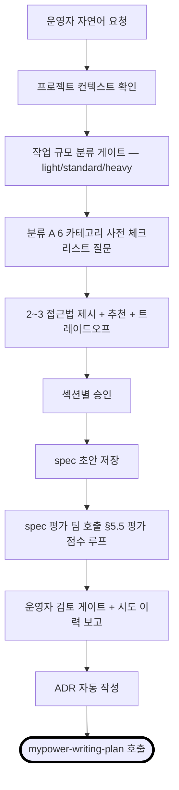
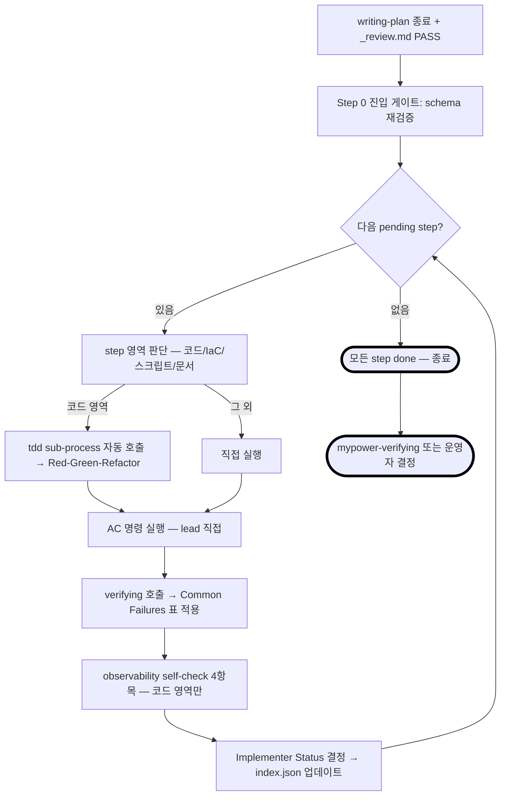
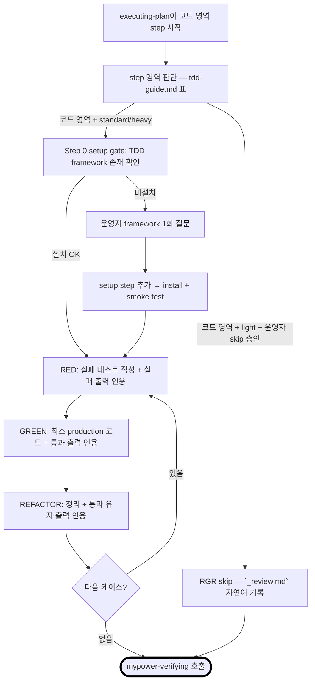

# mypower v1 빌드 Implementation Plan

> **For agentic workers:** REQUIRED SUB-SKILL: Use superpowers:subagent-driven-development (recommended) or superpowers:executing-plans to implement this plan task-by-task. Steps use checkbox (`- [ ]`) syntax for tracking.

**Goal:** Claude Code plugin `mypower` v1을 처음부터 빌드. 6단계 lifecycle 슬래시 스킬 + tdd sub-process + 12 reviewer 페르소나 + references 카탈로그 + destructive 명령 차단 hook을 MyPower repo의 `plugin/` 디렉토리에 모두 배치하고, `plugin/tests/smoke.sh`로 `/plugin marketplace add` → `/plugin install` → `/plugin uninstall` 흐름을 검증한 뒤, 운영자 직접 토이 프로젝트로 6 lifecycle 통합 동작까지 1회 검증해 v1 완료.

**Architecture:**
- mypower는 Claude Code plugin 표준 (`.claude-plugin/plugin.json` + `marketplace.json` + `hooks/hooks.json`) 위에 놓인다. 운영자가 `git pull` → `claude plugin update` 한 줄 alias로 갱신.
- 산출물 카테고리 3종: ① 운영자가 외울 슬래시 6개 + tdd 자동 호출 = `skills/<name>/SKILL.md` 7개, ② 12명 페르소나 = `agents/<name>.md` 1층 + `references/persona-checklists/<name>.md` 2층, ③ 강제력 = prompt-level 4 장치(`<HARD-GATE>`/Iron Law/mermaid 종료 노드/`REQUIRED SUB-SKILL`) + hooks 1개(`applying-approval-gate.sh`).
- self-bootstrap: v1 빌드 plan 자체는 superpowers writing-plans로 작성 (mypower writing-plan은 Step 7에서 빌드되는 산출물). §5.5 평가 점수 루프·§6.2.2 결정 카탈로그·§6.1.3 사전 체크리스트는 v1.1부터 self-application.

**Tech Stack:** Claude Code plugin (manifest JSON), bash 5+ (smoke.sh / applying-approval-gate.sh), markdown (SKILL.md / agents / references), git (MyPower repo 단일 + `plugin/` 영역이 install 대상).

**Source of truth:**
- Spec: [`docs/specs/2026-05-09-mypower-design.md`](../../specs/2026-05-09-mypower-design.md) (현재 최신은 v3.15 — frontmatter top 1줄 "최종 갱신: 2026-05-12 | v3.15"만 차수 인용)
- 핸드오프 v3.14: [`docs/specs/2026-05-11-mypower-handoff-v3.14.md`](../../specs/2026-05-11-mypower-handoff-v3.14.md) (§5 워크스페이스 골격 + §6 운영 모드 확인 결과 — Step 0 사전 확인 행 인용)
- ADR: [plugin-adopt](../../adrs/2026-05-11-mypower-plugin-adopt.md), [subagent-memory](../../adrs/2026-05-11-mypower-subagent-memory.md), [changelog-policy](../../adrs/2026-05-11-mypower-changelog-policy.md)
- 빌드 순서 표: spec §11.2 (Step 0~13). 본 plan은 같은 번호 체계를 따른다.
- §1.4 mypower 분류 A 사전 응답: spec L47~L62. 모든 step의 결정 카탈로그 G2(§6.2.2)에서 인용.

**self-bootstrap 메타 결정 (v1 빌드 plan 한정 미적용)**:
- §5.5 평가 점수 루프 — `_review.md` 산출 안 함, plan 평가 팀 호출 없음
- §6.1.3 분류 A 사전 체크리스트 — §1.4에 이미 박힌 mypower 자체 응답을 인용만
- §6.2.2 결정 카탈로그(G2) — 본 plan은 superpowers writing-plans 포맷을 따르므로 step별 7섹션 강제 안 함. 단 각 step에 "결정 카탈로그 인용" 박스 1개로 §1.4 응답을 step에 박는다(다음 LLM이 자율 결정 없이 인용 가능)

## Evaluation Loop History (운영자 명시 호출 — self-bootstrap 미적용이므로 별도 `_review.md` 미생성, 본 표에 기록)

§5.5 평가 점수 루프는 self-bootstrap 미적용이지만 운영자가 v1 빌드 plan 품질 보강을 위해 명시 호출. 본 표는 round 1·2 시도 이력 + 점수 추이 + 적용된 fix 요약.

| 회차 | 모드 | 평가자 (lens) | 점수 (C/I/N/F) | 판정 | 자동 수정 요약 |
|---|---|---|---|---|---|
| 1 | agent-team (학습 목적) | mypower-plan-eval 팀 3명 (completeness / ambiguity / scope-clarity) | 0 / 7 / 4 / 4 | FAIL | Important 7건 + Nit 핵심 3건 plan 본문 반영 (handoff 외부 참조 / destructive SSOT 양측 / hook PROJECT_ROOT fallback / persona-checklists 도메인 함정 4건 / 12 페르소나 description 일관 골격 / Step 7·11 line range / Out of Scope 섹션 / memory scope 매핑 / ADR 6 섹션) |
| 2 | subagent 병렬 (spec §8.1 권장 모드) | 3명 subagent — completeness / ambiguity / scope-clarity (격리 강화 §5.5.5 옵션 c) | 2 / 6 / 7 / 7 | FAIL | 운영자 검토 게이트 진입 — round 2가 round 1보다 더 깊게 검토 결과 Critical 2건(Step 2 5-tier severity grep 결함·운영자 검토 게이트 commit 14건 vs 실제 15건) 신규 발굴. fix 자동 적용 보류, 운영자 결정 대기 |

§5.5.4 자동 수정 범위 제한 적용: round 2 finding 중 (a) Critical 2건 = 빌드 직결 — 즉시 fix 후보, (b) Important 6건 = 결정 분기 필요 — 운영자 검토 대상. **3회 상한(§5.5.2) 도달 전이나 round 2가 round 1보다 점수 악화 추세이므로 §5.5.3 형식으로 운영자 호출 진행**.

운영자 결정 (2026-05-12): **옵션 B 채택** — Critical 2건만 즉시 fix + Important 6건은 운영자 직접 검토 후 결정. round 3 진입 보류.

| 추가 fix | 위치 | 내용 |
|---|---|---|
| Critical 1 | Step 2.13 grep | 5-tier severity 5개 라벨 각각 grep 후 누락 라벨 명시 출력 — 한 줄 순차 매치 요구 제거 |
| Critical 2 | 운영자 검토 게이트 commit 카운트 | "commit 14건" → "commit 15건 (Step 0가 0.8 + 0.10 두 번, Step 1~13 각 1번)" 정확화 |

남은 Important 6건 — 운영자 직접 검토 + spec 갱신 / plan 보강 / v1.1 백로그 중 분기 결정 대상. 본 plan은 PASS 미달성 상태로 v1 빌드 진입 (self-bootstrap 미적용 plan이라 평가 루프 PASS는 비강제).

## Out of Scope (spec §1.3 + §14 v1.1 백로그 인용)

본 v1 빌드 plan에서 다루지 않는 항목 — 평가 시 scope-clarity / completeness 페르소나가 "out of scope" 사유로 BLOCK 처리:

- 다른 IDE 지원 (Cursor / Gemini / Codex) — spec §1.3 비목표
- BDD 강제 워크플로우 (TDD는 코드 영역 한정, §6.4)
- Git worktree 자동 관리
- prod SRE 영향 분석 (PagerDuty / SLO 알람 자동화)
- v1.1 백로그 §14:
  - #19 LangGraph checkpointer (스킬 상태 저장)
  - #20 CrewAI memory 정형화
  - #21 LangSmith tracing 통합
  - #22 debugging 스킬 신설
  - #23 hooks 추가 도입 (commit-msg / pre-push 등)

**작업 디렉토리 anchor**: 본 plan의 절대 경로는 모두 `~/Projects/MyPower/` 기준 (v3.15부터 — ADR `docs/adrs/2026-05-12-mypower-docs-plugin-split.md`). 이하 표기 편의를 위해 `${HARNESS}`로 줄여 인용 (실행 시 절대 경로로 치환). MyPower repo 단일 git repo + 두 영역으로 분리:
- `${HARNESS}/docs/` = 의사결정 누적 (spec·plan·ADR — git commit 포함, `/plugin install`엔 무관)
- `${HARNESS}/plugin/` = Claude Code plugin install 대상 (skills·agents·references·hooks·tests + `.claude-plugin/plugin.json`). marketplace.json은 repo root `.claude-plugin/marketplace.json`에 두고 `source: "./plugin"`으로 plugin/만 cache 복사
- 마켓플레이스 이름 = `mypower-dev`, plugin slug = `mypower` — install 명령은 `mypower@mypower-dev` 형식

---

## 0. 빌드 시작 전 사전 확인 (Step 0 진입 전 1회)

다음 모두 충족 후 Step 0 진입. 미충족 시 운영자에 보고 후 중단:

- [ ] `${HARNESS}/docs/specs/2026-05-09-mypower-design.md` 존재 + L2 frontmatter top에 "최종 갱신: 2026-05-12 | v3.15" 1행 grep 1건
- [ ] `${HARNESS}/docs/adrs/2026-05-11-mypower-{plugin-adopt,subagent-memory,changelog-policy}.md` 3개 모두 존재
- [ ] `${HARNESS}/plugin/` 디렉토리 존재 (빈 골격 — handoff §5 L42~L57 인용)
- [ ] 운영자 환경 `~/.claude/settings.json`에 `CLAUDE_CODE_EXPERIMENTAL_AGENT_TEAMS=1` 활성 (핸드오프 §6 L59~L64 확인 완료)
- [ ] `which claude` 출력 = Claude Code CLI 절대 경로 존재 + `claude --version` 출력 grep
- [ ] `which gh` 출력 존재 (PR 리뷰 스킬이 의존)
- [ ] superpowers 플러그인 v5.1.0 활성 — `ls ~/.claude/plugins/cache/claude-plugins-official/superpowers/5.1.0/` 출력에 `skills/` 디렉토리 존재

> 위 6개 중 하나라도 누락이면 Step 0 시작 금지. 운영자 호출.

---

## Step 0: 워크스페이스 + plugin manifests + smoke.sh

**Goal:** MyPower repo의 plugin/ 디렉토리를 Claude Code plugin source로 부트스트랩 + root에 marketplace.json 배치. plugin manifest 2개(root marketplace.json + plugin/plugin.json) + hooks 등록 manifest + smoke test를 작성하고, `/plugin marketplace add ./` → `/plugin install mypower@mypower-dev` → 자동 인식 검증 → `/plugin uninstall mypower@mypower-dev` 흐름 + docs/ install 미포함 확인이 통과해야 다음 step.

**Files:**
- Create: `${HARNESS}/.claude-plugin/marketplace.json` (root — `/plugin marketplace add` entry point. `plugins[0].source: "./plugin"`)
- Create: `${HARNESS}/plugin/.claude-plugin/plugin.json` (plugin manifest)
- Create: `${HARNESS}/plugin/hooks/hooks.json`
- Create: `${HARNESS}/plugin/hooks/.gitkeep` (Step 5 스크립트 도착 전까지 디렉토리 보존)
- Create: `${HARNESS}/plugin/tests/smoke.sh` (chmod 755)
- Create: `${HARNESS}/plugin/README.md` (plugin 사용자용 — 슬래시 6개 + 페르소나 사용법)
- Create: `${HARNESS}/README.md` (프로젝트 전체 안내 — toy/learning 목적 + docs/ 학습 자료 + plugin install 흐름)
- Modify: `${HARNESS}/plugin/commands/` → 디렉토리 존재 시 삭제 (spec §12 "commands/ 디렉토리 없음")
- Create: `${HARNESS}/.gitignore` (root — macOS·iCloud·Claude cache·secrets·node·python·build·.claude/agent-memory/)

**결정 카탈로그 인용 (§1.4 spec L51~L58):**

| 카테고리 | 본 step 적용 |
|---|---|
| 보안 | manifest 파일에 secret 없음. hooks.json 본문은 `${CLAUDE_PLUGIN_ROOT}` 환경변수 인용만 — 절대 경로 박지 않음 |
| 데이터 스키마 | plugin.json 6필드(name·version·description·author·repository·license), marketplace.json 5필드(name·description·owner·plugins[0].name·plugins[0].source) 모두 spec §4.1 minimal schema 인용 |
| 비용 | 본 step은 토큰 비용 없는 manifest 작성. agent-team 호출 없음 |
| scope | spec §4.1 디렉토리 트리에 명시된 산출물 한정. `commands/` 디렉토리는 spec §12 트레이드오프 표 "commands/ 디렉토리 없음" 결정에 따라 삭제 |
| TDD framework | spec §1.4 mypower 자체 빌드 결정 — `tests/smoke.sh` 1개로 plugin install/uninstall 동작 + hook script destructive 패턴 차단 검증. bats 등 추가 의존성 없음 |
| 로깅 정책 | smoke.sh = bash `set -euo pipefail` + 실패 시 stderr 출력 + exit 1. JSON 구조화·요청ID 미적용 (v1.1 백로그) |

### Sub-steps

- [ ] **0.1 commands/ 디렉토리 제거**

`commands/`는 빈 채로 남아 있으면 Claude Code가 빈 슬래시 카탈로그를 잘못 인식할 수 있고, spec §12 트레이드오프 표 "commands/ 디렉토리 없음 — skills/ 자동 슬래시 등록 + 충돌 회피"와 어긋난다.

```bash
ls "${HARNESS}/plugin/commands/" 2>/dev/null
# 출력이 비어 있으면 (빈 디렉토리이면):
rmdir "${HARNESS}/plugin/commands/"
# 출력에 파일이 1개라도 있으면 운영자 호출 — 자율 삭제 금지
```

검증: `ls "${HARNESS}/plugin/commands/" 2>&1 | grep "No such file"` 1행 출력.

- [ ] **0.2 `${HARNESS}/.gitignore` 작성 (root)**

v3.15 분리 구조 + 운영자 합의 항목 (2026-05-12 결정 — agent-memory ignore, working drafts 디렉토리 없음):

```gitignore
# macOS
.DS_Store
.AppleDouble
.LSOverride
Icon
._*
.Spotlight-V100
.Trashes
.fseventsd

# iCloud placeholder (이동 후에도 잔존 가능)
*.icloud

# Claude Code plugin cache
.claude-plugin/cache/

# Claude agent-memory (project-scope) — 운영자 개인 데이터로 격리, git churn 방지
.claude/agent-memory/

# Editor / IDE
.vscode/
.idea/
*.swp
*.swo
*~

# Logs / temp / cache
*.log
*.tmp
*.bak
.cache/
tmp/
temp/

# Secrets
.env
.env.*
*.key
*.pem
credentials.json
secrets.json

# Node
node_modules/

# Python
__pycache__/
*.pyc
.pytest_cache/
.venv/
venv/

# Build artifacts
coverage/
dist/
build/
.tsbuildinfo
```

- [ ] **0.3 `${HARNESS}/plugin/.claude-plugin/plugin.json` 작성**

spec §4.1·§11.2 Step 0 AC 인용. **6필드 minimal schema** (name·version·description·author·repository·license).

```json
{
  "name": "mypower",
  "version": "1.0.0",
  "description": "Multi-agent skill framework for Claude Code (6 lifecycle skills + tdd sub-process + 12 reviewer personas)",
  "author": { "name": "<owner-name>", "email": "<owner-email>" },
  "repository": "https://github.com/<owner>/mypower",
  "license": "MIT"
}
```

> [!IMPORTANT]
> `<owner-name>` / `<owner-email>` placeholder는 운영자 식별자 일반화 결정 (ADR plugin-adopt §2 "운영자 식별자 일반화") 따라 v1 빌드 시 운영자 본인 값으로 치환할 필요 없다. 운영자가 본인 fork 시 placeholder를 본인 값으로 갈아끼움. 단 `<owner>` 두 자리(repository URL) 모두 동일 값이어야 함.

- [ ] **0.4 `${HARNESS}/.claude-plugin/marketplace.json` 작성 (root — entry point)**

v3.15 분리 구조: marketplace.json은 root `.claude-plugin/` 위치 (GitHub repo root에서 `/plugin marketplace add` 자동 발견). minimal schema 5필드 (name·description·owner·plugins[0].name·plugins[0].source). **`source: "./plugin"`로 plugin/ 디렉토리만 cache 복사**.

```json
{
  "name": "mypower-dev",
  "description": "mypower skills library marketplace",
  "owner": { "name": "<owner-name>", "email": "<owner-email>" },
  "plugins": [
    {
      "name": "mypower",
      "description": "Multi-agent skill framework for Claude Code (6 lifecycle skills + tdd sub-process + 12 reviewer personas)",
      "version": "1.0.0",
      "source": "./plugin",
      "author": { "name": "<owner-name>", "email": "<owner-email>" }
    }
  ]
}
```

`source: "./plugin"` — repo root에서 본 디렉토리만 `~/.claude/plugins/cache/`로 복사. docs/는 git clone에 포함되지만 plugin install엔 무관 (ADR `docs/adrs/2026-05-12-mypower-docs-plugin-split.md`).

- [ ] **0.5 `${HARNESS}/plugin/hooks/.gitkeep` + `${HARNESS}/plugin/hooks/hooks.json` 작성**

```bash
: > "${HARNESS}/plugin/hooks/.gitkeep"
```

hooks.json 본문 (spec §4.5 L335~L353 인용 — `${CLAUDE_PLUGIN_ROOT}` 환경변수 사용 + `applying-approval-gate.sh` 참조):

```json
{
  "hooks": {
    "PreToolUse": [
      {
        "matcher": "Bash",
        "hooks": [
          {
            "type": "command",
            "command": "\"${CLAUDE_PLUGIN_ROOT}/hooks/applying-approval-gate.sh\"",
            "async": false
          }
        ]
      }
    ]
  }
}
```

> [!IMPORTANT]
> `applying-approval-gate.sh` 본체는 Step 5에서 작성. Step 0에서는 hooks.json만 배치. 정상적인 install 흐름은 Step 5 완료 후에만 통과 — Step 0 smoke.sh도 "스크립트 부재 단계"에선 install 단계만 통과 / hook 동작 검증은 Step 5 smoke 확장 시 추가.

- [ ] **0.6 `${HARNESS}/plugin/tests/smoke.sh` 작성 (Step 0 한정 항목만)**

본 step에서 smoke.sh는 plugin 등록·인식·해제 흐름만 검증. Step 5 완료 후 같은 파일을 확장해 hook destructive 차단 검증 추가.

```bash
#!/usr/bin/env bash
# mypower v1 smoke test — plugin install/uninstall + skills/agents 인식 + hook 차단 동작
# v1 빌드 step별로 점진 확장:
#   - Step 0: plugin marketplace add / install / uninstall + skills·agents 인식 grep
#   - Step 5: hook script 실행 + destructive 패턴 stub → exit 1 + stderr 메시지 검증
#   - Step 13: 6 lifecycle 통합 (운영자 토이 프로젝트로 별도 검증, smoke.sh는 정적 검증만)

set -euo pipefail

# --- 사전 가드 ---
if ! command -v claude >/dev/null 2>&1; then
    echo "FAIL: claude CLI 미설치 — PATH 확인" >&2
    exit 1
fi
if ! command -v jq >/dev/null 2>&1; then
    echo "FAIL: jq 미설치 — manifest 검증 도구 필요" >&2
    exit 1
fi

# --- 분기점 1a: plugin 명령 존재 사전 검증 (spec §4.2 NOTE 박스 인용) ---
echo "[1a] claude plugin --help 출력 확인"
claude plugin --help 2>&1 | grep -E "update|install|uninstall" >/dev/null || {
    echo "FAIL: claude plugin 명령 변경됨 — fallback ADR 필요 (docs/adrs/YYYY-MM-DD-plugin-cmd-fallback.md)" >&2
    exit 1
}

# --- manifest 정적 검증 ---
# tests/smoke.sh 기준 디렉토리 anchor: PLUGIN_DIR = tests/.. = plugin/ / ROOT_DIR = plugin/.. = repo root
PLUGIN_DIR="$(cd "$(dirname "$0")/.." && pwd)"
ROOT_DIR="$(cd "${PLUGIN_DIR}/.." && pwd)"

echo "[2] plugin/.claude-plugin/plugin.json 6필드 검증"
jq -e '.name and .version and .description and .author and .repository and .license' "${PLUGIN_DIR}/.claude-plugin/plugin.json" >/dev/null \
    || { echo "FAIL: plugin.json 필드 누락" >&2; exit 1; }

echo "[3] root .claude-plugin/marketplace.json 5필드 + source 검증 (spec §4.1 minimal schema)"
jq -e '.name and .description and .owner and (.plugins[0].name) and (.plugins[0].source == "./plugin")' "${ROOT_DIR}/.claude-plugin/marketplace.json" >/dev/null \
    || { echo "FAIL: marketplace.json 필드 누락 또는 source != \"./plugin\"" >&2; exit 1; }

echo "[4] hooks.json PreToolUse Bash matcher 검증"
jq -e '.hooks.PreToolUse[0].matcher == "Bash"' "${PLUGIN_DIR}/hooks/hooks.json" >/dev/null \
    || { echo "FAIL: hooks.json matcher 누락" >&2; exit 1; }
jq -e '.hooks.PreToolUse[0].hooks[0].command | contains("applying-approval-gate.sh")' "${PLUGIN_DIR}/hooks/hooks.json" >/dev/null \
    || { echo "FAIL: hooks.json command 인용 누락" >&2; exit 1; }

# --- plugin install/uninstall 흐름 ---
echo "[5] /plugin marketplace add → install → uninstall 흐름"
echo "    수동 검증 항목 — 운영자가 Claude Code에서 다음 명령 실행 후 출력 캡처:"
echo "    /plugin marketplace add ${ROOT_DIR}"
echo "    /plugin install mypower@mypower-dev"
echo "    ls ~/.claude/plugins/ | grep mypower"
echo "    /plugin uninstall mypower@mypower-dev"
echo "    ls ~/.claude/plugins/ | grep mypower   # 0줄 기대"
echo "    위 5개 명령 출력 인용은 Step 0 검증 절차에 별도 기록"

echo "PASS: Step 0 정적 검증 완료. plugin install 흐름은 운영자 수동 검증 필요."
```

```bash
chmod 755 "${HARNESS}/plugin/tests/smoke.sh"
```

- [ ] **0.7 `${HARNESS}/plugin/README.md` 작성**

```markdown
# mypower

Claude Code plugin — 6단계 lifecycle 스킬(brainstorming / writing-plan / executing-plan / verifying / pr-review / applying) + tdd sub-process + 12명 reviewer 페르소나.

## 설계 문서

본 repo의 `docs/specs/2026-05-09-mypower-design.md`. plugin source(skills·agents·references·hooks·tests)는 `plugin/` 하위. v3.15 디렉토리 분리 결정 — ADR `docs/adrs/2026-05-12-mypower-docs-plugin-split.md`.

## 설치

### 시나리오 A — 운영자 본인 default (로컬 git working copy)

\`\`\`bash
git clone https://github.com/<owner>/MyPower ~/Projects/MyPower
/plugin marketplace add ~/Projects/MyPower        # root .claude-plugin/marketplace.json 자동 발견
/plugin install mypower@mypower-dev               # plugin/ 디렉토리만 cache로 복사 — docs/ 무관
\`\`\`

이후 갱신:

\`\`\`bash
cd ~/Projects/MyPower && git pull
claude plugin update mypower@mypower-dev
\`\`\`

### 시나리오 B — 외부 사용자 (fork·marketplace)

\`\`\`bash
/plugin marketplace add <owner>/MyPower
/plugin install mypower@mypower-dev
\`\`\`

> docs/(spec·plan·ADR)는 `git clone`엔 포함되지만 `/plugin install`로 cache에 안 따라감 — 학습 자료로 보고 싶으면 git clone 후 본 repo 직접 cd.

### 시나리오 C — 개발 중 빠른 테스트 보조

\`\`\`bash
claude --plugin-dir ~/Projects/MyPower/plugin     # plugin/ 디렉토리 직접 지정
\`\`\`

설치 후 6 lifecycle 슬래시 호출:

| 단계 | 슬래시 |
|---|---|
| 1 | /brainstorming |
| 2 | /writing-plan |
| 3 | /executing-plan |
| 4 | /verifying |
| 5 | /pr-review |
| 6 | /applying |

`/tdd`는 executing-plan 코드 영역 step에서 sub-process로 자동 호출.

## 강제력 장치

prompt-level 4종 (`<HARD-GATE>` / Iron Law / mermaid 종료 노드 / `REQUIRED SUB-SKILL`) + hooks 1개 (`applying-approval-gate.sh` — destructive 명령 차단).

## License

MIT.
```

- [ ] **0.7b `${HARNESS}/README.md` 작성 (root — 프로젝트 전체 안내)**

```markdown
# MyPower

Claude Code 운영자용 멀티 에이전트 스킬 프레임워크 — toy/educational project.

## 두 영역

- `plugin/` = Claude Code plugin source (skills·agents·references·hooks·tests). `/plugin install`로 cache에 복사되는 install 대상
- `docs/` = 의사결정 누적 (spec·plan·ADR). git clone에 포함, `/plugin install`엔 무관. 운영자 학습 자료로 외부 사용자도 열람 가능

## 설치 흐름

본 README 하위 plugin install 흐름은 `plugin/README.md`에 동일하게 박혀 있음. 운영자 본인은:

\`\`\`bash
/plugin marketplace add ~/Projects/MyPower
/plugin install mypower@mypower-dev
\`\`\`

## 의사결정 누적 학습 자료

- spec: `docs/specs/2026-05-09-mypower-design.md` (v3.15)
- 빌드 plan: `docs/superpowers/plans/2026-05-11-mypower-v1-build.md`
- ADR: `docs/adrs/*.md` (plugin-adopt / subagent-memory / changelog-policy / docs-plugin-split / v1 빌드 완료 ADR 등)

## License

MIT.
```

- [ ] **0.8 MyPower repo git 초기화 + 첫 commit**

```bash
cd "${HARNESS}"
git init -b main
# 의사결정 누적 + plugin 골격 모두 첫 commit에 박는다
git add docs/ .claude-plugin/ plugin/ README.md .gitignore
git commit -m "build(step0): MyPower repo 골격 + plugin manifest + docs 누적

- root .claude-plugin/marketplace.json (source: ./plugin)
- plugin/.claude-plugin/plugin.json
- plugin/hooks/hooks.json + .gitkeep
- plugin/tests/smoke.sh
- plugin/README.md + root README.md
- .gitignore (macOS·iCloud·secrets·node·python·build·.claude/agent-memory/)
- docs/specs/ + docs/adrs/ + docs/superpowers/plans/ (spec v3.15 + ADR 4개 + v1 빌드 plan)"
```

- [ ] **0.9 Step 0 검증 — smoke.sh 정적 + 수동 plugin 흐름**

```bash
bash "${HARNESS}/plugin/tests/smoke.sh"
# 기대: 최종 한 줄 "PASS: Step 0 정적 검증 완료. plugin install 흐름은 운영자 수동 검증 필요."
```

운영자 수동 검증 (Claude Code 세션에서 실행 후 출력 인용):

```
/plugin marketplace add ${HARNESS}
/plugin install mypower@mypower-dev
ls ~/.claude/plugins/ | grep mypower
/plugin uninstall mypower@mypower-dev
ls ~/.claude/plugins/ | grep mypower   # 0줄 기대
```

> [!IMPORTANT]
> Step 0의 plugin install 수동 검증은 운영자가 직접 실행 — LLM이 `/plugin` 명령을 Bash로 실행 불가 (Claude Code 슬래시 커맨드는 LLM tool 호출이 아님). 본 step은 정적 검증 + 운영자 수동 검증 출력 인용까지 통과해야 다음 step.

- [ ] **0.10 commit (출력 인용 포함)**

```bash
cd "${HARNESS}"
git add -A
git commit --allow-empty -m "build(step0): smoke.sh 정적 검증 통과 + 운영자 수동 install 검증 완료"
```

---

## Step 1: references 코어 6개

**Goal:** references/ 하위 6개 가이드 markdown 파일을 작성. agents·skills 본문이 이 references를 Read tool로 로드해 적용하는 단일 진실 출처. observability-guide의 self-check 4항목은 §6.3.3-1 spec에 박혀 있어 1:1 인용.

**Files:**
- Create: `${HARNESS}/plugin/references/adr-template.md`
- Create: `${HARNESS}/plugin/references/observability-guide.md`
- Create: `${HARNESS}/plugin/references/tech-currency-guide.md`
- Create: `${HARNESS}/plugin/references/critical-decisions-guide.md`
- Create: `${HARNESS}/plugin/references/tdd-guide.md`
- Create: `${HARNESS}/plugin/references/decision-catalog-template.md`

**결정 카탈로그 인용 (§1.4):**

| 카테고리 | 본 step 적용 |
|---|---|
| 보안 | references 본문에 secret 없음 |
| 데이터 스키마 | 영구 저장 데이터 없음 (가이드 markdown만) |
| 비용 | LLM 토큰 비용은 가이드 길이에 따라 결정. observability-guide·tdd-guide 각 ~80줄, 나머지 ~50줄 목표 — 운영자가 한 페이지로 검토 가능 (§1.2 목표 1) |
| scope | spec §9.1 references 파일 표 + §9.2.1~§9.2.3 본문 정의에 한정. `persona-checklists/` 12개는 Step 2에서 별도 처리 |
| TDD framework | 본 step 산출물은 markdown — `grep placeholder 0건 + 본문 절차 grep` 검증 (§1.4 mypower 자체 빌드 행 인용) |
| 로깅 정책 | observability-guide.md 본문에 spec §9.2.1 5개 헤더(로깅 / 메트릭 / Trace / 에러 핸들링 / 민감정보) 인용 |

### Sub-steps

- [ ] **1.1 `${HARNESS}/plugin/references/adr-template.md` 작성**

spec §9.3.1 L1972~L1995 본문 1:1 인용. 본문 6 섹션: 배경 / 결정 / 이유 / 트레이드오프 / 영향 / 후속 추적.

```bash
# 검증 grep (작성 후):
grep -E "^## (배경|결정|이유|트레이드오프|영향|후속 추적)" \
    "${HARNESS}/plugin/references/adr-template.md" | wc -l
# 기대: 6
```

- [ ] **1.2 `${HARNESS}/plugin/references/observability-guide.md` 작성**

spec §9.2.1 L1841~L1863 본문 5 헤더(로깅 / 메트릭 / Trace · Correlation ID / 에러 핸들링 / 민감정보) + §6.3.3-1 L1036~L1042 self-check 4항목 표를 함께 박는다. 두 출처를 한 파일에 통합 — agents·skills가 본 파일을 한 번 로드하면 코드 작성 가이드 + self-check 동시 적용.

본문 골격:

```markdown
# Observability 가이드

> 본 가이드는 executing-plan 코드 작성 subagent + pr-review observability-reviewer가 공유. spec §9.2.1 + §6.3.3-1 단일 진실 출처.

## 로깅
{spec §9.2.1 L1841~L1845 본문 인용}

## 메트릭
{spec §9.2.1 L1846~L1850 본문 인용}

## Trace / Correlation ID
{spec §9.2.1 L1851~L1854 본문 인용}

## 에러 핸들링
{spec §9.2.1 L1855~L1859 본문 인용}

## 민감정보
{spec §9.2.1 L1860~L1862 본문 인용}

## self-check 4항목 (코드 영역 step 종료 직전 lead 점검)

| # | 항목 | 검증 방법 |
|---|---|---|
| 1 | 함수 진입·이상 분기·외부 호출 직전/직후 로깅 존재 | 변경 파일에 로그 호출 grep |
| 2 | 외부 호출 latency 메트릭 또는 명시적 면제 사유 | 변경된 외부 호출 함수 인근 메트릭 호출 grep |
| 3 | 에러 핸들링에 stack trace + context | try/catch 블록 grep, silent catch 0건 |
| 4 | 민감정보 로깅 0건 | 비밀번호·토큰·API key 변수명 + 로그 호출 grep |

self-check 결과는 `index.json`의 해당 step에 `observability_check: {1: pass|fail, 2: pass|fail, 3: pass|fail, 4: pass|fail}` 형태로 기록.
```

```bash
# 검증 grep:
grep -c "^## " "${HARNESS}/plugin/references/observability-guide.md"
# 기대: 6 (5 헤더 + self-check 1 = 6)
grep -E "observability_check.*pass\|fail" "${HARNESS}/plugin/references/observability-guide.md" | wc -l
# 기대: 1 이상
```

- [ ] **1.3 `${HARNESS}/plugin/references/tech-currency-guide.md` 작성**

spec §9.2.2 L1873~L1918 본문 1:1 인용. 5 헤더(호출 trigger / 호출하지 않는 경우 / 어떤 도구로 확인하나 / 무엇을 확인하나 / 출력 규칙 / 안티패턴). 톤 가드("최신 메이저 버전 강요 아님") 본문 L1869 인용을 헤더 위 인용 박스에 포함.

```bash
# 검증:
grep -E "최신 메이저.*강요.*아니" "${HARNESS}/plugin/references/tech-currency-guide.md" | wc -l
# 기대: 1 이상 (톤 가드 박힘)
grep -E "AWS Knowledge MCP|Context7 MCP" "${HARNESS}/plugin/references/tech-currency-guide.md" | wc -l
# 기대: 2 이상
```

- [ ] **1.4 `${HARNESS}/plugin/references/critical-decisions-guide.md` 작성**

spec §9.2.3 L1926~L1966 본문 1:1 인용. 핵심: 모호 시 원칙(분류 A) / 분류 A 카테고리 / 분류 B 자율+ADR / 분류 C 자율 / 게이트 형식 / 안티패턴. 본문에서 §6.3.5 게이트 형식(L1078~L1093 인용)을 그대로 박아 운영자 호출 메시지가 한 파일에서 끝나도록.

```bash
# 검증:
grep -E "분류 A|분류 B|분류 C" "${HARNESS}/plugin/references/critical-decisions-guide.md" | wc -l
# 기대: 3 이상
grep -E "plan scope 위반.*분류 A" "${HARNESS}/plugin/references/critical-decisions-guide.md" | wc -l
# 기대: 1 이상 (scope 위반 격상 결정 인용)
```

- [ ] **1.5 `${HARNESS}/plugin/references/tdd-guide.md` 작성**

spec §6.4.2 L1188~L1204 영역 판단 표 + §6.4.3 L1207~L1225 Red-Green-Refactor 절차 + §6.4.5 L1240~L1246 Rationalizations 표 통합. light scope 예외 단서(§6.4.1 절대 법칙 행 "단 하나의 예외: scope_class=light 코드 step에서 운영자 명시 승인을 받은 경우만 RGR skip 가능") 본문 grep 가능 위치에 박는다.

```bash
# 검증:
grep -E "scope_class=light.*운영자 명시 승인.*RGR skip" "${HARNESS}/plugin/references/tdd-guide.md" | wc -l
# 기대: 1 이상
grep -E "RED.*실패.*테스트|GREEN.*통과.*최소.*production|REFACTOR" "${HARNESS}/plugin/references/tdd-guide.md" | wc -l
# 기대: 3 이상
```

- [ ] **1.6 `${HARNESS}/plugin/references/decision-catalog-template.md` 작성**

spec §6.2.2 L763~L781 결정 카탈로그 6항목(에러 정책 / 로깅 레벨 + 메시지 포맷 / retry · timeout / 입력 검증 정책 / 데이터 스키마 / 의존성 import 방향) 각 항목에 **SRE/플랫폼 도메인 default 값** 명시. fork 시 다른 도메인 운영자가 갈아끼우는 영역. spec §1.1 운영자 컨텍스트(SRE/플랫폼) 가정.

본문 골격:

```markdown
# 결정 카탈로그 템플릿 (SRE/플랫폼 도메인 default)

> step{N}.md `## 결정 카탈로그` 섹션에서 "default 따름" 인용 시 본 파일 §X 참조. fork 시 다른 도메인 운영자는 본 default를 갈아끼움.

## §1 에러 정책 default
- raise + 구조화 로그 (`{level: ERROR, stack, context.request_id}`)
- HTTP 응답 4xx는 입력 검증 실패, 5xx는 내부 에러로 분리

## §2 로깅 레벨 + 메시지 포맷 default
- INFO 기본. 함수 진입·외부 호출 직전/직후 INFO. 이상 분기 WARN. 예외 ERROR
- 포맷: JSON 구조화 + 필수 필드 (`timestamp`, `level`, `request_id`, `message`)

## §3 retry · timeout default
- 외부 호출 retry: 지수 backoff 3회 (초기 100ms, max 1s)
- timeout: 5s (long-running batch는 step 본문에 별도 명시)

## §4 입력 검증 정책 default
- whitelist + 거부 시 4xx + `Invalid input: {field}` 메시지
- 외부 입력은 함수 진입 직후 검증, 내부 호출은 검증 생략

## §5 데이터 스키마 default
- 영구 저장 없음. 임시 캐시는 in-memory dict
- DB 필요 시 분류 A 게이트로 격상 — spec §6.3.5 보안·데이터 스키마 카테고리

## §6 의존성 import 방향 default
- domain → infra 단방향
- infra → domain 금지 (역방향 발견 시 architect-reviewer Critical)
```

```bash
# 검증:
grep -E "^## §[1-6]" "${HARNESS}/plugin/references/decision-catalog-template.md" | wc -l
# 기대: 6
```

- [ ] **1.7 Step 1 통합 검증**

```bash
# 6 파일 존재 + placeholder 잔존 0건
ls "${HARNESS}/plugin/references/"*.md | wc -l
# 기대: 6

grep -rE "(TBD|TODO|FIXME|XXX|\{slug\}|\{name\})" "${HARNESS}/plugin/references/" --include="*.md" | grep -v "decision-catalog-template" | wc -l
# 기대: 0 (decision-catalog-template.md는 본문에 `{N}` 같은 형식 표기 가능 — 예외 grep)
```

- [ ] **1.8 commit**

```bash
cd "${HARNESS}"
git add plugin/references/
git commit -m "build(step1): references 코어 6개 (adr/observability/tech-currency/critical-decisions/tdd/decision-catalog)"
```

---

## Step 2: persona-checklists/*.md 12개

**Goal:** 12명 페르소나의 2층(`references/persona-checklists/<name>.md`)을 작성. 1층(`agents/<name>.md`)은 Step 3에서 작성하며 본 2층을 Read tool로 로드해 적용. 페르소나별 sub-checklist + 출력 markdown 템플릿 + 5-tier severity 분류 가이드 + 도메인 함정 사례 4개 구성요소를 모두 포함해야 한다 (spec §7.2 L1531~L1535).

**Files (12개):**
- Create: `${HARNESS}/plugin/references/persona-checklists/spec-compliance.md`
- Create: `${HARNESS}/plugin/references/persona-checklists/code-quality.md`
- Create: `${HARNESS}/plugin/references/persona-checklists/tech-currency.md`
- Create: `${HARNESS}/plugin/references/persona-checklists/architect.md`
- Create: `${HARNESS}/plugin/references/persona-checklists/security.md`
- Create: `${HARNESS}/plugin/references/persona-checklists/observability.md`
- Create: `${HARNESS}/plugin/references/persona-checklists/completeness.md`
- Create: `${HARNESS}/plugin/references/persona-checklists/ambiguity.md`
- Create: `${HARNESS}/plugin/references/persona-checklists/scope-clarity.md`
- Create: `${HARNESS}/plugin/references/persona-checklists/change-impact.md`
- Create: `${HARNESS}/plugin/references/persona-checklists/rollback.md`
- Create: `${HARNESS}/plugin/references/persona-checklists/safety-checks.md`

**결정 카탈로그 인용 (§1.4):**

| 카테고리 | 본 step 적용 |
|---|---|
| 보안 | persona-checklists는 markdown — secret 없음 |
| 데이터 스키마 | 영구 저장 없음 |
| 비용 | 파일당 ~150~250줄 목표 (spec §7.2 인용) |
| scope | spec §7.1 12명 + §7.3 핵심 질문 표 + §8.3 5-tier severity 표 적용 한정 |
| TDD framework | grep 검증만 (markdown 산출물) |
| 로깅 정책 | 출력 템플릿이 5단 보고(`[상황]` `[문제]` `[현재 영향]` `[결정 권고]` `[1줄 요약]`) — spec §7.2 L1517 인용 |

### Sub-steps

각 페르소나 1개당 다음 5 구성요소를 본문에 포함 (어순 자율, 모두 grep 가능해야 함):

1. **핵심 질문 1줄** — spec §7.3 표에서 인용
2. **sub-checklist (axis별 항목, 5~15개)** — 페르소나 lens 분해
3. **5-tier severity 분류 가이드** — spec §8.3 라벨 4단(Critical / Important / Nit / Optional / FYI) 본 페르소나에 적용 시 무엇이 어떤 단계인지 예시 2~3개씩
4. **출력 markdown 템플릿** — 페르소나가 finding 작성 시 그대로 복사할 5단 보고 양식
5. **도메인 함정 사례 2~3개** — 본 페르소나가 실제로 잡아야 할 안티패턴 예시

- [ ] **2.1 `spec-compliance.md` 작성**

핵심 질문: "이 PR이 spec/plan과 정확히 일치하는가? 추가/누락/scope 위반?" (§7.3)

sub-checklist 예시:
- (a) PR diff의 모든 파일 변경이 plan에 명시된 step에 매핑되는가
- (b) plan step 7개 섹션 중 "작업"·"금지사항"에 위배 행위 0건
- (c) spec "Out of scope" 영역 침범 0건
- (d) plan에 없는 새 endpoint·새 파일·새 의존성 도입 0건

severity 분류:
- Critical = scope 명시적 위반 (plan에 없는 endpoint 추가 등 — spec §6.3.5 분류 A "plan scope 위반")
- Important = plan AC 명령 누락
- Nit = 변수명이 plan 명시 시그니처와 다름

출력 템플릿: spec §7.2 L1517 5단 보고 양식 그대로.

도메인 함정: "공통 import 파일은 예외" 같은 lib 영역 사후 추가 / scope creep로 plan 갱신 누락된 새 헬퍼 함수 / spec "Out of scope" 영역에 들어간 데이터 모델 변경.

- [ ] **2.2 `code-quality.md` 작성**

핵심 질문: "버그 가능성·이름·테스트 빠짐·뻔한 perf 함정 어디?" (§7.3)

sub-checklist:
- correctness — null check / boundary / off-by-one / 비동기 race
- readability — 변수명·함수명 의도 표현 / nested 깊이 3 초과 / magic number
- 테스트 lens — RGR 사이클 출력 인용 존재 / RED→GREEN 순서 / 테스트가 production 코드 *전에* 작성됐는지
- perf 함정 — N+1 query / unbounded loop / 메모리 누수 의심 패턴만 (본격 perf 분석은 별도 도구 영역, §1.3 비목표)

severity:
- Critical = 명백한 버그 (null dereference 등) / 테스트 없이 production 코드
- Important = N+1 / 가독성 심각
- Nit = 변수명 개선

출력 템플릿 + 도메인 함정 2~3개.

- [ ] **2.3 `tech-currency.md` 작성**

핵심 질문: "사용한 API/라이브러리가 deprecated거나 잘못된 사용 패턴은 아닌가?" (§7.3)

sub-checklist (`tech-currency-guide.md` trigger 조건 인용):
- 본 PR diff에 trigger 조건(deps 변경 / 새 import / 새 API 호출 / 운영자 명시 요청) 발생했는가
- trigger 발생 시 AWS Knowledge MCP / Context7 MCP / web_search 중 어느 도구로 확인했는가 + 출처 URL 인용
- 결론 = `safe` / `deprecated` / `wrong-pattern` 중 하나로 분류
- 결과를 ADR(`docs/adrs/YYYY-MM-DD-{slug}-tech-{n}.md`)에 박았는가

severity:
- Critical = 공식 deprecation 명시 + 다음 메이저에서 제거 예정
- Important = 잘못된 사용 패턴 (공식 docs "Don't do this" 위반)
- FYI = 최신 메이저 아니지만 stable + deprecation 없음 → flag 안 함 (`tech-currency-guide.md` 톤 가드)

> [!IMPORTANT]
> ADR(`subagent-memory.md`) 따라 본 페르소나는 `memory: user` scope. cross-project 학습 누적 — Iron Law는 anchoring 방지(memory가 새 코드에 강제 적용되지 않도록). 1층에서 박는다.

- [ ] **2.4 `architect.md` 작성**

핵심 질문: "이 변경이 아키텍처 경계 깨거나 의존성 방향 뒤집는가?" (§7.3)

sub-checklist:
- (a) 의존성 import 방향 — domain → infra 단방향 보존 (`decision-catalog-template.md` §6)
- (b) 아키텍처 경계 신규 추가 — `docs/ARCHITECTURE.md` 갱신 동반 ADR 존재 여부
- (c) 추상화 누수 — infra 세부사항(SQL 쿼리·HTTP 헤더)이 domain 시그니처에 새는지

severity 분류 + 출력 템플릿 + 도메인 함정.

- [ ] **2.5 `security.md` 작성**

핵심 질문: "보안 취약점·인증 우회·secret 노출 가능성?" (§7.3)

sub-checklist:
- OWASP Top 10 (SQL injection / XSS / CSRF / 인증 우회 등)
- secret 노출 (API key·토큰·DB 패스워드가 로그·git diff에 인용됐는가)
- 입력 검증 — whitelist 위반 / `eval`·`exec` 호출
- 권한 — 새 endpoint에 인증 체크 누락 / IAM policy 과도 권한

severity:
- Critical = 인증 우회 / SQL injection 가능 / secret commit
- Important = 입력 검증 약화 / 권한 과도
- Nit = secret 변수명이 grep 친화적이지 않음

- [ ] **2.6 `observability.md` 작성**

핵심 질문: "이 코드 이상 동작 시 운영자가 1분 안에 원인 짚을 단서 있나?" (§7.3)

sub-checklist: `observability-guide.md` self-check 4항목 그대로 인용 (`로깅 / 메트릭 / 에러 핸들링 / 민감정보`) + 추가 lens:
- request_id 전파 — 모든 외부 호출에 trace_id
- silent catch 0건 (`except: pass` 같은)
- 에러 메시지에 충분한 context (어디서·왜·무엇이)

severity 분류 + 함정.

- [ ] **2.7 `completeness.md` 작성**

핵심 질문: "spec/plan에 빠진 요구사항·미정의 항목 있나?" + 책임 확장(§7.3 G5): "이 step을 다른 세션 LLM이 받았을 때 답 없이 진행 못 하는 질문(executing-plan 시점 `needs_context` 발생 후보)이 무엇인가? 시뮬레이션 1회 후 후보 0건 보장"

sub-checklist:
- spec의 모든 요구사항이 step에 매핑됐는가 (요구사항 → step 매핑 표 생성)
- step{N}.md 7섹션 빈 칸 0건
- §6.1.3 분류 A 6 카테고리 모두 spec에 응답 박힘 (재확인)
- `needs_context` 시뮬레이션 — 본 plan을 fresh LLM이 받았을 때 어떤 질문이 발생할지 1라운드 예측

severity 분류 + 함정.

- [ ] **2.8 `ambiguity.md` 작성**

핵심 질문: "둘 이상 해석 가능한 표현·모호 부사 어디?" + 분류 A 사전 응답 검사(§7.3): "§6.1.3 분류 A 6개 카테고리가 spec에 결정값으로 박혔나? '적절히/필요시/추후' 같은 부사가 분류 A 결정 자리에 들어가 있나?"

sub-checklist:
- placeholder 잔존 grep (`TBD`/`TODO`/`FIXME`/`...`)
- 한국어 모호 부사 의미 검사 (단순 grep 아닌 맥락 인식 — "적절히" "필요시" "추후" 등이 분류 A 결정 자리에 들어가 있는가)
- 다중 해석 가능한 기능 요구사항

severity:
- Critical = 분류 A 결정 자리에 모호 부사 ("인증 정책: 추후 결정")
- Important = 기능 요구사항 다중 해석
- Nit = 산문 영역 모호 부사 (의도적 일반화 허용)

> [!IMPORTANT]
> ADR(`subagent-memory.md`) 따라 본 페르소나는 `memory: user` scope. 언어 자체 검사 lens는 cross-project 학습 누적이 효율적.

- [ ] **2.9 `scope-clarity.md` 작성**

핵심 질문: "Out of scope 명시됐나? scope creep 있나?" (§7.3)

sub-checklist:
- spec "Out of scope" 섹션 존재 + 명시적 항목 1개 이상
- plan의 모든 step이 in-scope 영역만 다룸
- scope creep 식별 — 본 PR에서 plan 갱신 없이 추가된 새 항목

출력 템플릿 = spec §7.2 L1517 5단 보고 양식 그대로 인용 (`[상황]` `[문제]` `[현재 영향]` `[결정 권고]` `[1줄 요약]`).

도메인 함정 (위 sub-checklist 항목 2~3개를 안티패턴 사례로 변환):
- "scope에 명시되지 않은 신규 endpoint·파일 신설을 PR 본문에 'while I was here'로 포함" → BLOCK 권고
- "spec 'Out of scope'에 명시된 항목을 PR에서 슬쩍 추가 (refactor 명목)" → BLOCK 권고
- "plan에 없는 step을 LLM이 자율 추가했는데 plan 본문은 그대로" → BLOCK 권고

- [ ] **2.10 `change-impact.md` 작성**

핵심 질문: "이 변경이 영향 주는 컴포넌트·파일·외부 시스템 목록?" (§7.3)

sub-checklist:
- 변경 파일 → 의존 컴포넌트 매핑 (grep으로 import 추적)
- 외부 시스템 호출 변경 (API endpoint / SQL 쿼리 / S3 키 등)
- 영향 범위가 변경된 모듈을 넘어 다른 모듈에 미치는 사례

출력 템플릿 = spec §7.2 L1517 5단 보고 양식 그대로 인용.

도메인 함정:
- "단일 파일 수정처럼 보이지만 grep 결과 import 7곳 — PR 본문에 영향 컴포넌트 누락" → Important 권고
- "외부 API 응답 schema 1필드 추가 — 소비자 측 마이그레이션 영향 미언급" → Important 권고
- "SQL 쿼리 변경했는데 인덱스 영향 분석 누락" → Important 권고

- [ ] **2.11 `rollback.md` 작성**

핵심 질문: "실수했을 때 복구 명령은? 자동인가 수동인가? 시간은?" (§7.3)

sub-checklist:
- rollback 명령 명시 + 자동/수동 분류 + 추정 시간
- 데이터 손실 가능성 (DB migration / S3 delete 등)
- rollback 불가 작업 식별 (`terraform destroy` / `aws s3 rm --recursive`)

severity:
- Critical = rollback 명령 미명시 + 데이터 손실 가능
- Important = rollback 시간 5분 이상 + 영향 범위 큰 작업

출력 템플릿 = spec §7.2 L1517 5단 보고 양식 그대로 인용.

도메인 함정:
- "PR 본문에 'revert 가능' 문구만 — 실제 rollback 명령·소요시간 미기재" → Critical 권고
- "DB migration drop column — backfill 없이 rollback 시 데이터 손실" → Critical 권고
- "S3 `--recursive` delete — 휴지통 없는 destructive, rollback 불가" → Critical 권고

- [ ] **2.12 `safety-checks.md` 작성**

핵심 질문: "`terraform plan` 확인했나? `--dry-run`·자동 승인 옵션 위험 없나?" (§7.3)

sub-checklist:
- destructive 명령 자동 승인 옵션(`-auto-approve`·`-y`·`--force`) 사용 여부
- `--dry-run` / `terraform plan` 출력 인용 존재 여부
- 운영자 승인 텍스트 (한국어 동의어 표 §6.7.4) 인용 존재

출력 템플릿 = spec §7.2 L1517 5단 보고 양식 그대로 인용.

도메인 함정:
- "`terraform apply -auto-approve` PR에 등장 — plan 출력 인용 0건" → BLOCK 권고
- "`kubectl delete` 명령에 `--dry-run=client` 없이 실행 시도" → BLOCK 권고
- "destructive 명령 직전 운영자 승인 텍스트(한국어 동의어 §6.7.4) 인용 누락" → BLOCK 권고

- [ ] **2.13 Step 2 통합 검증**

```bash
ls "${HARNESS}/plugin/references/persona-checklists/"*.md | wc -l
# 기대: 12

# 각 파일에 5단 보고 양식 grep
for f in "${HARNESS}/plugin/references/persona-checklists/"*.md; do
    if ! grep -E "\[상황\]|\[문제\]|\[현재 영향\]|\[결정 권고\]|\[1줄 요약\]" "$f" >/dev/null; then
        echo "MISSING 5-단 보고 양식: $f"
    fi
done
# 기대: 출력 0줄

# 각 파일에 5-tier severity 5개 라벨 모두 grep (round 2 Critical 1 fix —
# 한 줄 순차 매치 요구가 표·항목별 작성 시 0건이라 빌드 실패하던 결함 해소)
for f in "${HARNESS}/plugin/references/persona-checklists/"*.md; do
    for label in Critical Important Nit Optional FYI; do
        grep -q "$label" "$f" || { echo "MISSING 5-tier severity 라벨 [$label]: $f"; break; }
    done
done
# 기대: 출력 0줄

# 각 파일에 도메인 함정 헤더 grep (Important 4 — 안티패턴 사례 강제)
for f in "${HARNESS}/plugin/references/persona-checklists/"*.md; do
    grep -E "도메인 함정|안티패턴|함정 사례" "$f" >/dev/null || echo "MISSING 도메인 함정: $f"
done
# 기대: 출력 0줄
```

- [ ] **2.14 commit**

```bash
cd "${HARNESS}"
git add plugin/references/persona-checklists/
git commit -m "build(step2): persona-checklists 12개 (2층 — sub-checklist + 5단 보고 + severity 가이드)"
```

---

## Step 3: agents/*.md 12개 (1층 + memory frontmatter)

**Goal:** 페르소나 1층(`agents/<name>.md`) 12개 작성. frontmatter에 `memory` 필드 명시 — `ambiguity-hunter`·`tech-currency-reviewer` 2명은 `user`, 나머지 10명은 `project` (ADR `subagent-memory.md`). 본문은 spec §7.2 L1486~L1529 골격 1:1 인용.

**Files (12개):**
- Create: `${HARNESS}/plugin/agents/spec-compliance-reviewer.md` (`memory: project`)
- Create: `${HARNESS}/plugin/agents/code-quality-reviewer.md` (`memory: project`)
- Create: `${HARNESS}/plugin/agents/tech-currency-reviewer.md` (**`memory: user`**)
- Create: `${HARNESS}/plugin/agents/architect-reviewer.md` (`memory: project`)
- Create: `${HARNESS}/plugin/agents/security-reviewer.md` (`memory: project`)
- Create: `${HARNESS}/plugin/agents/observability-reviewer.md` (`memory: project`)
- Create: `${HARNESS}/plugin/agents/completeness-reviewer.md` (`memory: project`)
- Create: `${HARNESS}/plugin/agents/ambiguity-hunter.md` (**`memory: user`**)
- Create: `${HARNESS}/plugin/agents/scope-clarity-reviewer.md` (`memory: project`)
- Create: `${HARNESS}/plugin/agents/change-impact-reviewer.md` (`memory: project`)
- Create: `${HARNESS}/plugin/agents/rollback-reviewer.md` (`memory: project`)
- Create: `${HARNESS}/plugin/agents/safety-checks-reviewer.md` (`memory: project`)

**결정 카탈로그 인용 (§1.4):**

| 카테고리 | 본 step 적용 |
|---|---|
| 보안 | agents 본문에 secret 없음. memory 디렉토리는 운영자 로컬 `.claude/agent-memory/` — git에 들어갈 수 있으므로 `.gitignore` 추가는 운영자 본인 프로젝트 책임 (mypower repo 자체는 영향 없음) |
| 데이터 스키마 | memory frontmatter 1필드 추가 (5필드 → 6필드: name·description·tools·model·memory). spec §7.2 골격 인용 |
| 비용 | sonnet 모델 사용 (spec §7.2 frontmatter 예시). agent-team 7배 토큰 비용은 Phase 2 heavy PR에만 적용 (§8.1) |
| scope | 페르소나 12명 정의 spec §7.1 한정. 13번째 페르소나 추가 시 분류 A 격상 |
| TDD framework | grep 검증 (markdown 산출물) |
| 로깅 정책 | 페르소나 출력 = 5단 보고 (`[상황]`~`[1줄 요약]`). spec §7.2 L1517 |

### Sub-steps

각 페르소나 1개당 다음을 본문에 박는다 (spec §7.2 골격 + ADR `subagent-memory.md` §3.4 + §13 검증 체크리스트 reviewer Iron Law 인용):

**Frontmatter (6필드)**:

```yaml
---
name: <persona-name>
description: <한국어 트리거 + 영문 Use when>.
tools: Read, Glob, Grep, Bash
model: sonnet
memory: project    # ambiguity-hunter·tech-currency-reviewer는 user
---
```

**본문 골격 (spec §7.2 L1497~L1529 인용)**:

```markdown
당신은 mypower 검토 팀의 {역할명}이다. 페르소나는 reviewer 전용 — 운영자 프로젝트의 코드·문서를 직접 수정하지 않고 finding만 출력.

## 절대 법칙 (Iron Law) — 응답 시작 전 필수
- `${CLAUDE_PLUGIN_ROOT}/references/persona-checklists/{name}.md`를 Read tool로 로드한 뒤 본문 시작
- 로드 못 했으면 finding 출력 금지. "체크리스트 로드 실패" 보고 후 중단
- 글자(Read 호출) 어김 = 정신(체크리스트 적용) 어김
- **운영자 프로젝트 코드·문서 Write·Edit 금지**: memory 활성화로 Write·Edit tool이 자동 부여되지만, 페르소나는 본인 memory 디렉토리(`.claude/agent-memory/<persona-name>/` 또는 `~/.claude/agent-memory/<persona-name>/`) 안에서만 사용. 운영자 프로젝트 코드·spec·plan에 Write·Edit 시도 시 reviewer 역할 위반 — 해당 finding 전체 무효 처리 (executing-plan은 페르소나 출력이 아니라 별도 implementer subagent 담당)
- scope 매핑: `memory: project` → `.claude/agent-memory/<persona>/` (운영자 프로젝트 cwd 기준, git 버전 관리 가능 — `.gitignore`에 박지 않으면 운영자 commit에 포함될 수 있음 주의). `memory: user` → `~/.claude/agent-memory/<persona>/` (홈 기준, cross-project 공유)

## 메모리 운영 (sub-agent persistent memory)
- 검토 시작 전 본인 memory의 `MEMORY.md` 확인. 이전에 본 유사 패턴·재발 이슈 인용 가능 시 finding에 reference
- 검토 종료 시 새로 발견한 패턴·재발 이슈를 `MEMORY.md`에 누적. 200줄 또는 25KB 한도 도달 시 curate
- anchoring 방지 — 메모리 패턴을 새 코드에 강제 적용 금지. 메모리는 참고용, 현재 코드 본문이 1순위 증거

# 검토 lens
- {주된 lens 한 줄 — §7.3 핵심 질문 인용}
- 상세 체크리스트는 위 Iron Law에 따라 로드된 본문 적용

# 출력 규칙
- 모든 지적은 `path/to/file.ext:42-48` 형식으로 라인 인용
- 5-tier 라벨: Critical / Important / Nit / Optional / FYI
- 각 건 5단 보고: [상황] [문제] [현재 영향] [결정 권고] [1줄 요약]
- "위험해 보임"·"개선 여지" 금지. 어떤 입력·시나리오에서 무엇이 깨지는지 구체
- "좋은 지적입니다!" 류 performative agreement 금지

# 격리 규칙 (doubt-driven)
- spawn 프롬프트가 준 정보(diff/plan + spec 경로)만 본다
- 운영자 의도·대화 이력·다른 페르소나 결과 못 본다 (Phase 1)
- 다른 페르소나에 위임 금지
- **`docs/adrs/` 디렉토리 + `docs/ARCHITECTURE.md` Read·Glob 금지**: 의사결정 축적 파일을 보면 "이건 이미 ADR에서 OK됐다"는 anchoring 발생, doubt-driven 격리 무효화. Glob listing도 금지. 글자 어김 = 정신 어김. 위반 시 finding 출력 무효 처리. hook 강제 없음 — lead가 페르소나 결과 수신 시 본인이 Read/Glob 호출 안 했는지 자체 보고하도록 spawn prompt에 명시

# 모르는 경우
- 추측·hallucination 금지. "확인 필요" 명시
```

- [ ] **3.1 ~ 3.12 (12명 모두 동일 골격)** — 페르소나별 차이는 `description` (한국어 트리거 한 문장 + 영문 Use when), `memory` 값(2명만 user), `검토 lens` 1줄 (§7.3 핵심 질문 인용)만.

**description 일관 골격** (12명 모두 다음 패턴 강제):

```yaml
description: PR 또는 spec/plan 평가 시 {lens 영역}을 검토. {sub-checklist 핵심 1~2개 한국어 — §7.3 핵심 질문 그대로 인용}. Use when reviewing a PR for {persona scope}. Use when {evaluation context}.
```

12명 description 예시 (spec §7.3 표 핵심 질문 인용):

- `spec-compliance-reviewer`: "PR 또는 spec/plan 평가 시 spec/plan 부합성을 검토. 누락·추가·scope 위반·plan에 없는 새 endpoint·파일·의존성 도입을 lens로 본다. Use when reviewing a PR for spec compliance. Use when evaluating a spec or plan for completeness against intent."
- `code-quality-reviewer`: "PR 코드 영역 검토 시 correctness·readability·테스트 누락·perf 함정을 lens로 본다. Use when reviewing a PR for code quality. Use when checking test coverage and obvious performance pitfalls."
- `tech-currency-reviewer`: "PR 또는 spec/plan 평가 시 최신 메이저 버전·deprecation·CVE를 lens로 본다 (강요 아님 — 의사결정 정보 제공). Use when reviewing a PR for dependency currency. Use when validating tech-stack choices against current ecosystem state."
- `architect-reviewer`: "PR 또는 spec/plan 평가 시 모듈 경계·인터페이스 일관성·아키텍처 결정 부합성을 lens로 본다. Use when reviewing a PR for architectural integrity. Use when checking spec/plan against existing ADRs."
- `security-reviewer`: "PR 또는 spec/plan 평가 시 인증/인가·입력 검증·시크릿 노출·SQLi/XSS/SSRF/IDOR 패턴을 lens로 본다. Use when reviewing a PR for security vulnerabilities. Use when checking spec/plan for security threat models."
- `observability-reviewer`: "PR 또는 spec/plan 평가 시 로그·메트릭·트레이스 커버리지·요청ID 전파를 lens로 본다. Use when reviewing a PR for observability gaps. Use when checking spec/plan for SLO/SLI definitions."
- `completeness-reviewer`: "spec/plan 평가 시 헤더 7섹션·검증 패스·산출물 schema·결정 카탈로그·로깅 정책·TDD framework·분류 A 사전 응답 누락을 lens로 본다. Use when evaluating a spec for completeness. Use when checking a plan for required sections before execution."
- `ambiguity-hunter`: "spec/plan 평가 시 'OOO 같은 시스템'·'적당히'·'필요시'·'추후'·'TBD' 같은 모호 표현 + 다중 해석 가능 문장을 lens로 본다. Use when evaluating a spec/plan for ambiguous wording. Use when need to surface unresolved decisions before plan execution."
- `scope-clarity-reviewer`: "spec/plan 평가 시 Out of scope 명시·scope creep·plan 갱신 없이 추가된 새 step·endpoint를 lens로 본다. Use when evaluating a spec/plan for scope clarity. Use when reviewing a PR for scope creep."
- `change-impact-reviewer`: "PR 또는 spec/plan 평가 시 변경이 영향 주는 컴포넌트·파일·외부 시스템 매핑·의존 import grep을 lens로 본다. Use when reviewing a PR for impact radius. Use when checking a spec/plan for blast-radius analysis."
- `rollback-reviewer`: "spec/plan 평가 시 rollback 명령 명시·자동/수동 분류·시간 추정·데이터 손실 가능성을 lens로 본다. Use when reviewing a PR for rollback safety. Use when evaluating a spec/plan for rollback completeness."
- `safety-checks-reviewer`: "PR 또는 applying 직전 평가 시 `terraform plan` 출력 인용·`--dry-run`·자동 승인 옵션(`-auto-approve`·`-y`·`--force`) 사용·운영자 승인 텍스트 인용을 lens로 본다. Use when reviewing a PR for destructive command safety. Use when checking applying gate readiness."

12개 작성 후 각각의 `검토 lens` 줄은 spec §7.3 표 핵심 질문을 그대로 인용.

- [ ] **3.13 Step 3 통합 검증**

```bash
ls "${HARNESS}/plugin/agents/"*.md | wc -l
# 기대: 12

# 6필드 frontmatter 검증
for f in "${HARNESS}/plugin/agents/"*.md; do
    head -10 "$f" | grep -E "^(name|description|tools|model|memory):" | wc -l | xargs -I{} test {} -ge 5 \
        || echo "MISSING frontmatter 필드: $f"
done

# memory: user 2명 검증
grep -l "^memory: user$" "${HARNESS}/plugin/agents/"*.md | sort
# 기대: ambiguity-hunter.md + tech-currency-reviewer.md (2개 파일)

# memory: project 10명 검증
grep -l "^memory: project$" "${HARNESS}/plugin/agents/"*.md | wc -l
# 기대: 10

# reviewer Iron Law 본문 grep (§13 검증)
grep -l "운영자 프로젝트 코드.*문서.*Write.*Edit 금지" "${HARNESS}/plugin/agents/"*.md | wc -l
# 기대: 12

# Read tool 강제 Iron Law grep
grep -l "Read tool로 로드한 뒤 본문 시작" "${HARNESS}/plugin/agents/"*.md | wc -l
# 기대: 12

# ADR Read 금지 grep
grep -l "docs/adrs/.*Read.*금지\|docs/adrs/.*Glob 금지" "${HARNESS}/plugin/agents/"*.md | wc -l
# 기대: 12

# 운영자 식별자 잔존 0건 (§13 인용 — 실행 시 빌드 운영자 본인 이름·소속·직무·GitHub handle·실이메일로 grep target 치환)
grep -rE "<owner-org>|<owner-name>|<owner-role>|<owner-handle>" "${HARNESS}/plugin/agents/" | wc -l
# 기대: 0
```

- [ ] **3.14 commit**

```bash
cd "${HARNESS}"
git add plugin/agents/
git commit -m "build(step3): agents/*.md 12개 (1층 + memory frontmatter, Iron Law 본문)"
```

---

## Step 4: 4 검토 checklist

**Goal:** writing-plan / verifying / pr-review / applying 스킬이 본문에서 Read tool로 로드하는 4개 checklist 작성. 각 checklist는 본 스킬의 self-review·합의 알고리즘·승인 게이트 같은 깊이 보존 내용을 담는다.

**Files:**
- Create: `${HARNESS}/plugin/references/plan-checklist.md`
- Create: `${HARNESS}/plugin/references/verification-checklist.md`
- Create: `${HARNESS}/plugin/references/pr-review-checklist.md`
- Create: `${HARNESS}/plugin/references/applying-checklist.md`

**결정 카탈로그 인용 (§1.4):**

| 카테고리 | 본 step 적용 |
|---|---|
| 보안 | applying-checklist는 destructive 명령 패턴 리스트 포함 — secret 없음 |
| 데이터 스키마 | 영구 저장 없음 |
| 비용 | pr-review-checklist에 §8.2.1 합의 알고리즘 본문(4 step) 1:1 인용 |
| scope | spec §9.1 references 표 + §6.5.1 Common Failures 표 + §8.2.1 합의 알고리즘 + §6.7.4 한국어 승인 동의어 인용. **destructive 패턴 리스트는 applying-checklist.md와 hook script(`applying-approval-gate.sh`) 양쪽에 이중 박힘** — checklist는 운영자 가독·hook은 실행. 갱신 시 두 곳 동시 변경 필수. Step 5 smoke.sh `[10]`에 양측 동기 검증 항목 추가 |
| TDD framework | grep 검증만 |
| 로깅 정책 | applying-checklist에 명령 출력 캡처 + Common Failures 표 적용 명시 |

### Sub-steps

- [ ] **4.1 `plan-checklist.md` 작성**

spec §6.2.4 L924~L942 검증 체크리스트(12 기계 + 3 self-judge) + §6.2.5 L946~L953 Rationalizations 표 + §6.2.6 L957~L961 Red Flags 통합. 4-pass + G6 3-pass = 7-pass schema 본문(§6.2.2-1 L786~L834) 그대로 인용.

```bash
grep -E "placeholder|consistency|ambiguity|scope|decision_catalog|tdd_framework|classA_preflight" "${HARNESS}/plugin/references/plan-checklist.md" | wc -l
# 기대: 7 이상 (7-pass 모두 grep)
```

- [ ] **4.2 `verification-checklist.md` 작성**

spec §6.5.1 L1275~L1283 Common Failures 표 + §6.5.3 L1297~L1301 Gate Function 5단계(IDENTIFY / RUN / READ / VERIFY / ONLY THEN) 1:1 인용 + 도메인 검증 패턴 추가.

```bash
grep -E "IDENTIFY|RUN|READ|VERIFY|ONLY THEN" "${HARNESS}/plugin/references/verification-checklist.md" | wc -l
# 기대: 5 이상

grep -E "테스트 통과|Lint 통과|빌드 성공|버그 수정됨" "${HARNESS}/plugin/references/verification-checklist.md" | wc -l
# 기대: 4 이상 (Common Failures 표 4행 grep)
```

- [ ] **4.3 `pr-review-checklist.md` 작성**

다음을 한 파일에 박는다 (각 spec 출처):
- §8.3 L1739~L1745 5-tier Severity 표
- §8.2.1 L1603~L1625 충돌·합의 식별 알고리즘 4 step (정규화 / 합의 / 충돌 / Phase 2 결정 / 출력)
- §8.2.2 L1633~L1644 diff 분류기 규칙 표
- §8.2.3 L1655~L1675 머지 차단 규칙 + 2-1 split 규칙
- §8.2.4-A L1690~L1711 spawn 절차 (issue #23712 회피)
- §8.2.4-B L1713~L1721 종료 오케스트레이션
- §8.2.4-C L1723~L1728 teammate 수 상한

```bash
grep -E "Phase 1.*subagent 병렬|Phase 2.*agent-team|issue #23712" "${HARNESS}/plugin/references/pr-review-checklist.md" | wc -l
# 기대: 3 이상

grep -E "정규화.*키|합의.*Severity 격상|충돌.*Phase 2 redispatch" "${HARNESS}/plugin/references/pr-review-checklist.md" | wc -l
# 기대: 3 이상

# 머지 차단 비율 규칙 grep
grep -E "0~20%|21~60%|61% 이상" "${HARNESS}/plugin/references/pr-review-checklist.md" | wc -l
# 기대: 3 이상
```

- [ ] **4.4 `applying-checklist.md` 작성**

다음을 한 파일에 박는다:
- §6.7.4 L1413~L1430 한국어 승인 동의어 (승인 / 모호 / 거부 분류) + 판정 모호 시 "승인 아님" 안전 원칙
- §6.7.2 L1395~L1405 검증 팀 호출 절차 8 step
- §6.7.3 L1409~L1411 검증 체크리스트
- §8.2.3 L1668~L1675 2-1 split 규칙 (BLOCK lens 우선)
- destructive 패턴 리스트 (Step 5 `applying-approval-gate.sh`가 grep할 패턴) — 본 checklist가 single source of truth:

```text
gh pr merge
terraform apply
kubectl delete
aws s3 rm
aws s3api delete
helm uninstall
helm delete
rm -rf
git push --force
git push -f
docker rm -f
docker volume rm
```

```bash
grep -E "yes|승인|허가|진행|실행|해줘|ㅇㅇ|네|예" "${HARNESS}/plugin/references/applying-checklist.md" | wc -l
# 기대: 5 이상 (한국어 동의어 grep)

grep -E "gh pr merge|terraform apply|kubectl delete|aws s3 rm" "${HARNESS}/plugin/references/applying-checklist.md" | wc -l
# 기대: 4 이상

# 2-1 split 규칙 grep
grep -E "safety-checks.*BLOCK|rollback.*BLOCK.*중단" "${HARNESS}/plugin/references/applying-checklist.md" | wc -l
# 기대: 1 이상
```

- [ ] **4.5 Step 4 통합 검증**

```bash
ls "${HARNESS}/plugin/references/"{plan,verification,pr-review,applying}-checklist.md | wc -l
# 기대: 4
```

- [ ] **4.6 commit**

```bash
cd "${HARNESS}"
git add plugin/references/plan-checklist.md plugin/references/verification-checklist.md plugin/references/pr-review-checklist.md plugin/references/applying-checklist.md
git commit -m "build(step4): references checklist 4개 (plan/verification/pr-review/applying)"
```

---

## Step 5: applying-approval-gate.sh

**Goal:** destructive 명령 실행 직전 Claude Code가 호출하는 hook 스크립트. PreToolUse(Bash) matcher로 LLM이 만든 Bash 명령을 stdin JSON으로 받아 destructive 패턴 grep — 운영자 승인 텍스트가 최근 `docs/reviews/apply-{slug}-*.md`에 없으면 exit 1 + stderr 메시지 차단. 분기점 1b: stderr only (stdout은 hook 응답 전용).

**Files:**
- Create: `${HARNESS}/plugin/hooks/applying-approval-gate.sh` (chmod 755)
- Modify: `${HARNESS}/plugin/tests/smoke.sh` — Step 5 hook 검증 항목 추가

**결정 카탈로그 인용 (§1.4):**

| 카테고리 | 본 step 적용 |
|---|---|
| 보안 | hook 스크립트가 destructive 명령을 실행 직전 차단. 운영자 승인 텍스트(`apply-{slug}-*.md`에 한국어 동의어 인용) 없으면 exit 1. spec §4.5 NOTE 박스 인용. **Claude Code PreToolUse hook 호출 시 PWD = Claude Code 세션 시작 작업 디렉토리(= 운영자 프로젝트 루트) 가정 (spec §4.5 L356~L359 NOTE 박스 인용)**. 보장 안 되는 환경(예: 시나리오 C `--plugin-dir` 디버깅) 대비 fallback: `${CLAUDE_PROJECT_DIR:-${PWD}}` 우선 사용 |
| 데이터 스키마 | 영구 저장 없음. hook은 stdin JSON 한 번 읽고 종료 |
| 비용 | hook 실행 시간 < 100ms 목표 (간단한 grep + 파일 검사) |
| scope | **destructive 패턴 리스트는 `applying-checklist.md`와 본 hook script 양쪽에 이중 박힘** — checklist는 운영자 가독·hook은 실행. 갱신 시 두 곳 동시 변경 필수. Step 5.2 smoke.sh `[10]` 양측 동기 검증 항목으로 강제 |
| TDD framework | smoke.sh에 hook 단위 테스트 추가 — destructive 패턴 stub 입력 → exit 1 + stderr 메시지 grep + `[10]` checklist/hook 패턴 diff = 0행 |
| 로깅 정책 | stderr만 출력 — spec §4.5 NOTE 박스 "stdout은 hook 응답 전용" 인용. JSON 구조화 없음 (shell script 단순성 우선) |

### Sub-steps

- [ ] **5.1 `${HARNESS}/plugin/hooks/applying-approval-gate.sh` 작성**

본문 골격 (spec §4.5 L356~L359 + L323~L326 인용):

```bash
#!/usr/bin/env bash
# mypower applying-approval-gate
# Claude Code PreToolUse(Bash) matcher가 호출.
# stdin으로 JSON ({tool_input: {command: "..."}})을 받아 destructive 패턴 grep
#  ↳ 매칭 + 운영자 승인 텍스트 없음 → exit 1 + stderr 메시지 (LLM이 받아 재시도 게이트 진입)
#  ↳ 매칭 없음 → exit 0 (통과)
# stderr만 출력 — stdout은 hook 응답 전용 (spec §4.5 분기점 1b)

set -euo pipefail

# --- ${CLAUDE_PLUGIN_ROOT} unset 가드 (spec §4.5 IMPORTANT 박스) ---
if [ -z "${CLAUDE_PLUGIN_ROOT:-}" ]; then
    echo "plugin context 외부 호출 — 정상 plugin install 후 재시도" >&2
    exit 1
fi

# --- stdin JSON 파싱 ---
if ! command -v jq >/dev/null 2>&1; then
    echo "jq 미설치 — hook 동작 불가" >&2
    exit 1
fi

INPUT="$(cat)"
COMMAND="$(echo "$INPUT" | jq -r '.tool_input.command // ""')"

if [ -z "$COMMAND" ]; then
    # Bash matcher가 호출했지만 command 비어있음 — 통과
    exit 0
fi

# --- destructive 패턴 grep ---
# 패턴 리스트는 applying-checklist.md single source of truth (spec §9.1 references 표)
# 본 스크립트에서 패턴 인라인 — checklist 변경 시 본 리스트도 동기 갱신 필요
DESTRUCTIVE_PATTERNS=(
    "gh pr merge"
    "terraform apply"
    "kubectl delete"
    "aws s3 rm"
    "aws s3api delete"
    "helm uninstall"
    "helm delete"
    "git push --force"
    "git push -f"
    "docker rm -f"
    "docker volume rm"
    "rm -rf"
)

MATCHED_PATTERN=""
for pat in "${DESTRUCTIVE_PATTERNS[@]}"; do
    if echo "$COMMAND" | grep -F -- "$pat" >/dev/null; then
        MATCHED_PATTERN="$pat"
        break
    fi
done

if [ -z "$MATCHED_PATTERN" ]; then
    # destructive 아님 — 통과
    exit 0
fi

# --- 승인 텍스트 검사 ---
# applying 스킬은 검증 결과를 docs/reviews/apply-{slug}-YYYY-MM-DD.md에 기록
# 운영자가 해당 보고서 본문 또는 turn 응답에 한국어 동의어를 박은 흔적이 있어야 통과
# 본 hook은 단순화 단계 — 최근 24h 안에 apply-*.md가 존재하고 그 안에 승인 동의어 grep 1건 이상이면 통과

# 운영자 프로젝트 작업 디렉토리 = Claude Code 세션 시작 디렉토리
# spec §4.5 L356~L359 NOTE 박스 인용: hook PWD는 통상 운영자 프로젝트 루트와 동일하나
# `--plugin-dir` 디버깅 등 보장 안 되는 환경 대비해 CLAUDE_PROJECT_DIR 우선 사용
PROJECT_ROOT="${CLAUDE_PROJECT_DIR:-${PWD}}"
PROJECT_DOCS_REVIEWS="${PROJECT_ROOT}/docs/reviews"

if [ ! -d "$PROJECT_DOCS_REVIEWS" ]; then
    echo "applying 검증 보고서 미존재 (${PROJECT_DOCS_REVIEWS}). 명령: $COMMAND" >&2
    echo "운영자 승인 미확인 — /applying 스킬로 검증 + 승인 후 재시도" >&2
    exit 1
fi

# 최근 24h apply-*.md
RECENT_APPROVAL="$(find "$PROJECT_DOCS_REVIEWS" -name "apply-*.md" -mmin -1440 2>/dev/null | head -1)"

if [ -z "$RECENT_APPROVAL" ]; then
    echo "applying 검증 보고서 24h 안에 없음. 명령: $COMMAND ($MATCHED_PATTERN 패턴 매칭)" >&2
    echo "운영자 승인 미확인 — /applying 스킬로 재검증 후 재시도" >&2
    exit 1
fi

# 한국어 승인 동의어 + 영문 동의어 grep
# spec §6.7.4 인용 — applying-checklist.md와 동기화 유지
APPROVAL_REGEX='(승인|허가|진행|실행|해줘|해주세요|머지해|apply 진행|^OK$|^Ok$|^ok$|yes|approve|confirm)'

if grep -E "$APPROVAL_REGEX" "$RECENT_APPROVAL" >/dev/null; then
    # 통과
    exit 0
fi

echo "applying 검증 보고서 ${RECENT_APPROVAL}에 운영자 승인 텍스트 미확인. 명령: $COMMAND" >&2
echo "한국어 승인 동의어(승인/허가/진행/실행/해줘 등) 또는 영문(OK/yes/approve) 인용 후 재시도" >&2
exit 1
```

```bash
chmod 755 "${HARNESS}/plugin/hooks/applying-approval-gate.sh"
```

- [ ] **5.2 smoke.sh에 hook 검증 추가**

기존 `${HARNESS}/plugin/tests/smoke.sh` 끝부분 (현재 "PASS: Step 0 정적 검증 완료" 행 *바로 위*)에 추가:

```bash
# --- Step 5 hook 검증 ---
echo "[6] applying-approval-gate.sh unset 가드 검증"
unset CLAUDE_PLUGIN_ROOT
if echo '{"tool_input":{"command":"ls"}}' | "${PLUGIN_DIR}/hooks/applying-approval-gate.sh" 2>/tmp/mypower-hook-stderr.log; then
    echo "FAIL: unset 시 exit 0 (가드 미동작)" >&2
    exit 1
fi
grep "plugin context 외부 호출" /tmp/mypower-hook-stderr.log >/dev/null \
    || { echo "FAIL: unset 가드 stderr 메시지 누락" >&2; exit 1; }

echo "[7] applying-approval-gate.sh destructive 패턴 차단 검증"
export CLAUDE_PLUGIN_ROOT="${PLUGIN_DIR}"
cd /tmp  # apply-*.md 없는 디렉토리에서 검증
mkdir -p /tmp/mypower-hook-test && cd /tmp/mypower-hook-test
rm -rf docs/  # apply-*.md 없음 보장
# Important 3 fallback 검증을 위해 CLAUDE_PROJECT_DIR을 현재 작업 디렉토리로 명시 export
export CLAUDE_PROJECT_DIR="/tmp/mypower-hook-test"

if echo '{"tool_input":{"command":"gh pr merge 42"}}' | "${PLUGIN_DIR}/hooks/applying-approval-gate.sh" 2>/tmp/mypower-hook-stderr.log; then
    echo "FAIL: destructive 명령 차단 실패" >&2
    exit 1
fi
grep -E "운영자 승인 미확인|applying 검증 보고서" /tmp/mypower-hook-stderr.log >/dev/null \
    || { echo "FAIL: destructive 차단 stderr 메시지 누락" >&2; exit 1; }

echo "[8] applying-approval-gate.sh 정상 명령 통과 검증"
if ! echo '{"tool_input":{"command":"ls -la"}}' | "${PLUGIN_DIR}/hooks/applying-approval-gate.sh" 2>/dev/null; then
    echo "FAIL: 정상 명령(ls)도 차단됨" >&2
    exit 1
fi

echo "[9] applying-approval-gate.sh 승인 후 통과 검증"
mkdir -p docs/reviews
cat > docs/reviews/apply-test-2026-05-11.md <<'EOF'
# Apply 검증 보고서
운영자 승인: 진행
EOF
# Important 3: CLAUDE_PROJECT_DIR fallback이 실제 동작하는지 한 번 더 확인
# (apply-*.md를 CLAUDE_PROJECT_DIR 경로로 탐색해야 함)
if ! echo '{"tool_input":{"command":"gh pr merge 42"}}' | "${PLUGIN_DIR}/hooks/applying-approval-gate.sh" 2>/dev/null; then
    echo "FAIL: 승인 텍스트 존재 시도 차단됨 (CLAUDE_PROJECT_DIR fallback 미동작 가능성)" >&2
    exit 1
fi

echo "[10] destructive 패턴 양측 (checklist ↔ hook script) 동기 검증"
# Important 2: applying-checklist.md와 hook script에 박힌 destructive 패턴이 일치해야 함
CHECKLIST_PATTERNS=$(grep -E "^(gh pr merge|terraform apply|kubectl delete|aws s3|helm|git push --force|git push -f|docker|rm -rf)" "${PLUGIN_DIR}/references/applying-checklist.md" | sort -u)
HOOK_PATTERNS=$(grep -oE '"[^"]+"' "${PLUGIN_DIR}/hooks/applying-approval-gate.sh" | grep -E "(gh pr merge|terraform apply|kubectl delete|aws s3|helm|git push --force|git push -f|docker|rm -rf)" | tr -d '"' | sort -u)
if ! diff <(echo "$CHECKLIST_PATTERNS") <(echo "$HOOK_PATTERNS") >/dev/null; then
    echo "FAIL: checklist와 hook destructive 패턴 불일치" >&2
    echo "checklist:" >&2; echo "$CHECKLIST_PATTERNS" >&2
    echo "hook:" >&2; echo "$HOOK_PATTERNS" >&2
    exit 1
fi

# 정리
unset CLAUDE_PROJECT_DIR
cd /
rm -rf /tmp/mypower-hook-test
```

마지막 행("PASS: Step 0 정적 검증 완료...") 메시지도 확장:

```bash
echo "PASS: Step 0~5 정적 + hook 동작 검증 완료. plugin install 흐름은 운영자 수동 검증 필요."
```

- [ ] **5.3 smoke.sh 실행 + 출력 인용**

```bash
bash "${HARNESS}/plugin/tests/smoke.sh"
# 기대 출력에 다음 행 모두 grep 가능:
# [6] applying-approval-gate.sh unset 가드 검증
# [7] applying-approval-gate.sh destructive 패턴 차단 검증
# [8] applying-approval-gate.sh 정상 명령 통과 검증
# [9] applying-approval-gate.sh 승인 후 통과 검증
# [10] destructive 패턴 양측 (checklist ↔ hook script) 동기 검증
# PASS: Step 0~5 정적 + hook 동작 검증 완료. ...
```

- [ ] **5.4 commit**

```bash
cd "${HARNESS}"
git add plugin/hooks/applying-approval-gate.sh plugin/tests/smoke.sh
git commit -m "build(step5): applying-approval-gate hook + smoke.sh 확장 (unset 가드 + destructive 차단 + 승인 통과 검증)"
```

---

## Step 6: skills/brainstorming/SKILL.md

**Goal:** brainstorming 스킬 본문 작성. §5.2 9개 골격 섹션(HARD-GATE / 절대 법칙 / 언제 쓰나 / 절차 / Rationalizations / Red Flags / 검증 / ADR 트리거 / 다음 스킬) + §6.1.1 분류 게이트 + §6.1.3 분류 A 사전 체크리스트 + §5.5 평가 점수 루프 진입 명시. 11개 절차 단계.

**Files:**
- Create: `${HARNESS}/plugin/skills/brainstorming/SKILL.md`

**결정 카탈로그 인용 (§1.4):**

| 카테고리 | 본 step 적용 |
|---|---|
| 보안 | SKILL.md 본문에 secret 없음. 분류 A 사전 체크리스트가 보안 카테고리 사전 질문 강제 |
| 데이터 스키마 | spec 산출물 schema는 `docs/specs/YYYY-MM-DD-{slug}.md` markdown + `docs/specs/{slug}-review.md`(§5.5.6 평가 시도 이력) — spec §4.3 인용 |
| 비용 | scope_class 분류로 light/standard/heavy별 평가 팀 동적 셀렉션 (§6.1.1) — 작은 작업에 전원 spawn 우회 |
| scope | spec §6.1 brainstorming 정의 + §6.1.1 분류 게이트 + §6.1.3 사전 체크리스트 + §5.5 평가 점수 루프 한정 |
| TDD framework | 본 step 산출물 = SKILL.md markdown. 검증 = grep markers (9개 골격 헤더 + 분류 게이트 표 + 사전 체크리스트 6 카테고리 + 평가 점수 루프 인용) |
| 로깅 정책 | 본 SKILL.md 본문에 로깅 정책 없음 (스킬 자체는 markdown 가이드). 운영자 호출 메시지 형식은 §5.5.3 인용 |

### Sub-steps

- [ ] **6.1 `${HARNESS}/plugin/skills/brainstorming/SKILL.md` 작성**

골격 (spec §5.2 9 섹션 + §6.1 본문):

```yaml
---
name: brainstorming
description: 자연어 요청 → 합의된 spec 문서. brainstorming 단계 진입 시 호출. 명확화 질문 + 분류 A 6 카테고리 사전 체크리스트 + scope_class 분류 게이트 + 2~3 접근법 제시 + spec 작성 + spec 평가 팀 + §5.5 평가 점수 루프. Use when starting a new feature or refactor from a natural language request. Use when need to produce a spec document from intent.
allowed-tools: Read Glob Grep Bash Edit Write
---

# brainstorming — 자연어 요청에서 합의된 spec 문서까지

<HARD-GATE>
이 스킬 본문 절차를 마치기 전에는: 코드 작성 금지. 다른 스킬 호출 금지(다음 스킬은 `mypower-writing-plan` 외 없음). 파일 생성 금지(spec 본문 + ADR 외). 명령 실행 금지.
</HARD-GATE>

## 절대 법칙 (Iron Law)

```
설계 승인 없이 구현 단계로 넘어가지 않는다.
```

이 법칙의 글자(letter)를 어기면 정신(spirit)도 어긴다. 우회는 위반이다.

## 언제 쓰나



종료 노드는 단 하나. 다음 스킬은 `mypower-writing-plan` 외에 없다.

## 절차

{spec §6.1 절차 요약 L617~L631 본문 11 단계 1:1 인용}

### 분류 게이트 (절차 2번 상세)

{spec §6.1.1 L637~L661 분류 표 + light 자가 점검 강화 G4 6 카테고리 인용}

### 분류 A 사전 체크리스트 (절차 3번 상세)

{spec §6.1.3 L671~L687 6 카테고리 표 + 제시 방법 + default 따름 처리 + 완전성 검증 인용. references/decision-catalog-template.md 인용 경로 박는다.}

### 평가 점수 루프 (절차 7~9번 상세)

{spec §5.5 L505~L598 본문 인용:
- §5.5.1 점수 정의 (PASS / FAIL 기준)
- §5.5.2 루프 시퀀스 3회
- §5.5.3 3회 상한 도달 시 운영자 호출 형식
- §5.5.4 자동 수정 범위 제한
- §5.5.5 페르소나 anchoring 방지 옵션 c
- §5.5.6 시도 이력 박는 위치 — docs/specs/{slug}-review.md}

## 자주 하는 변명 — 그리고 반박 (Rationalizations)

{spec §6.1 brainstorming 본문에 변명·반박 표가 별도 명시 없으므로, §5.3 강제력 4 장치 + §6.2.5 writing-plan Rationalizations 표 + 다음 5건 자체 작성:

| 변명 | 반박 |
|---|---|
| "운영자 자연어 요청에 이미 다 있음 — 사전 체크리스트 생략 가능" | §6.1.3 6 카테고리 누락이 executing-plan 시점에 발동 → 운영자 호출. 사전 차단이 비용 최소 |
| "light 분류니까 평가 팀 통째 생략" | §6.1.1 G4 자가 점검에서 분류 A 키워드 1건 hit → standard 격상. light라고 평가 0 아님 |
| "2~3 접근법 다 봐주기 귀찮음" | 운영자 합의 = mypower 핵심. 추천만 제시는 §1.2 목표 1 위반 |
| "평가 점수 루프 PASS인데 ADR 또 만들기 번거로움" | 채택 접근법 ADR은 §9.3.2 자동 트리거 매트릭스 brainstorming 행 — 강제 |
| "운영자가 빨리 끝내자 했으니 분류 A 게이트 우회" | 빨리 끝내자 = 승인 아님. 분류 A는 명시 승인 텍스트만 인정 |
}

## 경계 신호 (Red Flags)

- "운영자가 정확히 안 물어봤지만 알아서 결정"
- "scope 명시 안 됐는데 추가 기능 한 줄 슬쩍"
- "분류 A 카테고리 응답 비어 있는데 spec 저장"
- "평가 팀 FAIL 1회로 운영자 호출 (3회 상한 전에 우회)"

## 검증 (Verification)

기계 검증:
- [ ] `docs/specs/YYYY-MM-DD-{slug}.md` 존재 + frontmatter top "최종 갱신" 1줄
- [ ] `docs/specs/{slug}-review.md` 존재 + §5.5.6 평가 시도 이력 인용
- [ ] §6.1.3 6 카테고리 응답 모두 spec에 박힘 (결정값 / "default 따름" / "out of scope" / "추후 결정" 중 하나)
- [ ] scope_class 결정 + ADR 자동 작성 (`docs/adrs/YYYY-MM-DD-{slug}-approach.md`)
- [ ] 평가 점수 루프 PASS 시점에 시도 이력이 `{slug}-review.md`에 박힘

self-judge:
- [ ] 분류 A 카테고리를 분류 B/C로 잘못 분류한 경우 0건 (애매하면 A)
- [ ] 모호 부사가 분류 A 결정 자리에 들어가 있지 않음
- [ ] 운영자 명시 승인

## ADR 트리거

이 스킬에서 다음 결정이 있을 때 ADR 자동 작성 (§9.3.2 자동 트리거 매트릭스 brainstorming 행):
- 채택 접근법 + 포기한 옵션 + 이유
- scope_class 분류 결정 (light / standard / heavy)
- 분류 A 6 카테고리 응답 결과 (운영자 명시 결정값 인용)

`light` 분류 + 운영자 명시 확인 시 ADR 면제 가능. 그 외 모두 강제.

## 다음 스킬 (필수)

**REQUIRED SUB-SKILL: `mypower-writing-plan`**

호출 경로 (§5.3 4 장치 항목 4):
- (A) 우선 — `/mypower-writing-plan` Skill tool 호출
- (B) 보조 — Read tool로 `${CLAUDE_PLUGIN_ROOT}/skills/writing-plan/SKILL.md` 로드 후 본문 적용 (subagent 컨텍스트에서 Skill tool 호출 불가 시)
```

> [!IMPORTANT]
> `{spec §X.X ...}` 형태 인용 표기는 본 plan에서만 사용한 placeholder. **실제 SKILL.md에는 spec 본문을 그대로 박는다** — Read tool로 spec 본문을 인용해 markdown 본문 안에 직접 채워라. 결과 SKILL.md에 `{spec §...}` 같은 표기 잔존 0건이 검증 통과 조건.

> [!NOTE]
> **subagent spawn prompt 예시 (구현 에이전트용)**
>
> ```
> 작업: skills/brainstorming/SKILL.md 작성 (Step 6)
>
> 필독:
> - docs/superpowers/plans/2026-05-11-mypower-v1-build.md Step 6 (본 문서)
> - docs/specs/2026-05-09-mypower-design.md 다음 영역 Read:
>   - L362~L504 (§5.2 9 골격 + §5.3 강제력 4 장치 + §5.4 markdown 시각성)
>   - L505~L598 (§5.5 평가 점수 루프 — 본문 인용)
>   - L603~L688 (§6.1 brainstorming + §6.1.1 분류 게이트 + §6.1.3 사전 체크리스트)
>
> 산출:
> - plugin/skills/brainstorming/SKILL.md를 Write tool로 생성
> - 골격 9 섹션을 spec 본문 그대로 채움 (`{spec §X.X}` 표기 잔존 0건)
> - Step 6.2 검증 grep 명령 6개 모두 통과 후 commit
> ```

- [ ] **6.2 Step 6 검증**

```bash
# 9개 골격 섹션 헤더 grep
grep -E "^(<HARD-GATE>|## 절대 법칙|## 언제 쓰나|## 절차|## 자주 하는 변명|## 경계 신호|## 검증|## ADR 트리거|## 다음 스킬)" \
    "${HARNESS}/plugin/skills/brainstorming/SKILL.md" | wc -l
# 기대: 9 이상

# 분류 게이트 표 grep
grep -E "light.*standard.*heavy|standard.*heavy|scope_class" \
    "${HARNESS}/plugin/skills/brainstorming/SKILL.md" | wc -l
# 기대: 3 이상

# 분류 A 사전 체크리스트 6 카테고리 grep
grep -E "보안|데이터 스키마|비용|scope|TDD framework|로깅 정책" \
    "${HARNESS}/plugin/skills/brainstorming/SKILL.md" | wc -l
# 기대: 6 이상

# 평가 점수 루프 진입 명시 grep
grep -E "§5.5 평가 점수 루프|평가 점수 루프 진입|3회 상한 도달" \
    "${HARNESS}/plugin/skills/brainstorming/SKILL.md" | wc -l
# 기대: 2 이상

# REQUIRED SUB-SKILL grep
grep -E "REQUIRED SUB-SKILL.*mypower-writing-plan" \
    "${HARNESS}/plugin/skills/brainstorming/SKILL.md" | wc -l
# 기대: 1 이상

# placeholder 잔존 0건
grep -rE "\{spec §|TBD|TODO|FIXME" "${HARNESS}/plugin/skills/brainstorming/SKILL.md" | wc -l
# 기대: 0
```

- [ ] **6.3 commit**

```bash
cd "${HARNESS}"
git add plugin/skills/brainstorming/
git commit -m "build(step6): skills/brainstorming/SKILL.md (9 골격 + 분류 게이트 + §6.1.3 사전 체크리스트 + §5.5 평가 점수 루프)"
```

---

## Step 7: skills/writing-plan/SKILL.md

**Goal:** writing-plan 스킬 본문 작성. spec §6.2 본문 1:1 인용. 9개 골격 섹션 + `_review.md` 7-pass schema(§6.2.2-1) + §6.2.3 절차 1.5번 TDD 환경 점검 게이트 + step{N}.md 7섹션 강제(§6.2.2 G2) + 결정 카탈로그 6항목.

**Files:**
- Create: `${HARNESS}/plugin/skills/writing-plan/SKILL.md`

**결정 카탈로그 인용 (§1.4):**

| 카테고리 | 본 step 적용 |
|---|---|
| 보안 | SKILL.md 본문에 secret 없음 |
| 데이터 스키마 | plan 산출물 schema: `docs/plans/{slug}/index.json` + `step{N}.md` + `_review.md` (§6.2.2 + §6.2.2-1) |
| 비용 | plan 평가 팀 3명(같은 페르소나 재사용 — `completeness/ambiguity/scope-clarity`). agent-team 안 씀 |
| scope | spec §6.2.1~§6.2.8 + §6.2.2-1 `_review.md` schema + §5.5 평가 점수 루프 인용. self-bootstrap 메타 결정: v1 빌드 plan은 본 스킬을 사용 안 함 (superpowers writing-plans 사용). v1.1부터 self-application |
| TDD framework | 본 스킬이 §6.2.3 절차 1.5번에서 TDD framework 결정을 spec에 박는 최종 게이트. greenfield + code 영역 step 1개 이상 + spec/step0 미명시 시 운영자 1회 질문 |
| 로깅 정책 | spec §6.2.2 결정 카탈로그 6항목 중 "로깅 레벨 + 메시지 포맷" 항목이 plan에 박힘 |

### Sub-steps

- [ ] **7.1 `${HARNESS}/plugin/skills/writing-plan/SKILL.md` 작성**

골격 (spec §5.2 9 섹션 + §6.2 본문 1:1):

```yaml
---
name: writing-plan
description: spec → 단계별 plan. spec 읽기 → TDD 환경 점검 게이트 → ambiguity 게이트 → 재실행 가드 → step 분할 → index.json + step{N}.md + _review.md 작성 → plan 평가 팀 + §5.5 평가 점수 루프. Use when transitioning from agreed spec to executable plan. Use when need to break a spec into bite-sized steps for executing-plan.
allowed-tools: Read Glob Grep Bash Edit Write
---

# writing-plan — spec에서 모호함 없는 plan으로

<HARD-GATE>
- spec 본문 수정 금지 (brainstorming 영역)
- 코드 작성 금지
- plan 미완성 상태에서 executing-plan 호출 금지
- `_review.md` 생략 금지
</HARD-GATE>

## 절대 법칙 (Iron Law)

```
사용자 검토·승인 없는 plan으로 실행 단계로 넘어가지 않는다.
```

이 법칙의 글자를 어기면 정신도 어긴다. 우회는 위반이다.

## 언제 쓰나

```mermaid
flowchart TD
    A[brainstorming 종료 + spec 합의] --> B[spec 읽기]
    B --> C[TDD 환경 점검 게이트 — greenfield 시 운영자 1회 질문]
    C --> D[spec ambiguity 게이트 — ambiguity-hunter]
    D --> E[재실행 가드 — 기존 plan 덮어쓰기 확인]
    E --> F[step 분할 — 200줄/AC 3개 임계값]
    F --> G[index.json + step{N}.md 7섹션 작성]
    G --> H[plan 평가 팀 + §5.5 평가 점수 루프]
    H --> I[self-review 7-pass _review.md 산출]
    I --> J[운영자 검토 게이트 + 시도 이력 보고]
    J --> K[ADR — step 분할 결정]
    K --> Terminal([mypower-executing-plan 호출])
    style Terminal stroke:#000,stroke-width:4px
```

## 절차

{spec §6.2.3 L859~L921 본문 11 단계 (1, 1.5, 2~11) 1:1 인용. 절차 1.5번 TDD 환경 점검 게이트는 본문에 별도 박스로 강조 — 점검 절차 (1)(2)(3) + 운영자 호출 메시지 형식 + `_review.md`의 tdd_framework Pass 통과 흔적 명시}

### plan 파일 포맷 (§6.2.2)

`docs/plans/{slug}/index.json`:

{spec §6.2.2 L707~L722 본문 인용 — JSON schema + `scope_class` enum + `steps[].status` enum 7종 + `observability_check` 형식 + `tdd_skip` 폐기 명시}

`step{N}.md` — 7 섹션 강제:

{spec §6.2.2 L724~L782 본문 인용 — `# Step` / `## 읽어야 할 파일` / `## 작업` / `## Acceptance Criteria` / `## 검증 절차` / `## 금지사항` / `## 결정 카탈로그` 7 섹션 + 결정 카탈로그 6항목 작성 강제}

### `_review.md` schema (§6.2.2-1)

{spec §6.2.2-1 L786~L834 본문 1:1 인용 — Metadata / Pass Results (7-pass: placeholder / consistency / ambiguity / scope / decision_catalog / tdd_framework / classA_preflight) / Evaluation Loop History / Findings / Approvals}

### 평가 점수 루프 (절차 7~8번 상세)

{spec §5.5 L505~L598 본문 1:1 인용 — §5.5.1 점수 정의(PASS/FAIL 기준) / §5.5.2 루프 시퀀스 3회 / §5.5.3 3회 상한 시 운영자 호출 형식 / §5.5.4 자동 수정 범위 제한 / §5.5.5 페르소나 anchoring 방지 옵션 c / §5.5.6 시도 이력 위치(docs/specs/{slug}-review.md). brainstorming SKILL.md(Step 6)의 §5.5 인용 박스 그대로 복사 — 본문 차이 0}

## 자주 하는 변명 — 그리고 반박 (Rationalizations)

{spec §6.2.5 L946~L953 표 그대로 인용}

## 경계 신호 (Red Flags)

{spec §6.2.6 L957~L961 인용:
- "구현자 판단에 맡김"
- "비슷한 거 있으니 알아서"
- "TODO" / "TBD" / "FIXME" / "..." 단어 plan 잔존
- "대략적으로" / "적절히" / "충분한" / "필요시" / "~등"}

## 검증 (Verification)

{spec §6.2.4 L924~L942 12 기계 + 3 self-judge 인용}

## ADR 트리거

{spec §6.2.7 L964~L965 인용:
1. step 분할 방식 (대안과 트레이드오프)
2. spec 모호 항목 → brainstorming 회귀 결정 (회귀했다면 그 사실)}

## 다음 스킬 (필수)

**REQUIRED SUB-SKILL: `mypower-executing-plan`**

호출 경로 (§5.3 4 장치 항목 4): (A) `/mypower-executing-plan` Skill tool 호출 / (B) Read tool로 SKILL.md 로드.
```

> [!NOTE]
> **subagent spawn prompt 예시 (구현 에이전트용)**
>
> ```
> 작업: skills/writing-plan/SKILL.md 작성 (Step 7)
>
> 필독:
> - docs/superpowers/plans/2026-05-11-mypower-v1-build.md Step 7 (본 문서)
> - docs/specs/2026-05-09-mypower-design.md 다음 영역 Read:
>   - L362~L504 (§5.2 9 골격 + §5.3 강제력 4 장치)
>   - L505~L598 (§5.5 평가 점수 루프)
>   - L689~L971 (§6.2 writing-plan 본문 — §6.2.1 입출력 / §6.2.2 plan 파일 포맷 G2 / §6.2.2-1 _review.md schema 7-pass / §6.2.3 절차 11 단계(1.5 TDD 환경 점검 게이트 포함) / §6.2.4 검증 / §6.2.5 Rationalizations / §6.2.6 Red Flags / §6.2.7 ADR / §6.2.8 다음 스킬)
>
> 산출:
> - plugin/skills/writing-plan/SKILL.md를 Write tool로 생성
> - step{N}.md 7섹션 강제 본문 + `_review.md` 7-pass schema 본문 인용 강제
> - Step 7.2 검증 grep 6개 통과 후 commit
> ```

- [ ] **7.2 Step 7 검증**

```bash
# 9개 골격 섹션 grep
grep -E "^(<HARD-GATE>|## 절대 법칙|## 언제 쓰나|## 절차|## 자주 하는 변명|## 경계 신호|## 검증|## ADR 트리거|## 다음 스킬)" \
    "${HARNESS}/plugin/skills/writing-plan/SKILL.md" | wc -l
# 기대: 9 이상

# _review.md 7-pass schema grep
grep -E "placeholder|consistency|ambiguity|scope|decision_catalog|tdd_framework|classA_preflight" \
    "${HARNESS}/plugin/skills/writing-plan/SKILL.md" | wc -l
# 기대: 7 이상

# 절차 1.5번 TDD 환경 점검 게이트 grep
grep -E "TDD 환경 점검|절차 1.5|test runner 미설치.*greenfield" \
    "${HARNESS}/plugin/skills/writing-plan/SKILL.md" | wc -l
# 기대: 2 이상

# step{N}.md 7 섹션 grep
grep -E "^## (읽어야 할 파일|작업|Acceptance Criteria|검증 절차|금지사항|결정 카탈로그)" \
    "${HARNESS}/plugin/skills/writing-plan/SKILL.md" | wc -l
# 기대: 6 이상 (# Step + 6 ## 헤더 = 7 섹션)

# REQUIRED SUB-SKILL grep
grep -E "REQUIRED SUB-SKILL.*mypower-executing-plan" \
    "${HARNESS}/plugin/skills/writing-plan/SKILL.md" | wc -l
# 기대: 1 이상

# placeholder 0건
grep -rE "\{spec §|TBD|TODO|FIXME" "${HARNESS}/plugin/skills/writing-plan/SKILL.md" | wc -l
# 기대: 0
```

- [ ] **7.3 commit**

```bash
cd "${HARNESS}"
git add plugin/skills/writing-plan/
git commit -m "build(step7): skills/writing-plan/SKILL.md (9 골격 + _review.md 7-pass + TDD 환경 게이트 + step{N}.md 7섹션)"
```

---

## Step 8: skills/executing-plan/SKILL.md

**Goal:** executing-plan 스킬 본문. spec §6.3 1:1 인용. 9 골격 + Step 0 schema 재검증(§6.3.2) + observability self-check 4항목(§6.3.3-1) + 분류 A 게이트(§6.3.5) + scope_class 격상 절차(§6.3.6) + Implementer Status 7종(§6.3.4).

**Files:**
- Create: `${HARNESS}/plugin/skills/executing-plan/SKILL.md`

**결정 카탈로그 인용 (§1.4):**

| 카테고리 | 본 step 적용 |
|---|---|
| 보안 | 분류 A 게이트(§6.3.5)가 보안 정책 변경을 운영자 명시 승인 게이트로 차단 |
| 데이터 스키마 | `index.json.steps[].status` enum 7종 (lifecycle 2 + Implementer 5) + `observability_check` 형식 명시 |
| 비용 | subagent 위임 — code 영역 step 1개당 코드 작성 subagent 1회 + verifying 1회 + (코드면) tdd 1회 |
| scope | plan scope 위반은 분류 A로 격상 (§6.3.5). 자율 진행 금지 |
| TDD framework | code 영역 step은 tdd sub-process 자동 호출 (§6.3.2 절차 3번) |
| 로깅 정책 | observability self-check 4항목 자동 실행 (§6.3.3-1) — `observability_check` 결과를 `index.json`에 기록 |

### Sub-steps

- [ ] **8.1 `${HARNESS}/plugin/skills/executing-plan/SKILL.md` 작성**

골격:

```yaml
---
name: executing-plan
description: plan을 step 순서대로 LLM/subagent에 위임 실행. Step 0 schema 재검증 + 분류 A 게이트 + tdd sub-process 자동 호출(코드 영역) + observability self-check + Implementer Status 7종. Use when executing a completed plan after writing-plan. Use when running plan steps and need a step-by-step subagent dispatcher with verification gates.
allowed-tools: Read Glob Grep Bash Edit Write Task
---

# executing-plan — plan을 step 순서로 실행

<HARD-GATE>
- plan에 없는 파일 수정 금지
- step 순서 변경 금지
- AC 명령 실행 생략 금지
- "계속할까요?" 호출 금지 (연속 실행 규칙 §6.3.3)
- `_review.md` 4-pass + G6 3-pass 모두 PASS 아닌 plan은 한 줄도 진행 못 함 (§6.3.2 Step 0)
</HARD-GATE>

## 절대 법칙 (Iron Law)

```
한 step의 검증 통과 없이 다음 step으로 넘어가지 않는다.
```

이 법칙의 글자를 어기면 정신도 어긴다. 우회는 위반이다.

## 언제 쓰나



## 절차

### Step 0 진입 게이트 (§6.3.2)

{spec §6.3.2 L988~L1012 본문 1:1 인용 — HARD-GATE 강화 박스 + 4 항목 검증 표 (index.json parse / step{N}.md 매핑 / 6 섹션 헤더 / `_review.md` 4-pass PASS)}

### 본 절차 (§6.3.2 절차 1~9)

{spec §6.3.2 L1013~L1026 본문 1:1 인용. 절차 3번 subagent spawn prompt에 박을 단일 진입점 한 줄 명시 — `/mypower-tdd` Skill tool 우선 / Read tool 보조}

### 연속 실행 규칙 (§6.3.3)

step 간 인간 개입 요청 금지. **`blocked` / `needs_context` / `error` 외엔 묻지 않고 진행**.

### observability self-check (§6.3.3-1)

{spec §6.3.3-1 L1032~L1043 본문 1:1 인용 — 4 항목 표 + `observability_check` 형식 + PASS 못 하면 `done_with_concerns` 전환}

### step status 7종 (§6.3.4)

{spec §6.3.4 L1048~L1058 표 1:1 인용 — pending / in_progress / done / done_with_concerns / needs_context / blocked / error}

### 분류 게이트 (§6.3.5)

{spec §6.3.5 L1063~L1109 본문 1:1 인용:
- 분류 A 카테고리 표 + 운영자 호출 게이트 형식
- 분류 B 자동 처리 표 + plan scope 위반 격상 NOTE 박스
- 분류 C 자율 (ADR 불필요)}

### plan scope 위반 처리 (§6.3.6)

{spec §6.3.6 L1113~L1134 본문 1:1 인용 — 8 step 절차 + scope_class 재검토 + IMPORTANT 박스(D7)}

## 자주 하는 변명 — 그리고 반박 (Rationalizations)

{spec §6.3.8 L1153~L1161 표 1:1 인용}

## 경계 신호 (Red Flags)

{spec §6.3.9 L1165 인용:
- "subagent가 했다고 합니다"
- "에러 없는 것 같습니다"
- "거의 다 됐어요"
- "이건 크리티컬 아닌 것 같음"}

## 검증 (Verification)

{spec §6.3.7 L1138~L1149 기계 6 + self-judge 3 인용}

## ADR 트리거

{§9.3.2 매트릭스 executing-plan 행 인용:
- spec/plan에 답 없는 자율 결정 모두 (라이브러리·에러 정책·기본값 등)
- scope_class 격상 결정 (운영자 승인)
- plan scope 위반 — 운영자 승인 후 ADR}

## 다음 스킬 (필수)

**REQUIRED SUB-SKILL: `mypower-verifying`**

각 step마다 `mypower-verifying`. 코드 영역 step은 verifying 진입 전에 **`mypower-tdd` (sub-process)** 자동 호출. 모든 step 종료 후 (선택) `mypower-pr-review`.
```

> [!NOTE]
> **subagent spawn prompt 예시 (구현 에이전트용)**
>
> ```
> 작업: skills/executing-plan/SKILL.md 작성 (Step 8)
>
> 필독:
> - docs/superpowers/plans/2026-05-11-mypower-v1-build.md Step 8 (본 문서)
> - docs/specs/2026-05-09-mypower-design.md 다음 영역 Read:
>   - L362~L504 (§5.2 9 골격 + §5.3 강제력 4 장치)
>   - L973~L1173 (§6.3 executing-plan 본문 — §6.3.1 핵심 / §6.3.2 절차 + Step 0 진입 게이트 / §6.3.3 연속 실행 / §6.3.3-1 observability self-check / §6.3.4 step status 7종 / §6.3.5 분류 게이트 / §6.3.6 plan scope 위반 8 step / §6.3.7 검증 / §6.3.8 Rationalizations / §6.3.9 Red Flags / §6.3.10 다음 스킬)
>
> 산출:
> - plugin/skills/executing-plan/SKILL.md를 Write tool로 생성
> - Step 0 진입 게이트 4 항목 검증 표 + observability self-check 4항목 + status 7종 enum + 분류 A/B/C 게이트 모두 본문에 인용
> - Step 8.2 검증 grep 통과 후 commit
> ```

- [ ] **8.2 Step 8 검증**

```bash
# 9개 골격 헤더
grep -E "^(<HARD-GATE>|## 절대 법칙|## 언제 쓰나|## 절차|## 자주 하는 변명|## 경계 신호|## 검증|## ADR 트리거|## 다음 스킬)" \
    "${HARNESS}/plugin/skills/executing-plan/SKILL.md" | wc -l
# 기대: 9 이상

# Step 0 schema 재검증 grep
grep -E "Step 0.*진입 게이트|schema 재검증|index.json.*parse" \
    "${HARNESS}/plugin/skills/executing-plan/SKILL.md" | wc -l
# 기대: 2 이상

# observability self-check 4항목 grep
grep -E "observability_check|self-check.*4항목|함수 진입.*외부 호출" \
    "${HARNESS}/plugin/skills/executing-plan/SKILL.md" | wc -l
# 기대: 2 이상

# 분류 A 게이트 grep
grep -E "분류 A.*크리티컬|분류 A 게이트|운영자 명시 승인" \
    "${HARNESS}/plugin/skills/executing-plan/SKILL.md" | wc -l
# 기대: 2 이상

# step status 7종 enum grep
grep -E "pending.*in_progress.*done|done_with_concerns|needs_context|blocked|error" \
    "${HARNESS}/plugin/skills/executing-plan/SKILL.md" | wc -l
# 기대: 3 이상

# placeholder 0건
grep -rE "\{spec §|TBD|TODO|FIXME" "${HARNESS}/plugin/skills/executing-plan/SKILL.md" | wc -l
# 기대: 0
```

- [ ] **8.3 commit**

```bash
cd "${HARNESS}"
git add plugin/skills/executing-plan/
git commit -m "build(step8): skills/executing-plan/SKILL.md (9 골격 + Step 0 schema 재검증 + observability self-check + 분류 A 게이트 + Implementer Status 7종)"
```

---

## Step 9: skills/tdd/SKILL.md (sub-process)

**Goal:** tdd 스킬 본문. spec §6.4 1:1 인용. 9 골격 + Iron Law(§6.4.1, light scope 예외 단서 박힘) + setup gate(§6.4.3 Step 0) + Red-Green-Refactor 3단계.

**Files:**
- Create: `${HARNESS}/plugin/skills/tdd/SKILL.md`

**결정 카탈로그 인용 (§1.4):**

| 카테고리 | 본 step 적용 |
|---|---|
| 보안 | 본 step 본문에 secret 없음 |
| 데이터 스키마 | 테스트 결과는 코드 작성 출력 — 영구 저장 없음 (`_review.md` 또는 verifying 보고서로 흡수) |
| 비용 | 코드 영역 step만 호출 — IaC/스크립트/문서는 미적용 (§6.4.2 영역 판단 표) |
| scope | code 영역 + scope_class=standard/heavy 강제. light + 운영자 명시 승인 시만 RGR skip |
| TDD framework | 본 스킬이 setup gate에서 framework 결정 — greenfield 시 운영자 1회 질문 (writing-plan §6.2.3 절차 1.5번에서 이미 처리됐다면 인용만) |
| 로깅 정책 | RED/GREEN/REFACTOR 단계 명령 출력을 본문에 직접 인용 (hearsay 금지) |

### Sub-steps

- [ ] **9.1 `${HARNESS}/plugin/skills/tdd/SKILL.md` 작성**

```yaml
---
name: tdd
description: 코드 영역 step에 한해 Red-Green-Refactor 사이클 강제. setup gate(greenfield TDD framework 결정) + RED 실패 출력 인용 + GREEN 통과 출력 인용 + REFACTOR. executing-plan sub-process 자동 호출. Use when implementing code for a code-area step. Use when need to enforce TDD discipline before writing production code.
allowed-tools: Read Glob Grep Bash Edit Write
---

# tdd — 코드 영역 step Red-Green-Refactor 사이클

<HARD-GATE>
- 테스트 없이 production 코드 작성 금지 (단 §6.4.2 light scope + 운영자 명시 승인 예외)
- Green 단계 명령 실행 생략 금지
- "테스트 나중에" 우회 금지
- scope_class=light 외 작업에서 자율 skip 결정 금지
</HARD-GATE>

## 절대 법칙 (Iron Law)

```
실패하는 테스트 없이 production 코드 작성 금지.
NO PRODUCTION CODE WITHOUT A FAILING TEST FIRST.
```

이 법칙의 글자를 어기면 정신도 어긴다. 우회는 위반이다.

**단 하나의 예외**: `scope_class=light` 코드 step에서 운영자 명시 승인을 받은 경우만 RGR skip 가능 (§6.4.2 표 인용).

## 언제 쓰나



## 절차

### 영역 판단 (§6.4.2)

{spec §6.4.2 L1188~L1204 표 1:1 인용 + 모호 시 TDD 적용 안전 원칙 + NOTE 박스 (light scope 운영자 1회 확인)}

### Step 0 setup gate (§6.4.3)

{spec §6.4.3 L1208~L1216 본문 1:1 인용 — 3 상태 표 (test runner 설치 / 미설치 greenfield / 언어 미지원)}

### Red-Green-Refactor 사이클 (§6.4.3)

{spec §6.4.3 L1218~L1225 본문 1:1 인용 — RED/GREEN/REFACTOR 3 단계 + 출력 인용 강제}

## 자주 하는 변명 — 그리고 반박 (Rationalizations)

{spec §6.4.5 L1240~L1246 표 1:1 인용}

## 경계 신호 (Red Flags)

{spec §6.4.6 L1250~L1252 인용:
- "테스트는 step 끝나고 한 번에"
- "이번 케이스는 작아서 GREEN만"
- "기존 테스트 통과하니까 새 케이스 안 써도 됨"}

## 검증 (Verification)

{spec §6.4.4 L1229~L1236 기계 3 + self-judge 2 인용}

## ADR 트리거

{spec §6.4.7 L1256~L1258 인용:
- 독립 ADR 발생 없음 — 호출자 executing-plan ADR로 흡수
- 예외: TDD framework setup 결정(jest/vitest/pytest 등)은 분류 A 운영자 승인 → 별도 ADR}

## 다음 스킬 (필수)

**REQUIRED SUB-SKILL: `mypower-verifying`**

`mypower-tdd` 종료 후 `mypower-verifying` (각 step의 통합 검증). 코드 step 흐름:
`executing-plan → tdd (Red-Green-Refactor 반복) → verifying`.
```

> [!NOTE]
> **subagent spawn prompt 예시 (구현 에이전트용)**
>
> ```
> 작업: skills/tdd/SKILL.md 작성 (Step 9, sub-process)
>
> 필독:
> - docs/superpowers/plans/2026-05-11-mypower-v1-build.md Step 9 (본 문서)
> - docs/specs/2026-05-09-mypower-design.md 다음 영역 Read:
>   - L362~L504 (§5.2 9 골격 + §5.3 강제력 4 장치)
>   - L1175~L1267 (§6.4 tdd 본문 — §6.4.1 핵심 Iron Law + light scope 예외 / §6.4.2 영역 판단 표 / §6.4.3 setup gate + RGR 사이클 / §6.4.4 검증 / §6.4.5 Rationalizations / §6.4.6 Red Flags / §6.4.7 ADR 흡수 / §6.4.8 다음 스킬)
>
> 산출:
> - plugin/skills/tdd/SKILL.md를 Write tool로 생성
> - Iron Law 영문 + 한국어 문장 둘 다 인용 ("NO PRODUCTION CODE WITHOUT A FAILING TEST FIRST") + light scope 예외 단서 박힘
> - Step 9.2 검증 grep 통과 후 commit
> ```

- [ ] **9.2 Step 9 검증**

```bash
# 9 골격 헤더
grep -E "^(<HARD-GATE>|## 절대 법칙|## 언제 쓰나|## 절차|## 자주 하는 변명|## 경계 신호|## 검증|## ADR 트리거|## 다음 스킬)" \
    "${HARNESS}/plugin/skills/tdd/SKILL.md" | wc -l
# 기대: 9 이상

# Iron Law 영문 인용 (NO PRODUCTION CODE WITHOUT A FAILING TEST FIRST) grep
grep -E "NO PRODUCTION CODE WITHOUT A FAILING TEST" "${HARNESS}/plugin/skills/tdd/SKILL.md" | wc -l
# 기대: 1 이상

# light scope 예외 단서 grep
grep -E "scope_class=light.*운영자 명시 승인|RGR skip" "${HARNESS}/plugin/skills/tdd/SKILL.md" | wc -l
# 기대: 1 이상

# setup gate grep
grep -E "Step 0.*setup gate|TDD framework.*greenfield|setup 게이트" \
    "${HARNESS}/plugin/skills/tdd/SKILL.md" | wc -l
# 기대: 2 이상

# Red-Green-Refactor 3단계 grep
grep -E "RED|GREEN|REFACTOR" "${HARNESS}/plugin/skills/tdd/SKILL.md" | wc -l
# 기대: 3 이상

# placeholder 0건
grep -rE "\{spec §|TBD|TODO|FIXME" "${HARNESS}/plugin/skills/tdd/SKILL.md" | wc -l
# 기대: 0
```

- [ ] **9.3 commit**

```bash
cd "${HARNESS}"
git add plugin/skills/tdd/
git commit -m "build(step9): skills/tdd/SKILL.md (sub-process — Iron Law + light 예외 + setup gate + RGR)"
```

---

## Step 10: skills/verifying/SKILL.md

**Goal:** verifying 스킬 본문. spec §6.5 1:1 인용. 9 골격 + Common Failures 표(§6.5.1) + Gate Function 5단계(§6.5.3).

**Files:**
- Create: `${HARNESS}/plugin/skills/verifying/SKILL.md`

**결정 카탈로그 인용 (§1.4):**

| 카테고리 | 본 step 적용 |
|---|---|
| 보안 | 본 step 본문에 secret 없음 |
| 데이터 스키마 | 검증 결과는 markdown 본문 인용 — 영구 저장은 verifying 보고서 (선택, 운영자 프로젝트 docs/) |
| 비용 | lead 직접 명령 실행 (subagent hearsay 금지) — 토큰 최소 |
| scope | spec §6.5.1 Common Failures 7행 + §6.5.3 Gate Function 5단 인용 한정 |
| TDD framework | 본 스킬은 RGR 명령 출력의 사후 검증 — tdd 스킬과 다른 lens |
| 로깅 정책 | 모든 검증 항목 = 명령 + 출력 인용 (Common Failures 표 "충분하지 않은 것" 칸 회피) |

### Sub-steps

- [ ] **10.1 `${HARNESS}/plugin/skills/verifying/SKILL.md` 작성**

```yaml
---
name: verifying
description: "완료" 선언 전 증거 확보. Common Failures 표 적용 + Gate Function 5단계(IDENTIFY/RUN/READ/VERIFY/ONLY THEN). Use when claiming a step or task is complete. Use when need to verify "통과" with required evidence rather than assumptions.
allowed-tools: Read Glob Grep Bash
---

# verifying — 완료 선언 전 증거 확보

<HARD-GATE>
- 명령 실행 없이 완료 선언 금지
- 출력 추측·요약 금지
- "통과로 보임" 같은 약한 표현 금지
- hearsay 금지 ("subagent가 통과라 했음")
</HARD-GATE>

## 절대 법칙 (Iron Law)

```
검증 명령 실행 없이 완료 선언 금지.
```

이 법칙의 글자를 어기면 정신도 어긴다. 우회는 위반이다.

## 언제 쓰나

```mermaid
flowchart TD
    Start[step 종료 또는 운영자 verify 요청] --> Identify[1. IDENTIFY: 검증할 주장 리스트]
    Identify --> Run[2. RUN: 각 주장에 대응하는 명령 실행]
    Run --> Read[3. READ: 출력 끝까지 읽음 (skim 금지)]
    Read --> Verify[4. VERIFY: Common Failures 표에 비춰 "요구 증거" 충족 확인]
    Verify --> Pass{모두 충족?}
    Pass -->|예| Done[5. ONLY THEN 완료 선언]
    Pass -->|아니오| Fail[fail 보고 — 회귀]
    Done --> Terminal([mypower-pr-review 또는 운영자 결정])
    style Terminal stroke:#000,stroke-width:4px
```

## 절차

### Gate Function 5단계 (§6.5.3)

{spec §6.5.3 L1297~L1305 본문 1:1 인용 — IDENTIFY / RUN / READ / VERIFY / ONLY THEN + CAUTION 박스 ("어느 단계 하나라도 건너뛰면 = lying, not verifying")}

### Common Failures 표 (§6.5.1)

{spec §6.5.1 L1275~L1283 표 1:1 인용 — 7행 (테스트 통과 / Lint 통과 / 빌드 성공 / 버그 수정됨 / subagent가 완료라 함 / 이미 잘 되고 있음 / 관측성 OK)}

## 자주 하는 변명 — 그리고 반박 (Rationalizations)

(spec §6.5에 별도 표 없음. §6.3.8 executing-plan Rationalizations에서 verifying 관련 행 인용 + 자체 작성 5건)

| 변명 | 반박 |
|---|---|
| "subagent가 PASS라고 했으니 다시 안 돌려도 됨" | hearsay. lead 직접 실행 |
| "출력 너무 길어서 끝까지 안 읽음" | READ 단계 skim 금지 |
| "IDE 에러 표시 0건이니 빌드 OK" | "빌드 성공" 주장 = `npm run build` 실행 + exit 0 인용. IDE 표시는 충분 아님 |
| "테스트 코드 작성했으니 통과 (실행 안 함)" | 테스트 실행 + 통과 출력 인용 강제 |
| "이전 세션에서 됐었으니 이번에도 됨" | 현재 시점 명령 실행 + 출력 캡처 |

## 경계 신호 (Red Flags)

- "통과로 보임" / "에러 없는 것 같음" / "거의 다 됐어요"
- "출력은 길어서 생략"
- "subagent가 했다고 합니다"

## 검증 (Verification)

{spec §6.5.4 L1308~L1309 인용:
- 기계: 각 검증 항목에 명령 + 출력 둘 다 인용 / 모든 AC 통과
- self-judge: 추측·요약 표현 0건 / Common Failures 표 "충분하지 않은 것" 칸 행동 0건}

## ADR 트리거

본 스킬은 ADR 트리거 없음 — 검증 결과는 호출자(executing-plan 또는 applying)의 ADR로 흡수.

## 다음 스킬 (필수)

**REQUIRED SUB-SKILL: `mypower-pr-review`** (선택 — destructive 작업 또는 PR 머지 단계에서)

코드 변경 없이 끝나면 운영자 결정으로 종료.
```

> [!NOTE]
> **subagent spawn prompt 예시 (구현 에이전트용)**
>
> ```
> 작업: skills/verifying/SKILL.md 작성 (Step 10)
>
> 필독:
> - docs/superpowers/plans/2026-05-11-mypower-v1-build.md Step 10 (본 문서)
> - docs/specs/2026-05-09-mypower-design.md 다음 영역 Read:
>   - L362~L504 (§5.2 9 골격 + §5.3 강제력 4 장치)
>   - L1269~L1318 (§6.5 verifying 본문 — §6.5.1 Common Failures 표 7행 / §6.5.2 입출력 / §6.5.3 Gate Function 5단 / §6.5.4 검증 / §6.5.5 다음 스킬)
>
> 산출:
> - plugin/skills/verifying/SKILL.md를 Write tool로 생성
> - Common Failures 표 7행 + Gate Function 5단계(IDENTIFY/RUN/READ/VERIFY/ONLY THEN) 모두 본문에 인용
> - Step 10.2 검증 grep 통과 후 commit
> ```

- [ ] **10.2 Step 10 검증**

```bash
grep -E "^(<HARD-GATE>|## 절대 법칙|## 언제 쓰나|## 절차|## 자주 하는 변명|## 경계 신호|## 검증|## ADR 트리거|## 다음 스킬)" \
    "${HARNESS}/plugin/skills/verifying/SKILL.md" | wc -l
# 기대: 9 이상

# Common Failures 표 grep
grep -E "테스트 통과|Lint 통과|빌드 성공|버그 수정됨|subagent가 완료" \
    "${HARNESS}/plugin/skills/verifying/SKILL.md" | wc -l
# 기대: 4 이상

# Gate Function 5단계 grep
grep -E "IDENTIFY|RUN|READ|VERIFY|ONLY THEN" \
    "${HARNESS}/plugin/skills/verifying/SKILL.md" | wc -l
# 기대: 5 이상

grep -rE "\{spec §|TBD|TODO|FIXME" "${HARNESS}/plugin/skills/verifying/SKILL.md" | wc -l
# 기대: 0
```

- [ ] **10.3 commit**

```bash
cd "${HARNESS}"
git add plugin/skills/verifying/
git commit -m "build(step10): skills/verifying/SKILL.md (9 골격 + Common Failures 표 + Gate Function 5단)"
```

---

## Step 11: skills/pr-review/SKILL.md

**Goal:** pr-review 스킬 본문. spec §6.6 + §8.2 1:1 인용. 9 골격 + 하이브리드 모드(Phase 1 subagent / Phase 2 heavy→agent-team) + 합의 알고리즘(§8.2.1) + diff 분류기(§8.2.2) + 머지 차단 규칙(§8.2.3) + agent-team v1 포함 명시(§11.3) + agent-team 결함 4종 자동 fallback ADR.

**Files:**
- Create: `${HARNESS}/plugin/skills/pr-review/SKILL.md`

**결정 카탈로그 인용 (§1.4):**

| 카테고리 | 본 step 적용 |
|---|---|
| 보안 | security-reviewer 기본 5명 페르소나에 포함. comment 게시 = 외부 영향 → 운영자 명시 승인 게이트 |
| 데이터 스키마 | 산출물: `docs/reviews/pr-{N}-YYYY-MM-DD.md` + `docs/reviews/_workspace/pr-{N}-{persona}-findings.json` (raw JSON) |
| 비용 | Phase 1 subagent 병렬 (5~6명, 토큰 절약) + Phase 2 heavy만 agent-team(7배 토큰). light/standard PR은 끝까지 subagent |
| scope | diff 분류기(§8.2.2)가 typo/docs PR에 페르소나 1명만 호출 → 작은 PR에 5명 spawn 우회 |
| TDD framework | code-quality-reviewer가 테스트 lens 사후 검증 (RGR 사이클 출력 인용 있는지) |
| 로깅 정책 | finding 5단 보고 (`[상황]`~`[1줄 요약]`) — 페르소나 1층에서 강제 |

### Sub-steps

- [ ] **11.1 `${HARNESS}/plugin/skills/pr-review/SKILL.md` 작성**

```yaml
---
name: pr-review
description: PR diff에 대해 5관점 병렬 검토 + 충돌 1라운드 반박 + 5단 보고 + 5-tier Severity. 하이브리드 모드 - Phase 1 subagent 병렬, Phase 2 heavy 시만 agent-team. diff 분류기로 페르소나 동적 셀렉션 + 합의 항목 Severity 격상 + 머지 차단 규칙. Use when reviewing a GitHub PR before merge. Use when need multi-perspective review with hybrid agent dispatch.
allowed-tools: Read Glob Grep Bash Task
---

# pr-review — 하이브리드 모드 PR 다관점 검토

<HARD-GATE>
- 분류기(§8.2.2)가 호출한 모든 페르소나 결과 없이 머지 권고 금지
- 운영자 승인 없이 PR comment 게시 금지
- 1명 페르소나만으로 결론 금지 (단 분류기가 typo PR로 분류했으면 1명 OK)
- 결과 임의 가공 금지
- 운영자 의도/대화 이력 페르소나에 전달 금지 (doubt-driven 위반)
</HARD-GATE>

## 절대 법칙 (Iron Law)

```
분류기가 호출한 모든 페르소나 병렬 검토 결과 없이 PR 머지 권고 금지.
```

이 법칙의 글자를 어기면 정신도 어긴다. 우회는 위반이다.

## 언제 쓰나

{spec §8.2 L1573~L1601 mermaid 다이어그램 1:1 인용. 종료 노드 굵은 테두리 유지 (End / Post 두 종료)}

## 절차

### 흐름 개요

{spec §8.2 도입부 L1573~L1601 본문(흐름 mermaid + 페르소나 개요) 1:1 인용 + spec §6.6.2 L1326~L1334 본문(pr-review 입출력) 1:1 인용. §8.2.1~§8.2.4 하위 절은 본 SKILL.md의 별도 섹션(### diff 분류기 / ### Phase 1/2 충돌·합의 / ### Phase 2 — 하이브리드 분기 / ### 머지·apply 결정 규칙)에서 인용하므로 본 ### 흐름 개요 섹션엔 박지 않는다 — 중복 방지}

### diff 분류기 → 동적 페르소나 선택 (§8.2.2)

{spec §8.2.2 L1633~L1644 본문 1:1 인용 — 분류기 규칙 표 8행 + scope_class와 동기화 NOTE 박스}

### Phase 1 — subagent 병렬 dispatch

5명(또는 1~6명) 페르소나를 Task tool로 병렬 spawn. spawn prompt 예시는 spec §8.7 L1791~L1815 인용. 본 SKILL.md에 그대로 박는다 — agents.md 재지시 제거 + raw JSON 출력 파일 경로 명시.

### Phase 1/2 충돌·합의 식별 알고리즘 (§8.2.1)

{spec §8.2.1 L1605~L1625 본문 1:1 인용 — 입력 정의 + 5 step (정규화 / 합의 / 충돌 / Phase 2 결정 / 출력)}

### Phase 2 — 하이브리드 분기

{spec §8.2.4 본문 인용:
- §8.2.4 L1681~L1688 — 공식 docs 제약 5건
- §8.2.4-A L1690~L1711 spawn 절차 (issue #23712 회피)
- §8.2.4-B L1713~L1721 진행 + 종료 오케스트레이션
- §8.2.4-C L1723~L1728 teammate 수 상한 3~5명}

scope_class=light/standard는 Phase 2도 subagent 재dispatch (1라운드 반박만).

### 머지·apply 결정 규칙 (§8.2.3)

{spec §8.2.3 L1655~L1666 본문 1:1 인용 — Critical 비율 기반 머지 차단 표 4행 + IMPORTANT 박스 ("머지 차단은 권고이지 강제 머지 잠금이 아님")}

### agent-team 결함 4종 자동 fallback (§11.3)

{spec §11.3 L2086 인용 — issue #23712 / 종료 오케스트레이션 실패 / teammate 통신 두절 / output 누락 4종 검출 시 자동 fallback:
- subagent 재dispatch 진입
- `docs/adrs/YYYY-MM-DD-agent-team-fallback.md` 자동 작성
- 운영자 알림 1회
- 누적 발생 시 v1.1 백로그 §14 #23(hook 추가 도입) 검토}

### 페르소나 (기본 5명 + 조건부 1명, §6.6.3)

{spec §6.6.3 L1336~L1356 본문 1:1 인용 — 기본 5명 표 + 조건부 1명(tech-currency-reviewer) trigger 표 + NOTE 박스 (lens 분리 이유)}

## 자주 하는 변명 — 그리고 반박 (Rationalizations)

{spec §6.6.5 L1365~L1369 표 1:1 인용}

## 경계 신호 (Red Flags)

(spec §6.6에 별도 Red Flags 절 없음 — 자체 작성)

- "diff 짧으니 분류기 우회 + 1명으로"
- "합의 = 한 명 lens만 잡으면 됨"
- "운영자 의도 알려주면 페르소나가 빨리 끝낼 듯"
- "agent-team 결함 발생인데 fallback ADR 생략하고 다음 PR로"

## 검증 (Verification)

{spec §6.6.4 L1359~L1361 기계 + self-judge 인용}

## ADR 트리거

{§9.3.2 매트릭스 pr-review 행 인용:
- 합의 항목 / Severity 격상 / 머지 권고 / 게시 결정
- agent-team 결함 시 fallback ADR (§11.3)}

## 다음 스킬 (필수)

**REQUIRED SUB-SKILL: `mypower-applying`** (선택 — destructive 작업 있을 때만)

destructive 작업 (PR merge, terraform apply) 있으면 `mypower-applying`. 없으면 운영자 결정으로 종료.
```

> [!NOTE]
> **subagent spawn prompt 예시 (구현 에이전트용)**
>
> ```
> 작업: skills/pr-review/SKILL.md 작성 (Step 11)
>
> 필독:
> - docs/superpowers/plans/2026-05-11-mypower-v1-build.md Step 11 (본 문서)
> - docs/specs/2026-05-09-mypower-design.md 다음 영역 Read:
>   - L362~L504 (§5.2 9 골격 + §5.3 강제력 4 장치)
>   - L1319~L1377 (§6.6 pr-review 본문)
>   - L1556~L1815 (§8 agent-team vs subagent 단계별 모드 — §8.1 결정 표 / §8.2 PR 리뷰 흐름 mermaid / §8.2.1 충돌·합의 알고리즘 / §8.2.2 diff 분류기 / §8.2.3 머지 차단 규칙 + 2-1 split / §8.2.4 Phase 2 agent-team spawn 절차 A·B·C / §8.3 5-tier severity / §8.4 메커니즘 5가지 / §8.7 spawn prompt 예시 + raw JSON 경로)
>   - L2081~L2087 (§11.3 agent-team v1 포함 + 결함 4종 자동 fallback)
>
> 산출:
> - plugin/skills/pr-review/SKILL.md를 Write tool로 생성
> - 하이브리드 모드(Phase 1 subagent / Phase 2 heavy→agent-team) + 합의 알고리즘 4 step + 분류기 8행 + 머지 차단 4행 + agent-team fallback 명시
> - Step 11.2 검증 grep 통과 후 commit
> ```

- [ ] **11.2 Step 11 검증**

```bash
# 9 골격
grep -E "^(<HARD-GATE>|## 절대 법칙|## 언제 쓰나|## 절차|## 자주 하는 변명|## 경계 신호|## 검증|## ADR 트리거|## 다음 스킬)" \
    "${HARNESS}/plugin/skills/pr-review/SKILL.md" | wc -l
# 기대: 9 이상

# diff 분류기 grep
grep -E "diff 분류기|package\.json|.tf|새 endpoint|deps 변경" \
    "${HARNESS}/plugin/skills/pr-review/SKILL.md" | wc -l
# 기대: 3 이상

# 합의 알고리즘 grep
grep -E "정규화|합의 finding|충돌 finding|Phase 2 redispatch|normalized_line_range" \
    "${HARNESS}/plugin/skills/pr-review/SKILL.md" | wc -l
# 기대: 3 이상

# 머지 차단 규칙 grep
grep -E "0~20%|21~60%|61% 이상|머지 차단|머지 보류" \
    "${HARNESS}/plugin/skills/pr-review/SKILL.md" | wc -l
# 기대: 3 이상

# agent-team v1 포함 명시 grep
grep -E "CLAUDE_CODE_EXPERIMENTAL_AGENT_TEAMS|agent-team.*v1|결함 4종.*자동 fallback" \
    "${HARNESS}/plugin/skills/pr-review/SKILL.md" | wc -l
# 기대: 2 이상

grep -rE "\{spec §|TBD|TODO|FIXME" "${HARNESS}/plugin/skills/pr-review/SKILL.md" | wc -l
# 기대: 0
```

- [ ] **11.3 commit**

```bash
cd "${HARNESS}"
git add plugin/skills/pr-review/
git commit -m "build(step11): skills/pr-review/SKILL.md (9 골격 + 하이브리드 모드 + 분류기 + 합의 알고리즘 + 머지 차단 + agent-team fallback)"
```

---

## Step 12: skills/applying/SKILL.md

**Goal:** applying 스킬 본문. spec §6.7 1:1 인용. 9 골격 + 검증 팀(3명 subagent 병렬) + 한국어 승인 동의어(§6.7.4) + 2-1 split 규칙(§8.2.3) + hook 통과 후 진행 흐름.

**Files:**
- Create: `${HARNESS}/plugin/skills/applying/SKILL.md`

**결정 카탈로그 인용 (§1.4):**

| 카테고리 | 본 step 적용 |
|---|---|
| 보안 | hook(applying-approval-gate.sh)가 destructive 명령 차단 — 본 SKILL.md가 보고서 박는 위치 + 승인 텍스트 형식 명시 (한국어 동의어) |
| 데이터 스키마 | 산출물: `docs/reviews/apply-{slug}-YYYY-MM-DD.md` + 실행 결과 ADR |
| 비용 | subagent 병렬 3명 (anchoring 방지 + 토큰 절약) — agent-team 안 씀 (spec §8.1) |
| scope | destructive action(PR merge / terraform apply 등) 한정. 운영자 명시 승인 게이트 필수 |
| TDD framework | 본 스킬은 코드 작성 아님 — TDD 미적용 |
| 로깅 정책 | 명령 출력 캡처 + Common Failures 표 적용 (verifying 스킬 호출) |

### Sub-steps

- [ ] **12.1 `${HARNESS}/plugin/skills/applying/SKILL.md` 작성**

```yaml
---
name: applying
description: PR merge / terraform apply 같은 destructive 작업 — 검증 팀(3명 subagent 병렬) 통과 + 운영자 명시 승인 후 LLM이 직접 실행. 한국어 승인 동의어 인식 + 2-1 split BLOCK lens 우선 + hook 통과. Use when need to execute destructive actions like PR merge or infrastructure changes. Use when applying production-affecting commands with safety gates.
allowed-tools: Read Glob Grep Bash
---

# applying — destructive 작업 자율 실행 + 검증 게이트

<HARD-GATE>
- 검증 팀 통과 + 운영자 명시 승인 없이 destructive 명령 실행 금지
- 검증 결과 임의 통과 금지
- "괜찮아 보임" 만으로 실행 금지
- 승인 게이트 우회 금지
- 명령 실행 결과 추측·요약 금지
</HARD-GATE>

## 절대 법칙 (Iron Law)

```
검증 팀 통과 + 운영자 명시 승인 없이 destructive 명령 실행 금지.
```

이 법칙의 글자를 어기면 정신도 어긴다. 우회는 위반이다.

## 언제 쓰나

{spec §8.6 L1775~L1788 mermaid 다이어그램 1:1 인용. 종료 노드 굵은 테두리 (Exec / Stop)}

## 절차

### 8 step 절차 (§6.7.2)

{spec §6.7.2 L1395~L1405 본문 1:1 인용}

### 검증 팀 (3명 subagent 병렬, §6.7.1)

- `change-impact-reviewer`: 무엇이 바뀌는가
- `rollback-reviewer`: 되돌릴 수 있나, 명령·시간
- `safety-checks-reviewer`: destructive 안전장치 (terraform plan, --dry-run, 자동 승인 옵션 위험)

### 2-1 split 결정 규칙 (§8.2.3)

{spec §8.2.3 L1668~L1675 본문 1:1 인용 — 4행 표 (3 PASS / 3 BLOCK / 2 PASS+1 BLOCK / 1 PASS+2 BLOCK) + CAUTION 박스 ("다수결 PASS가 default가 아님. destructive default는 BLOCK")}

### 한국어 승인 동의어 (§6.7.4)

{spec §6.7.4 L1417~L1428 본문 1:1 인용 — 승인 표현 4 카테고리 + 승인 아님 표현 3 카테고리 + 판정 모호 시 안전 원칙 ("승인 아님으로 처리")}

자세한 패턴 + edge case는 `${CLAUDE_PLUGIN_ROOT}/references/applying-checklist.md`의 "한국어 승인 동의어" 섹션.

### hook 통과 후 진행 흐름

운영자 승인 텍스트가 `docs/reviews/apply-{slug}-YYYY-MM-DD.md`에 인용되면 `applying-approval-gate.sh` hook이 destructive 명령을 통과시킴 (spec §4.5).

승인 텍스트 부재 시 hook이 exit 1 + stderr 메시지로 차단 → LLM이 운영자에 재게이트 진입 메시지. 본 스킬은 항상 보고서를 먼저 작성하고, 보고서 안에 운영자 승인 텍스트를 인용한 다음에만 명령을 실행한다.

## 자주 하는 변명 — 그리고 반박 (Rationalizations)

{spec §6.7.5 L1434~L1439 표 1:1 인용}

## 경계 신호 (Red Flags)

{spec §6.7.6 L1443~L1445 인용:
- "운영자가 빨리 머지하라 했음" (구두 지시 hearsay)
- "이번엔 검증 건너뛰자"
- "rollback 명령은 나중에 만들면 됨"}

## 검증 (Verification)

{spec §6.7.3 L1409~L1411 기계 + self-judge 인용}

## ADR 트리거

{§9.3.2 매트릭스 applying 행 인용:
- 실행 내역 + 결정 근거 + 검증 팀 합의 + 명령 결과}

## 다음 스킬 (필수)

**REQUIRED SUB-SKILL: (없음 — applying이 lifecycle 종료점)**

운영자 결정 (필수 후속 없음). lifecycle 완료.
```

> [!NOTE]
> **subagent spawn prompt 예시 (구현 에이전트용)**
>
> ```
> 작업: skills/applying/SKILL.md 작성 (Step 12)
>
> 필독:
> - docs/superpowers/plans/2026-05-11-mypower-v1-build.md Step 12 (본 문서)
> - docs/specs/2026-05-09-mypower-design.md 다음 영역 Read:
>   - L362~L504 (§5.2 9 골격 + §5.3 강제력 4 장치)
>   - L1379~L1453 (§6.7 applying 본문 — §6.7.1 핵심 / §6.7.2 절차 8 step / §6.7.3 검증 / §6.7.4 한국어 승인 동의어 / §6.7.5 Rationalizations / §6.7.6 Red Flags / §6.7.7 다음 스킬)
>   - L1668~L1679 (§8.2.3 2-1 split BLOCK lens 우선 규칙)
>   - L1773~L1788 (§8.6 applying 검증 흐름 mermaid)
>   - L318~L360 (§4.5 hooks 등록 — applying-approval-gate hook 통과 흐름 인용)
>
> 산출:
> - plugin/skills/applying/SKILL.md를 Write tool로 생성
> - 한국어 승인 동의어 모든 카테고리 + 2-1 split 규칙 + hook 통과 흐름 + REQUIRED SUB-SKILL (없음) 명시
> - Step 12.2 검증 grep 통과 후 commit
> ```

- [ ] **12.2 Step 12 검증**

```bash
grep -E "^(<HARD-GATE>|## 절대 법칙|## 언제 쓰나|## 절차|## 자주 하는 변명|## 경계 신호|## 검증|## ADR 트리거|## 다음 스킬)" \
    "${HARNESS}/plugin/skills/applying/SKILL.md" | wc -l
# 기대: 9 이상

# 한국어 승인 동의어 grep
grep -E "승인|허가|진행|실행|해줘|ㅇㅇ|네|예" \
    "${HARNESS}/plugin/skills/applying/SKILL.md" | wc -l
# 기대: 4 이상

# 2-1 split 규칙 grep
grep -E "2 PASS \+ 1 BLOCK|BLOCK lens 우선|safety-checks.*rollback" \
    "${HARNESS}/plugin/skills/applying/SKILL.md" | wc -l
# 기대: 2 이상

# hook 통과 흐름 grep
grep -E "applying-approval-gate|hook이 exit 1|승인 텍스트 부재" \
    "${HARNESS}/plugin/skills/applying/SKILL.md" | wc -l
# 기대: 2 이상

# REQUIRED SUB-SKILL (없음) 명시 grep
grep -E "REQUIRED SUB-SKILL.*없음|lifecycle 종료" \
    "${HARNESS}/plugin/skills/applying/SKILL.md" | wc -l
# 기대: 1 이상

grep -rE "\{spec §|TBD|TODO|FIXME" "${HARNESS}/plugin/skills/applying/SKILL.md" | wc -l
# 기대: 0
```

- [ ] **12.3 commit**

```bash
cd "${HARNESS}"
git add plugin/skills/applying/
git commit -m "build(step12): skills/applying/SKILL.md (9 골격 + 검증 팀 + 한국어 승인 동의어 + 2-1 split + hook 흐름)"
```

---

## Step 13: 통합 테스트

**Goal:** 운영자가 토이 프로젝트로 6 lifecycle + tdd sub-process 자동 호출 + hook 차단 동작을 1회씩 검증. 각 단계 산출물 파일 존재 + step status 7종 enum grep + 평가 점수 루프 1회 작동 확인. 본 step은 LLM이 자동화 불가 — 운영자가 직접 Claude Code 세션에서 실행하고, 출력 인용을 본 plan의 검증 절차에 박는다.

**Files:**
- Create: `${HARNESS}/plugin/tests/integration-checklist.md` (운영자 수동 검증 체크리스트)
- 운영자 토이 프로젝트: `~/mypower-toy/` (가칭 — 실제 path는 운영자 결정)

**결정 카탈로그 인용 (§1.4):**

| 카테고리 | 본 step 적용 |
|---|---|
| 보안 | 토이 프로젝트는 secret 없는 작업으로 선택 (예: 단순 함수 추가) |
| 데이터 스키마 | 토이 프로젝트는 영구 저장 없는 작업 선택 |
| 비용 | 6 lifecycle 1회 = 평가 팀 3명 호출 1회 + PR 리뷰 5명 호출 1회 → standard 분류 PR 1개 토큰 비용. 운영자 직접 관찰 |
| scope | 토이 프로젝트는 standard 분류 1 PR 한정. heavy PR(agent-team Phase 2) 검증은 v1.1 백로그 |
| TDD framework | 토이 프로젝트가 greenfield면 §6.4.3 setup gate 동작 확인 — `tdd-setup` 게이트 발동 + 운영자 1회 질문 |
| 로깅 정책 | 토이 프로젝트 코드에 observability-guide 4 self-check 항목 적용 검증 |

### Sub-steps

- [ ] **13.1 `${HARNESS}/plugin/tests/integration-checklist.md` 작성**

```markdown
# mypower v1 통합 테스트 체크리스트

> 운영자 토이 프로젝트로 6 lifecycle + tdd + hook 차단 동작 1회씩 검증.
> 본 체크리스트의 모든 항목 통과 = v1 빌드 완료.

## 사전 준비

- [ ] 토이 프로젝트 디렉토리 생성: `mkdir -p ~/mypower-toy && cd ~/mypower-toy && git init -b main`
- [ ] mypower plugin install 완료: `/plugin marketplace add ${HARNESS} && /plugin install mypower@mypower-dev`
- [ ] `ls ~/.claude/plugins/ | grep mypower` 1줄 출력
- [ ] 토이 프로젝트 디렉토리에 `docs/` 생성: `mkdir -p docs/{specs,plans,adrs,reviews}`

## 1. brainstorming 단계

운영자 자연어 요청 예시: "TypeScript 프로젝트에 hello-world 함수 추가하고 jest 테스트 짜줘."

- [ ] `/brainstorming` 호출
- [ ] 작업 규모 분류 게이트 발동 → light 또는 standard 결정 (운영자 응답 인용)
- [ ] 분류 A 6 카테고리 사전 체크리스트 표 제시 (보안 / 데이터 스키마 / 비용 / scope / TDD framework / 로깅 정책) — 운영자 응답 모두 spec에 박힘
- [ ] 2~3 접근법 제시 + 트레이드오프 + 추천
- [ ] spec 초안 `docs/specs/YYYY-MM-DD-hello-world.md` 저장
- [ ] spec 평가 팀 3명 호출 (`completeness-reviewer`, `ambiguity-hunter`, `scope-clarity-reviewer`)
- [ ] 평가 점수 루프 1회 작동 확인 — `docs/specs/hello-world-review.md` 생성 + Evaluation Loop History 표 (1회차 PASS 또는 FAIL → 자동 수정 → 2회차)
- [ ] 채택 접근법 ADR `docs/adrs/YYYY-MM-DD-hello-world-approach.md` 자동 작성

## 2. writing-plan 단계

- [ ] `/writing-plan` 자동 진입 (REQUIRED SUB-SKILL 마커)
- [ ] 절차 1.5번 TDD 환경 점검 게이트 — toy project가 greenfield면 운영자에 "어떤 framework 쓸까" 1회 질문 + jest 응답 spec/step0.md에 박힘
- [ ] `docs/plans/hello-world/index.json` 생성 + `scope_class: "standard"` (또는 light)
- [ ] `docs/plans/hello-world/step{N}.md` 7 섹션 강제 — 각 파일 grep:
      `# Step` + `## 읽어야 할 파일` + `## 작업` + `## Acceptance Criteria` + `## 검증 절차` + `## 금지사항` + `## 결정 카탈로그`
- [ ] 결정 카탈로그 6항목 모두 채워짐 (결정값 / "N/A" / "default 따름" — 빈 칸 0건)
- [ ] `docs/plans/hello-world/_review.md` 7-pass 모두 PASS (placeholder / consistency / ambiguity / scope / decision_catalog / tdd_framework / classA_preflight)
- [ ] step 분할 ADR `docs/adrs/YYYY-MM-DD-hello-world-plan.md` 자동 작성

## 3. executing-plan 단계 (코드 영역 step + tdd sub-process)

- [ ] `/executing-plan` 자동 진입
- [ ] Step 0 schema 재검증 통과 (모든 step{N}.md 6 섹션 헤더 + `_review.md` 4-pass PASS)
- [ ] 첫 step `pending` → `in_progress` 전환
- [ ] code 영역 step에서 `tdd` sub-process 자동 호출 (Skill tool 우선 또는 Read tool 보조 경로 둘 다 인용 가능)
- [ ] tdd Step 0 setup gate — toy project에 jest 미설치면 운영자에 framework 1회 질문 (writing-plan 1.5번에서 이미 처리됐다면 인용만)
- [ ] RED 단계 실패 출력 인용 — `npm test` 실행 후 "test fails: function not defined" 같은 출력
- [ ] GREEN 단계 통과 출력 인용 — 같은 명령 재실행 후 "1 passed"
- [ ] REFACTOR 단계 통과 유지 출력 인용
- [ ] observability self-check 4항목 실행 → `index.json.steps[].observability_check: {1: pass, 2: pass, 3: pass, 4: pass}` (toy project가 외부 호출 없으면 2번 N/A 처리)
- [ ] Implementer Status `done` 또는 `done_with_concerns` 결정 → `index.json` 업데이트
- [ ] 자율 결정 발생 ADR (`docs/adrs/YYYY-MM-DD-hello-world-{n}.md`) 1건 이상 — 분류 B 라이브러리 선택 등

## 4. verifying 단계

- [ ] `/verifying` 자동 진입
- [ ] Gate Function 5단계 인용 — IDENTIFY / RUN / READ / VERIFY / ONLY THEN
- [ ] AC 명령 실제 실행 + 출력 인용 (Common Failures 표 적용)
- [ ] 통과 시 "완료 선언"

## 5. pr-review 단계 (선택 — toy project를 GitHub repo로 push 후 PR 생성)

- [ ] `/pr-review <PR-url>` 호출
- [ ] diff 분류기 동작 — toy project는 hello-world 함수 1개라 diff 100% TypeScript 코드 → 기본 5명 페르소나 호출
- [ ] Phase 1 subagent 병렬 dispatch — `docs/reviews/_workspace/pr-{N}-{persona}-findings.json` 5개 파일 생성
- [ ] 합의 알고리즘 동작 — 정규화 + 합의 (있다면 Severity 격상) + 충돌 (있다면 Phase 2 진입)
- [ ] `docs/reviews/pr-{N}-YYYY-MM-DD.md` 최종 보고서 생성 + 머지 권고 (Critical 비율 기반)
- [ ] (있다면) ADR — 합의/격상/머지 권고

## 6. applying 단계 (선택 — destructive 작업이 있을 때만, 토이 PR 머지로 검증)

- [ ] `/applying gh pr merge {N}` 호출
- [ ] 검증 팀 3명 subagent 병렬 (`change-impact`, `rollback`, `safety-checks`)
- [ ] 2-1 split 결정 규칙 동작 (3 PASS면 운영자 승인 게이트로)
- [ ] `docs/reviews/apply-pr-{N}-YYYY-MM-DD.md` 보고서 + 운영자 승인 텍스트 인용 (한국어 동의어 "진행"/"OK" 등)
- [ ] LLM이 `gh pr merge {N}` 직접 실행 시도 → **hook이 차단** 또는 **승인 텍스트 확인 후 통과**
- [ ] 명령 출력 캡처 + ADR 자동 작성

## 7. hook 차단 동작 검증 (단독)

위 6 lifecycle 흐름과 별개로, hook 차단 단독 검증:

- [ ] 토이 프로젝트에서 LLM에 직접 `Bash: terraform apply -auto-approve` 시도 요청
- [ ] `applying-approval-gate.sh` exit 1 + stderr "운영자 승인 미확인 — /applying 스킬로 검증 + 승인 후 재시도"
- [ ] Claude Code가 LLM에 hook 차단 메시지 전달 → LLM이 `/applying` 호출로 재진입

## 8. 평가 점수 루프 1회 작동 확인

- [ ] brainstorming 또는 writing-plan 평가 팀 호출 시 `_review.md`의 `## Evaluation Loop History` 섹션에 1회 이상 점수 인용 (1회차 finding 수 / PASS 여부 / 페르소나)
- [ ] FAIL 발생 시 자동 수정 → 2회차 재호출 → PASS (또는 3회 상한 도달 시 §5.5.3 형식 운영자 호출)

## 9. 각 페르소나 memory 누적 동작 (ADR subagent-memory.md §7 향후 확인)

- [ ] 위 PR 리뷰 1회 후 `.claude/agent-memory/<persona-name>/MEMORY.md` 생성 확인 (project scope 10명)
- [ ] `~/.claude/agent-memory/ambiguity-hunter/MEMORY.md` 생성 확인 (user scope)
- [ ] `~/.claude/agent-memory/tech-currency-reviewer/MEMORY.md` 생성 확인 (user scope — 단 toy project에 deps 변경 없으면 호출 안 됨, 별도 검증 필요)

## 통과 조건

위 1~9 모든 항목 ✓ → v1 빌드 완료. 누락 1건 이상 → 해당 영역 fix 후 재실행.
```

- [ ] **13.2 integration test 실행 (운영자 직접)**

운영자가 위 체크리스트를 따라 토이 프로젝트로 1회 실행. 출력은 본 plan의 검증 절차에 인용해 박는다 (`docs/reviews/v1-integration-test-YYYY-MM-DD.md` 별도 생성).

- [ ] **13.3 v1 빌드 완료 ADR 작성**

`docs/adrs/2026-MM-DD-mypower-v1-build-complete.md`:

본 ADR은 `references/adr-template.md` 6 섹션 구조(배경 / 결정 / 이유 / 트레이드오프 / 영향 / 후속 추적)를 따른다.

```markdown
# ADR — mypower v1 빌드 완료

> 작성: YYYY-MM-DD | 상태: 완료 | 분류: B (자율 결정 후 ADR 흡수)

## 1. 배경
- spec `docs/specs/2026-05-09-mypower-design.md` v3.15 기준 v1 빌드 진행
- 빌드 plan `docs/superpowers/plans/2026-05-11-mypower-v1-build.md` (superpowers writing-plans 사용)
- 14 step (Step 0~13) 모두 완료. self-bootstrap 메타 결정에 따라 v1 빌드 plan 자체는 §5.5 평가 점수 루프·§6.2.2 결정 카탈로그·§6.1.3 사전 체크리스트 미적용 (v1.1부터 self-application)
- 운영자 토이 프로젝트로 6 lifecycle 통합 동작 1회 검증 완료

## 2. 결정
v1 빌드 산출물 (mypower plugin repo):
- 7 SKILL.md (브레인스토밍 / 라이팅-플랜 / 익스큐팅-플랜 / tdd / 베리파잉 / pr-리뷰 / 어플라잉)
- 12 agents/*.md (1층 + memory frontmatter — 10명 project / 2명 user)
- 12 references/persona-checklists/*.md (2층)
- 6 references 가이드 (adr-template / observability / tech-currency / critical-decisions / tdd / decision-catalog-template)
- 4 references checklist (plan / verification / pr-review / applying)
- 1 hook (applying-approval-gate.sh — PreToolUse Bash matcher)
- plugin manifest 2 (plugin.json / marketplace.json) + hooks/hooks.json
- tests/smoke.sh + tests/integration-checklist.md
- v1.0.0 tag

## 3. 이유
- spec v3.15 기반 6 lifecycle 슬래시 + 12 페르소나 + 강제력 4 prompt-level + 1 hook이 운영자 학습 목적(개인 단독 사용)과 안전 임계치(destructive 명령 차단)를 동시에 충족. spec §1.4 분류 A 6 카테고리 응답에 박힌 결정을 plan 전 step에서 인용
- self-bootstrap 메타 결정 (v1 빌드 plan 한정 미적용)으로 v1.0의 빌드 부담을 낮추고, v1.1부터 self-application으로 자기 검증 적용 — early bootstrap 모순 회피
- 플러그인 표준(plugin.json / marketplace.json / hooks.json) 채택으로 `git pull + claude plugin update` 한 줄 갱신 흐름 확보 (ADR `plugin-adopt.md` 인용)

## 4. 트레이드오프
- 12 페르소나 × subagent 병렬 호출 시 토큰 비용 증가 — diff 분류기(§8.2.2)로 typo/docs PR은 1명만 호출해 비용 우회. Phase 2 agent-team은 heavy 시만 진입
- destructive 패턴 리스트가 applying-checklist.md와 hook script 양쪽에 이중 박힘 (Important 2 fix) — 운영자 가독·실행 분리 유지가 SSOT 단일화보다 우선. smoke.sh `[10]` 동기 검증으로 drift 방지
- self-bootstrap 미적용 — v1 빌드 plan 자체에 평가 점수 루프 미적용으로 v1.0 quality는 운영자 직접 평가에 의존 (round 1·2 명시 호출로 보강했으나 plan-level self-application 부재)

## 5. 영향
- 운영자 본인 Claude Code 환경 — `~/.claude/plugins/mypower/` 인식 + 6 슬래시 명령 활성. 다른 사용자 영향 없음 (toy project / 단독 사용 한정)
- destructive Bash 명령 시 hook 차단 활성 — `apply-{slug}-*.md`에 한국어 동의어 인용 없으면 LLM의 직접 실행 봉쇄. 운영자 워크플로우 일부 변경 (`/applying` 호출 의무화)
- v1.1 백로그 진입 시점에 self-application 활성 — 본인 plan부터 §5.5 평가 점수 루프 적용

## 6. 후속 추적
- v1.1 self-application 첫 plan에서 평가 점수 루프 1회 작동 확인 (3회 상한 도달 시 §5.5.3 운영자 호출 형식 발동 검증)
- v1.1 백로그 §14: LangSmith tracing (#21) / hooks 추가 도입 (#23) 우선. LangGraph checkpointer (#19) / CrewAI memory (#20)는 v1.2
- agent-team 결함 4종 (issue #23712 등) 자동 fallback 동작 — 첫 heavy PR 진입 시 점검. `docs/adrs/` 에 fallback 발동 사례 1건 박기
```

- [ ] **13.4 commit + tag**

```bash
cd "${HARNESS}"
git add plugin/tests/integration-checklist.md
git commit -m "build(step13): tests/integration-checklist.md (운영자 수동 통합 검증)"
git tag -a v1.0.0 -m "mypower v1.0.0 — 초기 빌드 완료 (6 lifecycle + tdd + 12 페르소나 + hook)"
```

운영자가 마지막에 v1 빌드 완료 ADR을 별도 commit으로 박는다:

```bash
cd "${HARNESS}"
git add docs/adrs/YYYY-MM-DD-mypower-v1-build-complete.md
git commit -m "docs(adr): mypower v1 빌드 완료"
```

---

## 전체 빌드 종료 후 운영자 검토 게이트

본 plan의 모든 step 종료 후 운영자가 다음을 검토하고 명시 승인:

- [ ] spec §13 검증 체크리스트 모든 행 ✓
- [ ] tests/integration-checklist.md 모든 행 ✓
- [ ] git log에 commit 15건 (Step 0가 0.8 + 0.10 두 번, Step 1~13 각 1번) + v1.0.0 tag 1건 존재 — 본 카운트는 MyPower repo 기준 (round 2 Critical 2 fix). v3.15 분리 구조라 첫 commit에 docs/ + plugin/ 골격이 모두 박힌 단일 commit으로 처리
- [ ] MyPower repo crispness — placeholder grep 0건 (`grep -rE "(TBD|TODO|FIXME|XXX)" docs/ plugin/ --include="*.md"`)
- [ ] 운영자 식별자 잔존 0건 grep (빌드 운영자 본인 이름·소속·직무·GitHub handle·실이메일을 grep target으로 — spec §13 인용)
- [ ] frontmatter linter 결과 — agents `tools:` 콤마 구분 12개 / skills `allowed-tools:` 스페이스 구분 7개 (spec §5.1 IMPORTANT 박스)

위 6 항목 모두 통과 = mypower v1 출시 가능. v1.1 진입 신호.

---

## Self-Review (writing-plans skill checklist)

### 1. Spec coverage

| spec 영역 | 본 plan 매핑 | gap |
|---|---|---|
| §1.4 분류 A 6 카테고리 응답 | 각 step "결정 카탈로그 인용" 박스에 인용 | — |
| §4.1 디렉토리 구조 (plugin/marketplace/hooks/skills/agents/references/persona-checklists) | Step 0~12 산출물 | — |
| §4.2 install 3 시나리오 | Step 0 README + 0.9 수동 검증 | — |
| §4.5 hooks 1개 (applying-approval-gate) | Step 0 (등록) + Step 5 (스크립트) | — |
| §5.2 9 골격 섹션 | Step 6~12 SKILL.md 각각 grep 9개 | — |
| §5.3 강제력 4 장치 + hooks | SKILL.md 본문 (HARD-GATE/Iron Law/mermaid 종료 노드/REQUIRED SUB-SKILL) + Step 5 hook | — |
| §5.5 평가 점수 루프 | Step 6 (brainstorming) + Step 7 (writing-plan) 본문 인용 | — |
| §6.1 brainstorming | Step 6 | — |
| §6.1.1 분류 게이트 G4 자가 점검 | Step 6 (brainstorming SKILL.md) 본문 인용 | — |
| §6.1.3 사전 체크리스트 6 카테고리 | Step 6 본문 인용 + Step 1 (decision-catalog-template.md default) | — |
| §6.2 writing-plan + §6.2.2 G2 + §6.2.2-1 7-pass | Step 7 | — |
| §6.3 executing-plan + Step 0 schema 재검증 + §6.3.3-1 self-check + §6.3.4 status 7종 + §6.3.5 분류 게이트 + §6.3.6 scope 위반 | Step 8 | — |
| §6.4 tdd + Iron Law + light 예외 + setup gate + RGR | Step 9 | — |
| §6.5 verifying + Common Failures + Gate Function | Step 10 | — |
| §6.6 pr-review + §8.2 하이브리드 모드 + §8.2.1 합의 + §8.2.2 분류기 + §8.2.3 머지 차단 + §8.2.4 agent-team spawn | Step 11 | — |
| §6.7 applying + §6.7.4 한국어 동의어 + §8.2.3 2-1 split | Step 12 | — |
| §7.1 페르소나 12명 그룹 | Step 2 (2층) + Step 3 (1층) | — |
| §7.2 두 층 구조 + Iron Law + ADR Read 금지 + Write/Edit 격리 | Step 2 + Step 3 본문 | — |
| §7.3 페르소나별 핵심 질문 | Step 2 각 페르소나 sub-checklist + Step 3 검토 lens 1줄 | — |
| §8.7 spawn prompt + raw JSON 경로 | Step 11 본문 인용 (Phase 1 spawn) | — |
| §9.1 references 카탈로그 | Step 1 (코어 6개) + Step 4 (checklist 4개) + Step 2 (persona-checklists 12개) | — |
| §9.2.1~§9.2.3 references 본문 | Step 1 본문 인용 (observability-guide / tech-currency-guide / critical-decisions-guide) | — |
| §9.3 ADR 시스템 | Step 1 (adr-template.md) + 각 SKILL.md ADR 트리거 섹션 | — |
| §10.1 prompt-level 4 장치 + §10.2 hooks | 7 SKILL.md 본문 + Step 5 hook | — |
| §11.1 self-bootstrap | plan 헤더 + 각 step 결정 카탈로그 "self-bootstrap 메타 결정" 행 | — |
| §11.2 빌드 순서 표 14 step | 본 plan Step 0~13 1:1 매핑 | — |
| §11.3 agent-team v1 포함 + 결함 4종 fallback | Step 11 (pr-review SKILL.md) 본문 인용 | — |
| §13 검증 체크리스트 | "전체 빌드 종료 후 운영자 검토 게이트" 절 | — |
| ADR subagent-memory.md (memory: user 2명 / project 10명) | Step 3 frontmatter + 본문 메모리 운영 단락 | — |
| ADR plugin-adopt.md (운영자 식별자 일반화) | Step 0 plugin.json placeholder 본문 IMPORTANT 박스 | — |
| ADR changelog-policy.md | 본 plan 헤더 "Source of truth" 항목 | — |

gap 없음. 모든 spec 요구사항이 step에 매핑됨.

### 2. Placeholder scan

본 plan에서 `{spec §...}` 형태 표기는 **plan 작성 편의 — 실제 SKILL.md/agents.md에는 spec 본문을 그대로 박는다는 instruction**. Step 6.1 IMPORTANT 박스로 명시. 결과 산출물(SKILL.md/agents.md)에 `{spec §...}` 잔존 0건이 통과 조건이며, 각 step의 검증 grep에 `grep -rE "\{spec §|TBD|TODO|FIXME"` 명령이 박혀 있음.

본 plan 자체에는 운영자 식별자 placeholder `<owner-name>` / `<owner-email>` / `<owner>` 3개만 의도적 잔존 (운영자 fork 시 갈아끼우는 영역 — ADR plugin-adopt §2 결정). 그 외 TBD/TODO/FIXME/XXX 0건.

### 3. Type consistency

- `index.json.steps[].status` enum 7종: pending / in_progress / done / done_with_concerns / needs_context / blocked / error — Step 8(executing-plan) + Step 13(통합 테스트)에서 동일 명칭
- `_review.md` Pass 7종: placeholder / consistency / ambiguity / scope / decision_catalog / tdd_framework / classA_preflight — Step 7(writing-plan) + Step 13에서 동일
- `scope_class` enum 3종: light / standard / heavy — Step 6 + Step 7 + Step 8 + Step 11 + Step 13
- 5-tier severity: Critical / Important / Nit / Optional / FYI — Step 2 (persona-checklists) + Step 11 (pr-review)
- destructive 패턴 리스트 — Step 4 (`applying-checklist.md` single source of truth) + Step 5 (hook script 인라인 동기 갱신 명시)
- memory scope: `user`(ambiguity-hunter, tech-currency-reviewer 2명) / `project`(나머지 10명) — Step 3 + ADR subagent-memory.md

타입·이름 불일치 없음.

---

## Execution Handoff

Plan complete and saved to `docs/superpowers/plans/2026-05-11-mypower-v1-build.md`. Two execution options:

**1. Subagent-Driven (recommended)** — 매 step마다 fresh subagent dispatch + step 간 review checkpoint. 빠른 회전 + 컨텍스트 격리. Step 6~12(SKILL.md 본문 작성)이 많아서 병렬·격리에 적합.

**2. Inline Execution** — 본 세션에서 superpowers:executing-plans로 batch 실행 + checkpoint마다 review. Step 0(plugin install 수동 검증)과 Step 13(통합 테스트 운영자 수동)이 인터럽트 필요해 대화형 모드가 자연스러움.

**어느 쪽으로 진행할까?**
